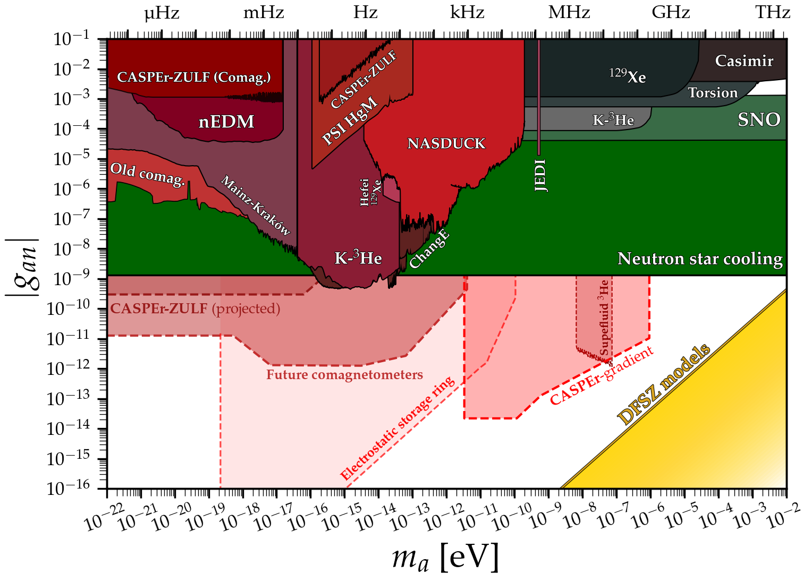
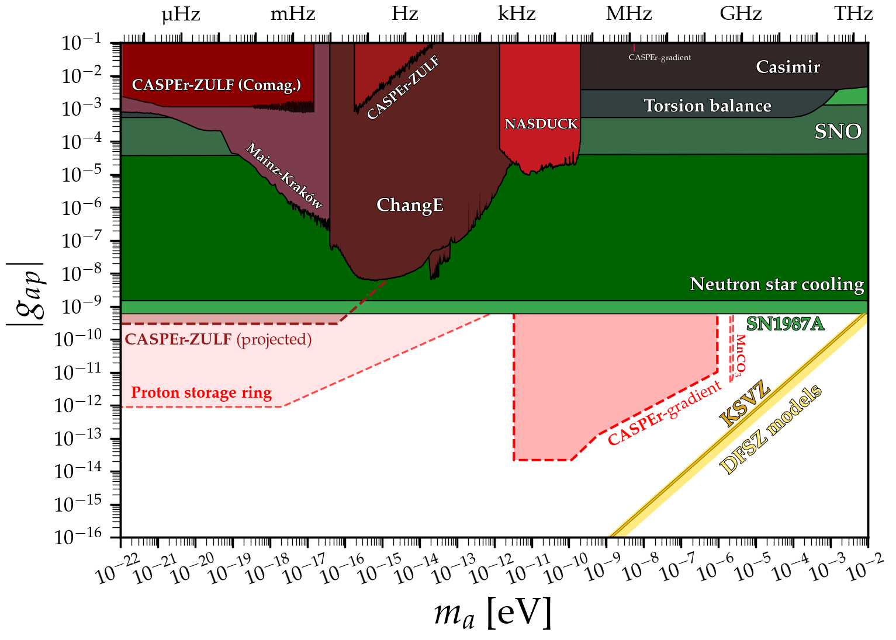
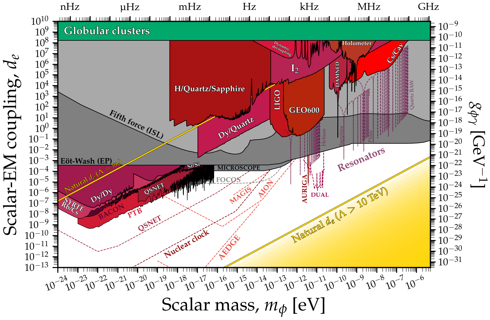
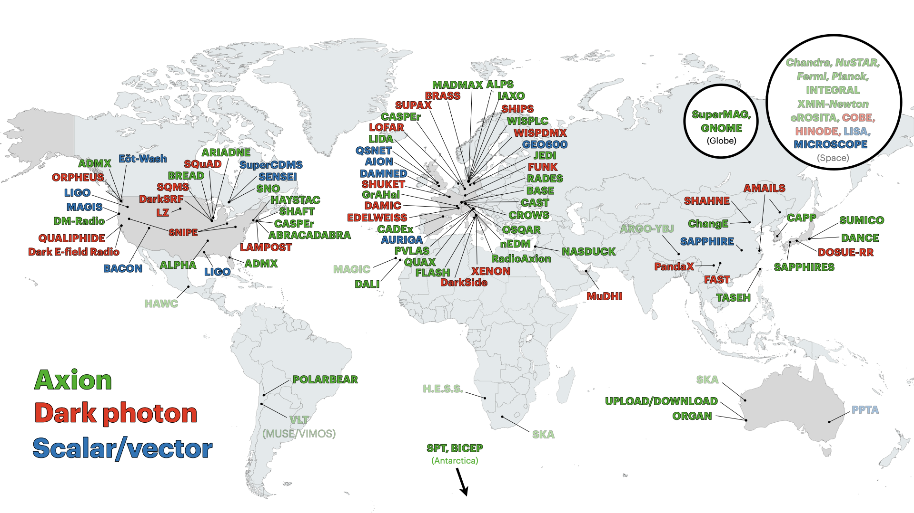

[](https://opensource.org/licenses/mit-license.php)
[](https://doi.org/10.5281/zenodo.3932430)

The purpose of this website is to host data files and python notebooks to create limit plots on axions, axion-like particles, dark photons, and other ultralight bosons. Please email me [ciaran.aj.ohare@gmail.com] if you have any questions/comments/complaints. I greatly appreciate corrections to anything here, no matter how minor or trivial. Please also inform me if a limit you have made isn't here, usually it will just be because I missed it. Also if you have made one of the limits shown here and it has been revised (e.g. in a v2 of the paper) please let me know as I am much more likely to have missed the update.

Please go to [refs/](refs/README.md) to see a full list of all references, including a .tex and .bib file with all citation details collected from Inspire.

**Disclaimer:** the limits on this website here have been collected from an extremely wide array of papers (not all of them published) and from several different sub-fields. There may be wildly varying levels of uncertainty, assumption, model dependence, and importantly, differing levels of statistical rigour. There is not necessarily any fixed convention for what even constitutes a bound. This goes especially for experimental projections, which vary considerably in their respective levels of optimism. Therefore, one should exercise some caution when reading these plots: they are not intended to be the definitive word on the status of the axion. I more see them as a way to advertise the many ways one can search, and give a *rough* picture for what is allowed, what is ruled out, and what the community in general has been up to. Some may see my inclusion of certain bounds as being overly democratic, however I felt that it was important for this extremely active field to be fully reflected in these plots.

---

[](docs/ap.md)

# [**Axion-photon coupling**](docs/ap.md)
[**Data files**](docs/ap.md)\
Plot ([pdf](https://github.com/cajohare/AxionLimits/raw/master/plots/AxionPhoton.pdf), [png](https://github.com/cajohare/AxionLimits/raw/master/plots/plots_png/AxionPhoton.png))\
Plot with projections ([pdf](https://github.com/cajohare/AxionLimits/raw/master/plots/AxionPhoton_with_Projections.pdf), [png](https://github.com/cajohare/AxionLimits/raw/master/plots/plots_png/AxionPhoton_with_Projections.png))\
Plot of dimensionless coupling ([pdf](https://github.com/cajohare/AxionLimits/raw/master/plots/AxionPhoton_Rescaled_NoProjections.pdf), [png](https://github.com/cajohare/AxionLimits/raw/master/plots/plots_png/AxionPhoton_Rescaled_NoProjections.png))\
Plot of dimensionless coupling with projections ([pdf](https://github.com/cajohare/AxionLimits/raw/master/plots/AxionPhoton_Rescaled_NoProjections.pdf), [png](https://github.com/cajohare/AxionLimits/raw/master/plots/plots_png/AxionPhoton_Rescaled_NoProjections.png))

---

[](docs/ae.md)

# [**Axion-electron coupling**](docs/ae.md)
[**Data files**](docs/ae.md)\
Plot ([pdf](https://github.com/cajohare/AxionLimits/raw/master/plots/AxionElectron.pdf), [png](https://github.com/cajohare/AxionLimits/raw/master/plots/plots_png/AxionElectron.png))\
Plot with projections ([pdf](https://github.com/cajohare/AxionLimits/raw/master/plots/AxionElectron_with_Projections.pdf), [png](https://github.com/cajohare/AxionLimits/raw/master/plots/plots_png/AxionElectron_with_Projections.png))\
   &nbsp; \
  &nbsp;

---

[](docs/an.md)

# [**Axion-neutron coupling**](docs/an.md)
[**Data files**](docs/an.md)\
Plot ([pdf](https://github.com/cajohare/AxionLimits/raw/master/plots/AxionNeutron.pdf), [png](https://github.com/cajohare/AxionLimits/raw/master/plots/plots_png/AxionNeutron.png))\
Plot with projections ([pdf](https://github.com/cajohare/AxionLimits/raw/master/plots/AxionNeutron_with_Projections.pdf), [png](https://github.com/cajohare/AxionLimits/raw/master/plots/plots_png/AxionNeutron_with_Projections.png))\
   &nbsp; \
      &nbsp; \
  &nbsp;

---

[](docs/app.md)

# [**Axion-proton coupling**](docs/app.md)
[**Data files**](docs/app.md)\
Plot ([pdf](https://github.com/cajohare/AxionLimits/raw/master/plots/AxionProton.pdf), [png](https://github.com/cajohare/AxionLimits/raw/master/plots/plots_png/AxionProton.png))\
Plot with projections ([pdf](https://github.com/cajohare/AxionLimits/raw/master/plots/AxionProton_with_Projections.pdf), [png](https://github.com/cajohare/AxionLimits/raw/master/plots/plots_png/AxionProton_with_Projections.png))\
   &nbsp; \
      &nbsp; \
  &nbsp;

---

[](docs/cp.md)

# [**Axion CP-violating couplings**](docs/cp.md)
[**Data files**](docs/cp.md)\
Plot for scalar nucleon coupling ([pdf](https://github.com/cajohare/AxionLimits/raw/master/plots/ScalarNucleon.pdf), [png](https://github.com/cajohare/AxionLimits/raw/master/plots/plots_png/ScalarNucleon.png))\
Plot for electron-electron coupling ([pdf](https://github.com/cajohare/AxionLimits/raw/master/plots/MonopoleDipole_ElectronNucleon.pdf), [png](https://github.com/cajohare/AxionLimits/raw/master/plots/plots_png/MonopoleDipole_ElectronNucleon.png))\
Plot for nucleon-nucleon coupling ([pdf](https://github.com/cajohare/AxionLimits/raw/master/plots/MonopoleDipole_NucleonNucleon.pdf), [png](https://github.com/cajohare/AxionLimits/raw/master/plots/plots_png/MonopoleDipole_NucleonNucleon.png))\
  &nbsp;

---

[](docs/aedm.md)

# [**Axion-EDM coupling**](docs/aedm.md)
[**Data files**](docs/aedm.md)\
Plot ([pdf](https://github.com/cajohare/AxionLimits/raw/master/plots/AxionEDM.pdf), [png](https://github.com/cajohare/AxionLimits/raw/master/plots/plots_png/AxionEDM.png))\
Plot with projections ([pdf](https://github.com/cajohare/AxionLimits/raw/master/plots/AxionEDM_with_Projections.pdf), [png](https://github.com/cajohare/AxionLimits/raw/master/plots/plots_png/AxionEDM_with_Projections.png))\
   &nbsp; \
      &nbsp; \
  &nbsp;

---

[](docs/fa.md)

# [**Mass versus f_a**](docs/fa.md)
[**Data files**](docs/fa.md)\
Plot ([pdf](https://github.com/cajohare/AxionLimits/raw/master/plots/Axion_fa.pdf), [png](https://github.com/cajohare/AxionLimits/raw/master/plots/plots_png/Axion_fa.png))\
Plot with projections ([pdf](https://github.com/cajohare/AxionLimits/raw/master/plots/Axion_fa_with_Projections.pdf), [png](https://github.com/cajohare/AxionLimits/raw/master/plots/plots_png/Axion_fa_with_Projections.png))\
   &nbsp; \
      &nbsp; \
  &nbsp;

---

[](docs/am.md)

# [**Axion DM predictions**](docs/am.md)
[**Data files**](docs/am.md)\
Plot ([pdf](https://github.com/cajohare/AxionLimits/raw/master/plots/AxionMass.pdf), [png](https://github.com/cajohare/AxionLimits/raw/master/plots/plots_png/AxionMass.png))\
   &nbsp; \
   &nbsp; \
   &nbsp; \
    &nbsp; \
        &nbsp; \
   &nbsp;

---

[](docs/dp.md)

# [**Dark photons**](docs/dp.md)
[**Data files**](docs/dp.md)\
Plot ([pdf](https://github.com/cajohare/AxionLimits/raw/master/plots/DarkPhoton.pdf), [png](https://github.com/cajohare/AxionLimits/raw/master/plots/plots_png/DarkPhoton.png))\
   &nbsp; \
  &nbsp; \
   &nbsp; \
  &nbsp;

---

[](docs/phie.md)

# [**Scalar-photon coupling**](docs/phie.md)
[**Data files**](docs/phie.md)\
Plot ([pdf](https://github.com/cajohare/AxionLimits/raw/master/plots/ScalarPhoton_with_Projections.png), [png](https://github.com/cajohare/AxionLimits/raw/master/plots/plots_png/ScalarPhoton_with_Projections.png))\
   &nbsp; \
  &nbsp; \
   &nbsp; 

---

[](docs/phime.md)

# [**Scalar-electron coupling**](docs/phime.md)
[**Data files**](docs/phime.md)\
Plot ([pdf](https://github.com/cajohare/AxionLimits/raw/master/plots/ScalarElectron_with_Projections.png), [png](https://github.com/cajohare/AxionLimits/raw/master/plots/plots_png/ScalarElectron_with_Projections.png))\
   &nbsp; \
  &nbsp; \
   &nbsp; 

---

[](docs/gBL.md)

# [**Vector B-L coupling**](docs/gBL.md)
[**Data files**](docs/gBL.md)\
Plot ([pdf](https://github.com/cajohare/AxionLimits/raw/master/plots/VectorB-L_with_Projections.pdf), [png](https://github.com/cajohare/AxionLimits/raw/master/plots/plots_png/VectorB-L_with_Projections.png))\
   &nbsp; \
  &nbsp; \
   &nbsp; 

---

[](docs/fips.md)

# [**FIPS Workshop plots**](docs/fips.md)
Plot ([pdf](https://github.com/cajohare/AxionLimits/raw/master/plots/AxionPhoton_FIPS.pdf), [png](https://github.com/cajohare/AxionLimits/raw/master/plots/plots_png/AxionPhoton_FIPS.png))\
   &nbsp; \
  &nbsp; \
   &nbsp; \
  &nbsp;

---

[](docs/cs.md)

# [**Dark matter cheatsheet**](docs/cs.md)
[**Data files**](docs/cs.md)\
Plot ([pdf](https://github.com/cajohare/AxionLimits/raw/master/plots/Cheatsheet.pdf), [png](https://github.com/cajohare/AxionLimits/raw/master/plots/plots_png/Cheatsheet.png))\
   &nbsp; \
  &nbsp; \
   &nbsp; \
   &nbsp; \
  &nbsp; \
   &nbsp; \
      &nbsp; \
  &nbsp; \
   &nbsp; \
     &nbsp; \
   &nbsp; \
      &nbsp; \
  &nbsp;

---

[](https://github.com/cajohare/AxionLimits/raw/master/plots/Wavy_Map.png)
# **Experiment map**
Work in progress (comments welcome)\
Download [png image](https://github.com/cajohare/AxionLimits/raw/master/plots/Wavy_Map.png)\
Download [keynote file](https://github.com/cajohare/AxionLimits/raw/master/plots/Wavy_Map.key)\
  &nbsp;

---

If you use something here, you can give credit by citing the zenodo DOI attached to this repository
```
@misc{AxionLimits,
  author       = {Ciaran O'Hare},
  title        = {cajohare/AxionLimits: AxionLimits},
  month        = jul,
  year         = 2020,
  publisher    = {Zenodo},
  version      = {v1.0},
  doi          = {10.5281/zenodo.3932430},
  howpublished = {\url{https://cajohare.github.io/AxionLimits/}}
}
```


# Acknowledgements
**Thank you to**: Masha Baryakhtar, Max Berbig, Itay Bloch, Andrea Caputo, Raphael Cervantes, Raymond Co, Chris Dessert, Akash Dixit, Babette Döbrich, Claudio Gatti, Sumita Ghosh, Maurizio Giannotti, Alexander Gramolin, Josh Foster, Fred Hiskins, Sebastian Hoof, Derek Jackson-Kimball, Stefan Knirck, Kazunori Kohri, Hai-Jun Li, Jesse Liu, Jack Manley, Laura Manenti, Giacomo Marocco, David Marsh, Javier Miguel Hernandez, Alex Millar, Viraf Mehta, Dion Noordhuis, Nadav Outmezguine, Giovanni Pierobon, Pablo Quílez, Javier Redondo, Alessio Rettaroli, Andreas Ringwald, Nick Rodd, Giuseppe Ruoso, Gray Rybka, Isaac Sarnoff, Jan Schuette-Engel, Ivo Schulthess, Philip Sørensen, Konstantin Springmann, Fuminobu Takahashi, Mike Tobar, Caner Ünal, Edoardo Vitagliano, Arne Wickenbrock, Sam Witte, Huangyu Xiao, Byeongsu Yang and Wen Yin for comments, corrections and suggestions that have greatly helped improve these plots.
