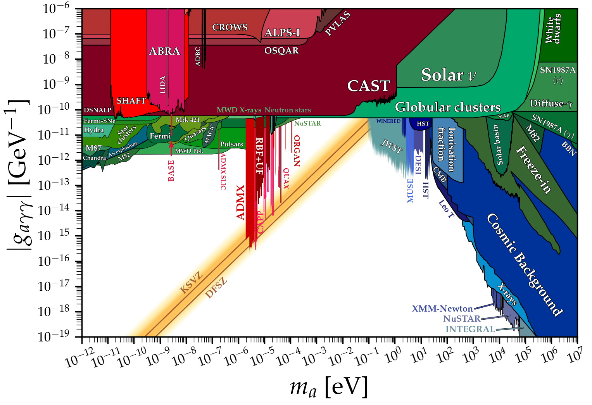
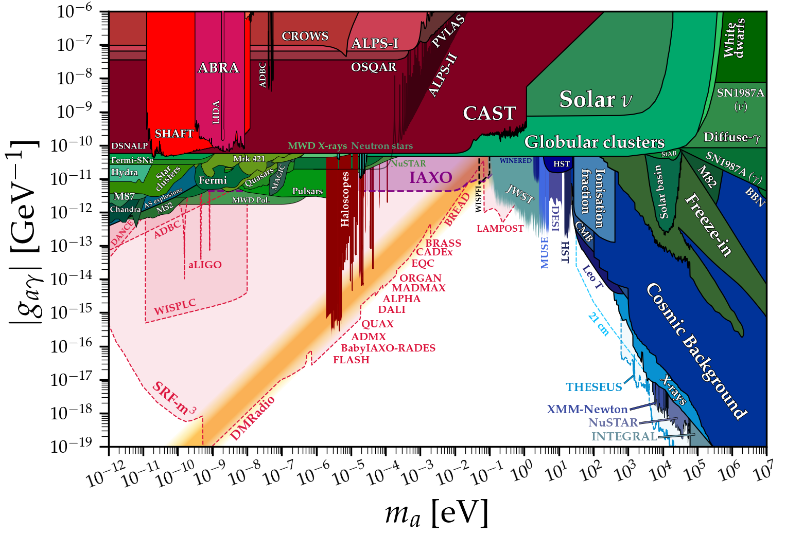

This page showcases my python scripts for reproducing plots of axion constraints. Various plots are available, see the jupyter notebooks (and the figures below) for different configurations. All the limit data can be found in the [limit_data](https://github.com/cajohare/AxionLimits/raw/master/limit_data) folder, at the very least I hope this can save you some time digitising plots.

Please email me [ciaran.aj.ohare@gmail.com] or make a pull request if you would like any limits being added.

**Disclaimer:** the limits listed here have been collected from an extremely wide array of papers (not all of them published) and from several different sub-fields. There may be wildly varying levels of uncertainty, assumption, model dependence, and importantly, differing levels of statistical rigour. There is not necessarily any fixed convention for what even constitutes a bound. This goes especially for experimental projections, which vary considerably in their respective levels of optimism. Therefore, one should exercise some caution when reading these plots: they are not intended to be the definitive word on the status of the axion. I more see them as a way to advertise the many ways one can search, and give a *rough* picture for what is allowed and what is ruled out. Some may see my inclusion of certain bounds as being overly democratic, however I felt that it was important for this extremely active field to be fully reflected in these plots.

# Contents
* [Axion-photon coupling](#axionphoton)
* [Axion-electron coupling](#axionelectron)
* [Axion-neutron coupling](#axionneutron)
* [Axion CP-violating couplings](#axionCPV)

---

### 
# Axion-photon coupling
Click on the plots to see the notebooks

Download: [png](https://github.com/cajohare/AxionLimits/raw/master/plots/plots_png/AxionPhoton.png), [pdf](https://github.com/cajohare/AxionLimits/raw/master/plots/AxionPhoton.pdf)

###  With projected limits

Download: [png](https://github.com/cajohare/AxionLimits/raw/master/plots/plots_png/AxionPhoton_with_Projections.png), [pdf](https://github.com/cajohare/AxionLimits/raw/master/plots/AxionPhoton_with_Projections.pdf)

### Dimensionless Axion-photon coupling (with projected limits)

Download: [png](https://github.com/cajohare/AxionLimits/raw/master/plots/plots_png/AxionPhoton_Rescaled.png), [pdf](https://github.com/cajohare/AxionLimits/raw/master/plots/AxionPhoton_Rescaled.pdf)

### Haloscopes:
* ABRACADABRA: [limit](https://github.com/cajohare/AxionLimits/raw/master/limit_data/AxionPhoton/ABRACADABRA.txt), [projection](https://github.com/cajohare/AxionLimits/raw/master/limit_data/AxionPhoton/Projections/ABRACADABRA.txt), [reference](https://arxiv.org/abs/1810.12257)
* ADBC: [projection](https://github.com/cajohare/AxionLimits/raw/master/limit_data/AxionPhoton/Projections/ADBC.txt), [reference](https://arxiv.org/abs/1809.01656)
* ADMX (2010): [limit](https://github.com/cajohare/AxionLimits/raw/master/limit_data/AxionPhoton/ADMX.txt), [reference](https://arxiv.org/abs/0910.5914)
* ADMX 2018: [limit](https://github.com/cajohare/AxionLimits/raw/master/limit_data/AxionPhoton/ADMX2018.txt), [reference](https://arxiv.org/abs/1804.05750)
* ADMX 2019: [limit1](https://github.com/cajohare/AxionLimits/raw/master/limit_data/AxionPhoton/ADMX2019_1.txt), [limit2](https://github.com/cajohare/AxionLimits/raw/master/limit_data/AxionPhoton/ADMX2019_2.txt), [reference](https://arxiv.org/abs/1910.08638)
* ADMX Sidecar: [limit](https://github.com/cajohare/AxionLimits/raw/master/limit_data/AxionPhoton/ADMX_Sidecar.txt), [reference](https://arxiv.org/abs/1901.00920)
* ADMX Projection: [projection](https://github.com/cajohare/AxionLimits/raw/master/limit_data/AxionPhoton/Projections/ADMX_Projected.txt)  [reference](https://arxiv.org/abs/1612.08296)
* aLIGO: [projection](https://github.com/cajohare/AxionLimits/raw/master/limit_data/AxionPhoton/Projections/aLIGO.txt), [reference](https://arxiv.org/abs/1903.02017)
* BRASS: [projection](https://github.com/cajohare/AxionLimits/raw/master/limit_data/AxionPhoton/Projections/BRASS.txt), [reference](http://www.iexp.uni-hamburg.de/groups/astroparticle/brass/brassweb.htm)
* CAPP-8TB: [limit](https://github.com/cajohare/AxionLimits/raw/master/limit_data/AxionPhoton/CAPP-8TB.txt), [reference](https://arxiv.org/abs/2001.05102)
* DANCE: [projection](https://github.com/cajohare/AxionLimits/raw/master/limit_data/AxionPhoton/Projections/DANCE.txt), [reference](https://arxiv.org/abs/1911.05196)
* HAYSTAC 2018: [limit](https://github.com/cajohare/AxionLimits/raw/master/limit_data/AxionPhoton/HAYSTAC.txt), [reference](https://arxiv.org/abs/1803.03690)
* HAYSTAC 2020: [limit](https://github.com/cajohare/AxionLimits/raw/master/limit_data/AxionPhoton/HAYSTAC_2020.txt), [reference](https://arxiv.org/abs/2008.01853)
* KLASH: [projection](https://github.com/cajohare/AxionLimits/raw/master/limit_data/AxionPhoton/Projections/KLASH.txt), [reference](https://arxiv.org/abs/1707.06010)
* LAMPOST: [projection](https://github.com/cajohare/AxionLimits/raw/master/limit_data/AxionPhoton/Projections/LAMPOST.txt), [reference](https://arxiv.org/abs/1803.11455)
* MADMAX: [projection](https://github.com/cajohare/AxionLimits/raw/master/limit_data/AxionPhoton/Projections/MADMAX.txt), [reference](https://arxiv.org/abs/2003.10894)
* ORGAN: [limit](https://github.com/cajohare/AxionLimits/raw/master/limit_data/AxionPhoton/ORGAN.txt), [projection](https://github.com/cajohare/AxionLimits/raw/master/limit_data/AxionPhoton/Projections/ORGAN_Projected.txt), [reference](https://arxiv.org/abs/1706.00209)
* Plasma haloscope: [projection](https://github.com/cajohare/AxionLimits/raw/master/limit_data/AxionPhoton/Projections/PlasmaHaloscope.txt), [reference](https://arxiv.org/abs/1904.11872)
* QUAX: [limit](https://github.com/cajohare/AxionLimits/raw/master/limit_data/AxionPhoton/QUAX.txt), [reference](https://arxiv.org/abs/1903.06547)
* RBF: [limit](https://github.com/cajohare/AxionLimits/raw/master/limit_data/AxionPhoton/RBF_UF_Haloscopes.txt), [reference](https://journals.aps.org/prl/abstract/10.1103/PhysRevLett.59.839)
* SHAFT: [limit](https://github.com/cajohare/AxionLimits/raw/master/limit_data/AxionPhoton/SHAFT.txt), [reference](https://arxiv.org/abs/2003.03348)
* TOORAD: [projection](https://github.com/cajohare/AxionLimits/raw/master/limit_data/AxionPhoton/Projections/TOORAD.txt), [reference](https://arxiv.org/abs/1807.08810)
* UF: [limit](https://github.com/cajohare/AxionLimits/raw/master/limit_data/AxionPhoton/RBF_UF_Haloscopes.txt), [reference](https://journals.aps.org/prd/abstract/10.1103/PhysRevD.42.1297)
* UPLOAD: [limit](https://github.com/cajohare/AxionLimits/raw/master/limit_data/AxionPhoton/UPLOAD.txt), [reference](https://arxiv.org/abs/1912.07751)
### Helioscopes/LSW
* ALPS: [limit](https://github.com/cajohare/AxionLimits/raw/master/limit_data/AxionPhoton/ALPS.txt), [reference](https://arxiv.org/abs/1004.1313)
* CAST (2007): [limit](https://github.com/cajohare/AxionLimits/raw/master/limit_data/AxionPhoton/CAST_highm.txt), [reference](https://arxiv.org/abs/hep-ex/0702006)
* CAST (2017): [limit](https://github.com/cajohare/AxionLimits/raw/master/limit_data/AxionPhoton/CAST.txt), [reference](https://arxiv.org/abs/1705.02290)
* CROWS: [limit](https://github.com/cajohare/AxionLimits/raw/master/limit_data/AxionPhoton/CROWS.txt), [reference](https://arxiv.org/abs/1310.8098)
* IAXO: [projection](https://github.com/cajohare/AxionLimits/raw/master/limit_data/AxionPhoton/Projections/IAXO.txt), [reference](https://arxiv.org/abs/1212.4633)
* OSQAR: [limit](https://github.com/cajohare/AxionLimits/raw/master/limit_data/AxionPhoton/OSQAR.txt), [reference](https://arxiv.org/abs/1506.08082)
* PVLAS: [limit](https://github.com/cajohare/AxionLimits/raw/master/limit_data/AxionPhoton/PVLAS.txt), [reference](https://arxiv.org/abs/1510.08052)
### Astro bounds
* Astrophysical Black hole spins: [limit](https://github.com/cajohare/AxionLimits/raw/master/limit_data/BlackHoleSpins.txt), [reference](https://arxiv.org/abs/2009.07206)
* Betelgeuse (NuStar X-ray obs.): [limit](https://github.com/cajohare/AxionLimits/raw/master/limit_data/Betelgeuse.txt), [reference](https://arxiv.org/abs/2009.09059)
* Chandra (Hydra-A): [limit](https://github.com/cajohare/AxionLimits/raw/master/limit_data/AxionPhoton/HYDRA_A.txt), [reference](https://arxiv.org/abs/1304.0989)
* Chandra (M87): [limit](https://github.com/cajohare/AxionLimits/raw/master/limit_data/AxionPhoton/M87.txt), [reference](https://arxiv.org/abs/1703.07354)
* Chandra (NGC 1275): [limit](https://github.com/cajohare/AxionLimits/raw/master/limit_data/AxionPhoton/Chandra.txt), [reference](https://arxiv.org/abs/1907.05475)
* Diffuse SN ALP background: [limit](https://github.com/cajohare/AxionLimits/raw/master/limit_data/AxionPhoton/DSNALP.txt), [reference](https://arxiv.org/abs/2008.11741)
* Fermi-LAT (NGC 1275): [limit](https://github.com/cajohare/AxionLimits/raw/master/limit_data/AxionPhoton/Fermi_bound.txt), [hole](https://github.com/cajohare/AxionLimits/raw/master/limit_data/AxionPhoton/Fermi_hole.txt), [reference](https://arxiv.org/abs/1603.06978)
* Fermi-LAT (Galactic SN): [projection](https://github.com/cajohare/AxionLimits/raw/master/limit_data/AxionPhoton/Projections/FermiSN.txt), [reference](https://arxiv.org/abs/1609.02350)
* Fermi-LAT (Extragalactic SNe): [limit](https://github.com/cajohare/AxionLimits/raw/master/limit_data/AxionPhoton/SNe-gamma.txt), [reference](https://arxiv.org/abs/2006.06722)
* HESS (PKS 2155-304): [limit](https://github.com/cajohare/AxionLimits/raw/master/limit_data/AxionPhoton/HESS.txt), [reference](https://arxiv.org/abs/1311.3148)
* Horizontal branch stars: [limit](https://github.com/cajohare/AxionLimits/raw/master/limit_data/AxionPhoton/HorizontalBranch.txt), [reference](https://arxiv.org/abs/1406.6053)
* Neutron Stars (Green Bank and Effelsberg) [limit](https://github.com/cajohare/AxionLimits/raw/master/limit_data/AxionPhoton/NeutronStars_GreenBank.txt), [reference](https://arxiv.org/abs/2004.00011)
* Neutron Stars (Jansky VLA) [limit](https://github.com/cajohare/AxionLimits/raw/master/limit_data/AxionPhoton/NeutronStars_VLA.txt), [reference1](https://arxiv.org/abs/2008.01877), [reference2](https://arxiv.org/abs/2008.11188)
* Mrk 421 (ARGO-YBJ+Fermi): [limit](https://github.com/cajohare/AxionLimits/raw/master/limit_data/AxionPhoton/Mrk421.txt), [reference](https://arxiv.org/abs/2008.09464)
* Solar neutrinos: [limit](https://github.com/cajohare/AxionLimits/raw/master/limit_data/AxionPhoton/SolarNu.txt), [reference](https://arxiv.org/abs/1501.01639)
* SN1987A ALP decay: [limit](https://github.com/cajohare/AxionLimits/raw/master/limit_data/AxionPhoton/SN1987A_decay.txt), [reference](https://arxiv.org/abs/1702.02964)
* SN1987A gamma rays: [limit](https://github.com/cajohare/AxionLimits/raw/master/limit_data/AxionPhoton/SN1987A_gamma.txt), [reference](https://arxiv.org/abs/1410.3747)
* SN1987A neutrinos: [limit](https://github.com/cajohare/AxionLimits/raw/master/limit_data/AxionPhoton/SN1987A_2019.txt), [reference](https://arxiv.org/abs/1808.10136)
* Super star clusters (NuSTAR Xray): [limit](https://github.com/cajohare/AxionLimits/raw/master/limit_data/AxionPhoton/Xray-SuperStarClusters.txt), [reference](https://arxiv.org/abs/2008.03305)
* Telescopes (MUSE Leo-T): [limit](https://github.com/cajohare/AxionLimits/raw/master/limit_data/AxionPhoton/Telescopes_MUSE.txt), [reference](https://arxiv.org/abs/2009.01310)
* Telescopes (VIMOS Abell 2667 and 2390): [limit](https://github.com/cajohare/AxionLimits/raw/master/limit_data/AxionPhoton/Telescopes_VIMOS.txt), [reference](https://arxiv.org/abs/astro-ph/0611502)
* THESEUS (ALP DM decay to Xrays): [limit](https://github.com/cajohare/AxionLimits/raw/master/limit_data/AxionPhoton/Projections/THESEUS.txt), [projection](https://arxiv.org/abs/2008.08306)
### Cosmology
* 2011 Compilation: [EBL](https://github.com/cajohare/AxionLimits/raw/master/limit_data/AxionPhoton/EBL.txt), [X-rays](https://github.com/cajohare/AxionLimits/raw/master/limit_data/AxionPhoton/XRAY.txt), [x_ion](https://github.com/cajohare/AxionLimits/raw/master/limit_data/AxionPhoton/x_ion.txt), [reference](https://arxiv.org/abs/1110.2895)
* Planck (BBN + N_eff): [limit](https://github.com/cajohare/AxionLimits/raw/master/limit_data/AxionPhoton/BBN_Neff.txt), [reference](https://arxiv.org/abs/2002.08370)

---

### 
# Axion-electron coupling

Download: [png](https://github.com/cajohare/AxionLimits/raw/master/plots/plots_png/AxionElectron_with_Projections.png), [pdf](https://github.com/cajohare/AxionLimits/raw/master/plots/AxionElectron_with_Projections.pdf)\
Download (without projections): [png](https://github.com/cajohare/AxionLimits/raw/master/plots/plots_png/AxionElectron.png), [pdf](https://github.com/cajohare/AxionLimits/raw/master/plots/AxionElectron.pdf)

### Underground detectors
* DARWIN: [projection](https://github.com/cajohare/AxionLimits/raw/master/limit_data/AxionElectron/Projections/DARWIN.txt), [reference](https://arxiv.org/abs/1606.07001)
* EDELWEISS: [limit](https://github.com/cajohare/AxionLimits/raw/master/limit_data/AxionElectron/EDELWEISS.txt), [projection](https://github.com/cajohare/AxionLimits/raw/master/limit_data/AxionElectron/Projections/EDELWEISS.txt), [reference](https://arxiv.org/abs/1808.02340)
* LUX: [limit](https://github.com/cajohare/AxionLimits/raw/master/limit_data/AxionElectron/LUX.txt), [reference](https://arxiv.org/abs/1704.02297)
* PandaX-II: [limit](https://github.com/cajohare/AxionLimits/raw/master/limit_data/AxionElectron/PandaX.txt), [reference](https://arxiv.org/abs/1707.07921)
* Semiconductors (absorption): [projection](https://github.com/cajohare/AxionLimits/raw/master/limit_data/AxionElectron/Projections/SemiconductorAbsorption.txt), [reference](https://arxiv.org/abs/1608.02123)
* SuperCDMS: [limit](https://github.com/cajohare/AxionLimits/raw/master/limit_data/AxionElectron/SuperCDMS.txt), [reference](https://arxiv.org/abs/1911.11905)
* XENON1T (ALP DM search, S2 only): [limit](https://github.com/cajohare/AxionLimits/raw/master/limit_data/AxionElectron/XENON1T_DM_S2.txt), [reference](https://arxiv.org/abs/1907.11485)
* XENON1T (ALP DM search S1+S2): [limit](https://github.com/cajohare/AxionLimits/raw/master/limit_data/AxionElectron/XENON1T_DM_S1S2.txt), [reference](https://arxiv.org/abs/2006.09721)
* XENON1T (Solar axion basin): [limit](https://github.com/cajohare/AxionLimits/raw/master/limit_data/AxionElectron/XENON1T_S2_SolarAxionBasin.txt), [reference](https://arxiv.org/abs/2006.12431)

### Haloscopes:
<!---* Electron spin magnetometers:  [projection](https://github.com/cajohare/AxionLimits/raw/master/limit_data/AxionElectron/Projections/ElectronSpinMagnetometers.txt), (in prep.)-->
* Axion-magnon conversion:  [projection](https://github.com/cajohare/AxionLimits/raw/master/limit_data/AxionElectron/Projections/Magnon.txt),  [reference](https://arxiv.org/abs/2005.10256)
* Axion-magnon conversion (scanning):  [projection](https://github.com/cajohare/AxionLimits/raw/master/limit_data/AxionElectron/Projections/MagnonScan.txt),  [reference1](https://arxiv.org/abs/2005.10256),  [reference2](https://arxiv.org/abs/2001.10666)

### Astro bounds:
* Red giant branch: [limit](https://github.com/cajohare/AxionLimits/raw/master/limit_data/AxionElectron/RedGiants.txt), [reference](https://arxiv.org/abs/2007.03694)
* Solar neutrinos: [limit](https://github.com/cajohare/AxionLimits/raw/master/limit_data/AxionElectron/SolarNu.txt), [reference](https://arxiv.org/abs/0807.2926)
* White dwarf hint: [limit](https://github.com/cajohare/AxionLimits/raw/master/limit_data/AxionElectron/WDhint.txt), [reference](https://arxiv.org/abs/1708.02111)

---

### 
# Axion-neutron coupling

Download: [png](https://github.com/cajohare/AxionLimits/raw/master/plots/plots_png/AxionNeutron_with_Projections.png), [pdf](https://github.com/cajohare/AxionLimits/raw/master/plots/AxionNeutron_with_Projections.pdf)\
Download (without projections): [png](https://github.com/cajohare/AxionLimits/raw/master/plots/plots_png/AxionNeutron.png), [pdf](https://github.com/cajohare/AxionLimits/raw/master/plots/AxionNeutron.pdf)

### Haloscopes
Note: CASPEr and nEDM limits account for stochastic correction reported in [1905.13650](https://arxiv.org/abs/1905.13650)
* CASPEr-wind: [projection](https://github.com/cajohare/AxionLimits/raw/master/limit_data/AxionNeutron/Projections/CASPEr_wind.txt), [reference](https://arxiv.org/abs/1711.08999)
* CASPEr-ZULF-Comagnetometer: [limit](https://github.com/cajohare/AxionLimits/raw/master/limit_data/AxionNeutron/CASPEr_Comagnetometer.txt), [reference](https://arxiv.org/abs/1901.10843)
* CASPEr-ZULF-Sidechain: [limit](https://github.com/cajohare/AxionLimits/raw/master/limit_data/AxionNeutron/CASPEr_ZULF.txt), [projection](https://github.com/cajohare/AxionLimits/raw/master/limit_data/AxionNeutron/Projections/CASPEr_ZULF.txt), [reference](https://arxiv.org/abs/1902.04644)
* nEDM (ultracold neutrons and mercury): [limit](https://github.com/cajohare/AxionLimits/raw/master/limit_data/AxionNeutron/UltracoldNeutronsAndMercury.txt), [reference](https://arxiv.org/abs/1902.04644)
* K-3He comagnetometer: [limit](https://github.com/cajohare/AxionLimits/raw/master/limit_data/AxionNeutron/K-3He_Comagnetometer.txt), [reference](https://arxiv.org/abs/0809.4700)
* Old comagnetometers: [limit](https://github.com/cajohare/AxionLimits/raw/master/limit_data/AxionNeutron/OldComagnetometers.txt), [reference](https://arxiv.org/abs/1907.03767)
* Future comagnetometers: [projection](https://github.com/cajohare/AxionLimits/raw/master/limit_data/AxionNeutron/Projections/FutureComagnetometers.txt), [reference](https://arxiv.org/abs/1907.03767)
* Torsion balance: [projection](https://github.com/cajohare/AxionLimits/raw/master/limit_data/AxionNeutron/TorsionBalance.txt), [reference](https://arxiv.org/abs/hep-ph/0611223)
### Other experiments
* SNO (deuterium dissasociation): [limit](https://github.com/cajohare/AxionLimits/raw/master/limit_data/AxionNeutron/SNO.txt), [reference](https://arxiv.org/abs/2004.02733)
* Proton storage ring: [projection](https://github.com/cajohare/AxionLimits/raw/master/limit_data/AxionNeutron/Projections/StorageRing.txt), [reference](https://arxiv.org/abs/2005.11867)

### Astro bounds
* Astrophysical Black hole spins: [limit](https://github.com/cajohare/AxionLimits/raw/master/limit_data/BlackHoleSpins.txt), [reference](https://arxiv.org/abs/2009.07206)
* Hot Neutron Star (HESS J1731-347): [limit](https://github.com/cajohare/AxionLimits/raw/master/limit_data/AxionNeutron/NeutronStars.txt), [reference](https://arxiv.org/abs/1806.07991)
* SN1987 Cooling: [limit](https://github.com/cajohare/AxionLimits/raw/master/limit_data/AxionNeutron/SN1987A.txt), [reference](https://arxiv.org/abs/1906.11844)

---

### 
# Axion CP-violating couplings

 \
For more details see our paper: [arXiv:2010.XXXX](https://arxiv.org/abs/2010.03889)

Download Scalar Nucleon: [png](https://github.com/cajohare/AxionLimits/raw/master/plots/plots_png/ScalarNucleon.png), [pdf](https://github.com/cajohare/AxionLimits/raw/master/plots/ScalarNucleon.pdf)\
Download Electron-Nucleon: [png](https://github.com/cajohare/AxionLimits/raw/master/plots/plots_png/MonopoleDipole_ElectronNucleon.png), [pdf](https://github.com/cajohare/AxionLimits/raw/master/plots/MonopoleDipole_ElectronNucleon.pdf)\
Download Nucleon-Nucleon: [png](https://github.com/cajohare/AxionLimits/raw/master/plots/plots_png/MonopoleDipole_NucleonNucleon.png), [pdf](https://github.com/cajohare/AxionLimits/raw/master/plots/MonopoleDipole_NucleonNucleon.pdf)

### Download combined limits
* Scalar-Nucleon combined bound: [.txt file](https://github.com/cajohare/AxionLimits/raw/master/limit_data/ScalarNucleon/Union.txt)
* Electron-Nucleon Astro/Lab combined bound: [.txt file](https://github.com/cajohare/AxionLimits/raw/master/limit_data/MonopoleDipole/ElectronNucleon/UnionAstroLab.txt)
* Nucleon-Nucleon Astro/Lab combined bound: [.txt file](https://github.com/cajohare/AxionLimits/raw/master/limit_data/MonopoleDipole/NucleonNucleon/UnionAstroLab.txt)

---

## Acknowledgements
Thank you to: Itay Bloch, Raymond Co, Chris Dessert, Maurizio Giannotti, Alexander Gramolin, Alex Millar, Pablo Quílez, Javier Redondo, Jan Schuette-Engel, and Edoardo Vitagliano for comments and corrections that have greatly helped improve these plots.
