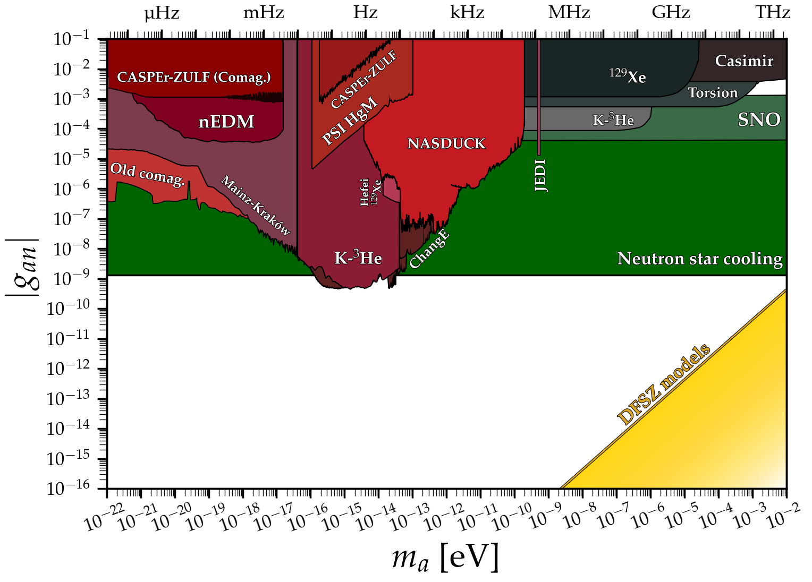

The purpose of this website is to host data files, and python notebooks needed to create for limit plots on axions, axion-like particles and dark photons. Please email me [ciaran.aj.ohare@gmail.com] if you have any questions/comments/complaints or if you would like your limit to be added to these plots.

**Disclaimer:** the limits on this website here have been collected from an extremely wide array of papers (not all of them published) and from several different sub-fields. There may be wildly varying levels of uncertainty, assumption, model dependence, and importantly, differing levels of statistical rigour. There is not necessarily any fixed convention for what even constitutes a bound. This goes especially for experimental projections, which vary considerably in their respective levels of optimism. Therefore, one should exercise some caution when reading these plots: they are not intended to be the definitive word on the status of the axion. I more see them as a way to advertise the many ways one can search, and give a *rough* picture for what is allowed and what is ruled out. Some may see my inclusion of certain bounds as being overly democratic, however I felt that it was important for this extremely active field to be fully reflected in these plots.

---

# [**Axion-photon coupling**](docs/ap.md)
[**Data files**](docs/ap.md)\
Plot ([pdf](https://github.com/cajohare/AxionLimits/raw/master/plots/AxionPhoton.pdf), [png](https://github.com/cajohare/AxionLimits/raw/master/plots/plots_png/AxionPhoton.png))\
Plot with projections ([pdf](https://github.com/cajohare/AxionLimits/raw/master/plots/AxionPhoton_with_Projections.pdf), [png](https://github.com/cajohare/AxionLimits/raw/master/plots/plots_png/AxionPhoton.png))\
Plot of dimensionless coupling ([pdf](https://github.com/cajohare/AxionLimits/raw/master/plots/AxionPhoton_Rescaled_NoProjections.pdf), [png](https://github.com/cajohare/AxionLimits/raw/master/plots/plots_png/AxionPhoton_Rescaled_NoProjections.png))\
Plot of dimensionless coupling with projections ([pdf](https://github.com/cajohare/AxionLimits/raw/master/plots/AxionPhoton_Rescaled_NoProjections.pdf), [png](https://github.com/cajohare/AxionLimits/raw/master/plots/plots_png/AxionPhoton_Rescaled.png))

---

# [**Axion-electron coupling**](docs/ae.md)
[**Data files**](docs/ae.md)\
Plot ([pdf](https://github.com/cajohare/AxionLimits/raw/master/plots/AxionElectron.pdf), [png](https://github.com/cajohare/AxionLimits/raw/master/plots/plots_png/AxionElectron.png))\
Plot with projections ([pdf](https://github.com/cajohare/AxionLimits/raw/master/plots/AxionElectron.pdf), [png](https://github.com/cajohare/AxionLimits/raw/master/plots/plots_png/AxionElectron.png))\
   &nbsp; \
  &nbsp;

---

# [**Axion-neutron coupling**](docs/an.md)
[**Data files**](docs/an.md)\
Plot ([pdf](https://github.com/cajohare/AxionLimits/raw/master/plots/AxionNeutron.pdf), [png](https://github.com/cajohare/AxionLimits/raw/master/plots/plots_png/AxionNeutron.png))\
Plot with projections ([pdf](https://github.com/cajohare/AxionLimits/raw/master/plots/AxionNeutron.pdf), [png](https://github.com/cajohare/AxionLimits/raw/master/plots/plots_png/AxionNeutron.png))\
   &nbsp; \
      &nbsp; \
  &nbsp;

---

# [**Axion CP-violating couplings**](docs/cp.md)
[**Data files**](docs/cp.md)\
Plot for scalar nucleon coupling ([pdf](https://github.com/cajohare/AxionLimits/raw/master/plots/ScalarNucleon.pdf), [png](https://github.com/cajohare/AxionLimits/raw/master/plots/plots_png/ScalarNucleon.png))\
Plot for electron-electron coupling ([pdf](https://github.com/cajohare/AxionLimits/raw/master/plots/MonopoleDipole_ElectronNucleon.pdf), [png](https://github.com/cajohare/AxionLimits/raw/master/plots/plots_png/MonopoleDipole_ElectronNucleon.png))\
Plot for nucleon-nucleon coupling ([pdf](https://github.com/cajohare/AxionLimits/raw/master/plots/MonopoleDipole_NucleonNucleon.pdf), [png](https://github.com/cajohare/AxionLimits/raw/master/plots/plots_png/MonopoleDipole_NucleonNucleon.png))\
  &nbsp;

---

# [**Dark photons**](docs/dp.md)
[**Data files**](docs/dp.md)\
Plot ([pdf](https://github.com/cajohare/AxionLimits/raw/master/plots/DarkPhoton.pdf), [png](https://github.com/cajohare/AxionLimits/raw/master/plots/plots_png/DarkPhoton.png))\
   &nbsp; \
  &nbsp; \
   &nbsp; \
  &nbsp;

# Acknowledgements
**Thank you to**: Masha Baryakhtar, Itay Bloch, Andrea Caputo, Raymond Co, Chris Dessert, Maurizio Giannotti, Alexander Gramolin, Sebastian Hoof, David Marsh, Alex Millar, Pablo Quílez, Javier Redondo, Jan Schuette-Engel, Philip Sørensen, and Edoardo Vitagliano for comments, corrections and suggestions that have greatly helped improve these plots.
