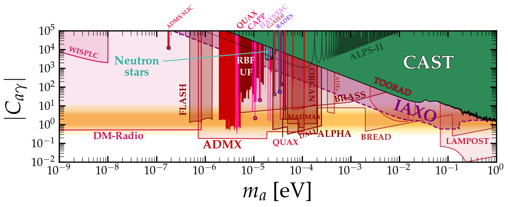

# AxionLimits
This page contains my python scripts for reproducing my plots of axion constraints. Various plots are available, see the jupyter notebooks (and the figures below) for different configurations. All the limit data can be found in the limit_data folder, at the very least I hope it can save you some time digitising plots.

Please email me [ciaran.aj.ohare@gmail.com] or make a pull request if you would like any limits being added.

## To do:
Add plots for axion-electron, nuclei, dipole moment, etc. 

---

## Axion-photon coupling:

[Click here for the notebook](https://github.com/cajohare/AxionLimits/blob/master/AxionPhoton.ipynb)

---

## Axion-photon coupling (with projected limits):

[Click here for the notebook](https://github.com/cajohare/AxionLimits/blob/master/AxionPhoton.ipynb)

---

## Dimensionless Axion-photon coupling (with projected limits):

[Click here for the notebook](https://github.com/cajohare/AxionLimits/blob/master/AxionPhoton.ipynb)

---

# Limits currently included:
## Haloscopes (r:
* ABRACADABRA: [limit](https://github.com/cajohare/AxionLimits/blob/master/limit_data/ABRACADABRA.txt), [data (projection)](https://github.com/cajohare/AxionLimits/blob/master/limit_data/Projections/ABRACADABRA.txt), [reference](https://arxiv.org/abs/arXiv:1810.12257)
* ADBC: [projection](https://github.com/cajohare/AxionLimits/blob/master/limit_data/Projections/ADBC.txt), [reference](https://arxiv.org/abs/arXiv:1809.01656)
* ADMX (2010): [limit](https://github.com/cajohare/AxionLimits/blob/master/limit_data/ADMX.txt), [reference](https://arxiv.org/abs/arXiv:0910.5914)
* ADMX 2018: [limit](https://github.com/cajohare/AxionLimits/blob/master/limit_data/ADMX2018.txt), [reference](https://arxiv.org/abs/arXiv:1804.05750)
* ADMX 2019: [limit](https://github.com/cajohare/AxionLimits/blob/master/limit_data/ADMX2019_1.txt), [data2](https://github.com/cajohare/AxionLimits/blob/master/limit_data/ADMX2019_2.txt), [reference](https://arxiv.org/abs/arXiv:1910.08638)
* aLIGO: [projection](https://github.com/cajohare/AxionLimits/blob/master/limit_data/Projections/aLIGO.txt), [reference](https://arxiv.org/abs/arXiv:1903.02017)
* BRASS: [projection](https://github.com/cajohare/AxionLimits/blob/master/limit_data/Projections/BRASS.txt), [reference](http://www.iexp.uni-hamburg.de/groups/astroparticle/brass/brassweb.htm)
* CAPP-8TB: [limit](https://github.com/cajohare/AxionLimits/blob/master/limit_data/CAPP-8TB.txt), [reference](https://arxiv.org/abs/arXiv:2001.05102)
* DANCE: [projection](https://github.com/cajohare/AxionLimits/blob/master/limit_data/Projections/DANCE.txt), [reference](https://arxiv.org/abs/arXiv:1911.05196)
* HAYSTAC: [limit](https://github.com/cajohare/AxionLimits/blob/master/limit_data/HAYSTAC.txt), [reference](https://arxiv.org/abs/arXiv:1803.03690)
* KLASH: [projection](https://github.com/cajohare/AxionLimits/blob/master/limit_data/Projections/KLASH.txt), [reference](https://arxiv.org/abs/arXiv:1707.06010)
* LAMPOST: [projection](https://github.com/cajohare/AxionLimits/blob/master/limit_data/Projections/LAMPOST.txt), [reference](https://arxiv.org/abs/arXiv:1803.11455)
* MADMAX: [projection](https://github.com/cajohare/AxionLimits/blob/master/limit_data/Projections/MADMAX.txt), [reference](https://arxiv.org/abs/arXiv:2003.10894)
* ORGAN: [limit](https://github.com/cajohare/AxionLimits/blob/master/limit_data/ORGAN.txt), [projection](https://github.com/cajohare/AxionLimits/blob/master/limit_data/Projections/ORGAN.txt) [reference](https://arxiv.org/abs/arXiv:1706.00209)
* QUAX: [limit](https://github.com/cajohare/AxionLimits/blob/master/limit_data/QUAX.txt), [reference](https://arxiv.org/abs/arXiv:1903.06547)
* RBF: [limit](https://github.com/cajohare/AxionLimits/blob/master/limit_data/RBF_UF.txt), [reference](https://journals.aps.org/prl/abstract/10.1103/PhysRevLett.59.839)
* SHAFT: [limit](https://github.com/cajohare/AxionLimits/blob/master/limit_data/QUAX.txt), [reference](https://arxiv.org/abs/arXiv:2003.03348)
* TOORAD: [projection](https://github.com/cajohare/AxionLimits/blob/master/limit_data/Projections/TOORAD.txt), [reference](https://arxiv.org/abs/arXiv:1807.08810)
* UF: [limit](https://github.com/cajohare/AxionLimits/blob/master/limit_data/RBF_UF.txt), [reference](https://journals.aps.org/prd/abstract/10.1103/PhysRevD.42.1297)
## Helioscopes/LSW
* ALPS
* CAST
* CROWS
* IAXO
* OSQAR
* PVLAS
## Astro bounds
* Chandra NGC ????
* Fermi NGC ????
* Horizontal branch stars
* Solar neutrinos
* SN1987A gamma rays
* SN1987A axion decay
* SN1987A neutrinos
* M87
* Perseus cluster
* VLT Galaxy clusters
## Cosmology 
* 2014 Constraints
* 2019 Updated BBN + N_eff constraints
