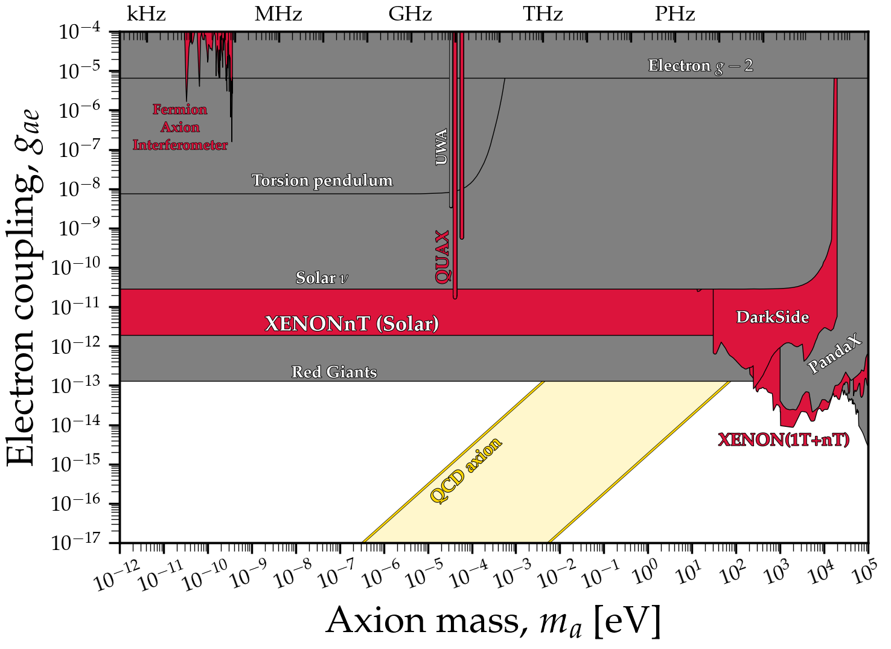

# Axion-electron coupling
---

### Basic plot
### [View Notebook (.ipynb)](https://github.com/cajohare/AxionLimits/blob/master/AxionElectron.ipynb)
### [Download (.pdf)](https://github.com/cajohare/AxionLimits/raw/master/plots/AxionElectron.pdf)
### [Download (.png)](https://github.com/cajohare/AxionLimits/raw/master/plots/plots_png/AxionElectron.png)
### &nbsp;
### &nbsp;
---

### Basic plot with projections
### [View Notebook (.ipynb)](https://github.com/cajohare/AxionLimits/blob/master/AxionElectron.ipynb)
### [Download (.pdf)](https://github.com/cajohare/AxionLimits/raw/master/plots/AxionElectron_with_Projections.pdf)
### [Download (.png)](https://github.com/cajohare/AxionLimits/raw/master/plots/plots_png/AxionElectron_with_Projections.png)
### &nbsp;
### &nbsp;
---

### Closeup of underground detectors
### [View Notebook (.ipynb)](https://github.com/cajohare/AxionLimits/blob/master/AxionElectron.ipynb)
### [Download (.pdf)](https://github.com/cajohare/AxionLimits/raw/master/plots/AxionElectron_UndergroundDetectorsCloseup.pdf)
### [Download (.png)](https://github.com/cajohare/AxionLimits/raw/master/plots/plots_png/AxionElectron_UndergroundDetectorsCloseup.png)
### &nbsp;
### &nbsp;
---

### European particle physics strategy version
### [View Notebook (.ipynb)](https://github.com/cajohare/AxionLimits/blob/master/UltraSimplifiedPlots.ipynb)
### [Download (.pdf)](https://github.com/cajohare/AxionLimits/raw/master/plots/COSTActionSummaryPlot_AxionElectron.pdf)
### [Download (.png)](https://github.com/cajohare/AxionLimits/raw/master/plots/plots_png/COSTActionSummaryPlot_AxionElectron.png)
### &nbsp;
### &nbsp;
### &nbsp;
---

See [Berlin et al. 2023](https://arxiv.org/abs/2312.11601) for a summary of the physical effects of electron-coupled axions, where several of these limits and projections were compiled. I thank Kevin Zhou and Alex Millar for discussions related to this plot.

# Data files and references

### Laboratory bounds
* Electron g-2: [limit](https://github.com/cajohare/AxionLimits/raw/master/limit_data/AxionElectron/Electron_g-2.txt), [reference](https://link.springer.com/article/10.1140/epjc/s10052-019-7442-8)
* Torsion pendulum (dipole-dipole force): [limit](https://github.com/cajohare/AxionLimits/raw/master/limit_data/AxionElectron/TorsionPendulum-Spin.txt), [reference](https://arxiv.org/abs/1508.02463)

### Underground detectors
* DARWIN: [projection](https://github.com/cajohare/AxionLimits/raw/master/limit_data/AxionElectron/Projections/DARWIN.txt), [reference](https://arxiv.org/abs/1606.07001)
* DarkSide-50: [limit](https://github.com/cajohare/AxionLimits/raw/master/limit_data/AxionElectron/DarkSide.txt), [reference](https://arxiv.org/abs/2207.11968)
* EDELWEISS: [limit](https://github.com/cajohare/AxionLimits/raw/master/limit_data/AxionElectron/EDELWEISS.txt), [projection](https://github.com/cajohare/AxionLimits/raw/master/limit_data/AxionElectron/Projections/EDELWEISS.txt), [reference](https://arxiv.org/abs/1808.02340)
* GERDA: [limit](https://github.com/cajohare/AxionLimits/raw/master/limit_data/AxionElectron/GERDA.txt), [reference](https://arxiv.org/abs/2005.14184)
* LUX: [limit](https://github.com/cajohare/AxionLimits/raw/master/limit_data/AxionElectron/LUX.txt), [reference](https://arxiv.org/abs/1704.02297)
* LZ: [projection](https://github.com/cajohare/AxionLimits/raw/master/limit_data/AxionElectron/Projections/LZ.txt), [reference](https://arxiv.org/abs/2102.11740)
* PandaX-II: [limit](https://github.com/cajohare/AxionLimits/raw/master/limit_data/AxionElectron/PandaX.txt), [reference](https://arxiv.org/abs/1707.07921)
* Semiconductors [projection](https://github.com/cajohare/AxionLimits/raw/master/limit_data/AxionElectron/Projections/Semiconductors.txt), [reference](https://arxiv.org/abs/1608.01994)
* Spin-orbit coupling [projection](https://github.com/cajohare/AxionLimits/raw/master/limit_data/AxionElectron/Projections/SpinOrbitCoupling.txt), [reference](https://arxiv.org/abs/2202.11716)
* Superconductors [projection](https://github.com/cajohare/AxionLimits/raw/master/limit_data/AxionElectron/Projections/Superconductors.txt), [reference](https://arxiv.org/abs/1604.06800)
* SuperCDMS: [limit](https://github.com/cajohare/AxionLimits/raw/master/limit_data/AxionElectron/SuperCDMS.txt), [reference](https://arxiv.org/abs/1911.11905)
* XENON1T (ALP DM search, S2 only): [limit](https://github.com/cajohare/AxionLimits/raw/master/limit_data/AxionElectron/XENON1T_DM_S2.txt), [reference](https://arxiv.org/abs/1907.11485)
* XENON1T (ALP DM search S1+S2): [limit](https://github.com/cajohare/AxionLimits/raw/master/limit_data/AxionElectron/XENON1T_DM_S1S2.txt), [reference](https://arxiv.org/abs/2006.09721)
* XENON1T (ALP DM search single electron): [limit](https://github.com/cajohare/AxionLimits/raw/master/limit_data/AxionElectron/XENON1T_DM_SE.txt), [reference](https://arxiv.org/abs/2112.12116)
* XENON1T (Solar axion basin): [limit](https://github.com/cajohare/AxionLimits/raw/master/limit_data/AxionElectron/XENON1T_S2_SolarAxionBasin.txt), [reference](https://arxiv.org/abs/2006.12431)
* XENONnT (ALP DM): [limit](https://github.com/cajohare/AxionLimits/raw/master/limit_data/AxionElectron/XENONnT.txt), [reference](https://arxiv.org/abs/2207.11330)
* XENONnT (Solar axions): [limit](https://github.com/cajohare/AxionLimits/raw/master/limit_data/AxionElectron/XENONnT_Solar.txt), [reference](https://arxiv.org/abs/2207.11330)

### Haloscopes:
* Axion-wind multilayer:  [projection (SQL)](https://github.com/cajohare/AxionLimits/raw/master/limit_data/AxionElectron/Projections/AxionWindMultilayer.txt), [projection (Single photon)](https://github.com/cajohare/AxionLimits/raw/master/limit_data/AxionElectron/Projections/AxionWindMultilayer_SinglePhoton.txt),  [reference](https://arxiv.org/abs/2312.11601)
* Axion-magnon conversion (scanning):  [projection](https://github.com/cajohare/AxionLimits/raw/master/limit_data/AxionElectron/Projections/MagnonScan.txt),  [reference1](https://arxiv.org/abs/2005.10256),  [reference2](https://arxiv.org/abs/2001.10666)
* Electron Storage Ring: [projection](https://github.com/cajohare/AxionLimits/raw/master/limit_data/AxionElectron/Projections/ElectronStorageRing.txt),  [reference](https://arxiv.org/abs/2211.08439)
* Fermionic Axion Interferometer:  [limit](https://github.com/cajohare/AxionLimits/raw/master/limit_data/AxionElectron/FermionicAxionInterferometer.txt),  [reference](https://arxiv.org/abs/2311.16364)
* Magnon quantum nondemolition:  [limit](https://github.com/cajohare/AxionLimits/raw/master/limit_data/AxionElectron/Magnons.txt),  [reference](https://arxiv.org/abs/2102.08764)
* MOSAIC [projection](https://github.com/cajohare/AxionLimits/raw/master/limit_data/AxionElectron/Projections/MOSAIC.txt), [reference](https://arxiv.org/abs/2504.16160)
* NV Centers [projection](https://github.com/cajohare/AxionLimits/raw/master/limit_data/AxionElectron/Projections/NVCenters.txt), [reference](https://arxiv.org/abs/2302.12756)
* Old comagnetometers:  [limit](https://github.com/cajohare/AxionLimits/raw/master/limit_data/AxionElectron/OldComagnetometers.txt),  [reference](https://arxiv.org/abs/1907.03767)
* Future comagnetometers:  [projection](https://github.com/cajohare/AxionLimits/raw/master/limit_data/AxionElectron/Projections/FutureComagnetometers.txt),  [reference](https://arxiv.org/abs/1907.03767)
* QUAX:  [limit](https://github.com/cajohare/AxionLimits/raw/master/limit_data/AxionElectron/QUAX.txt),  [reference 2018](https://arxiv.org/abs/1806.00310), [reference 2020](https://arxiv.org/abs/2001.08940)
* Torsion pendulum (DM search):  [limit](https://github.com/cajohare/AxionLimits/raw/master/limit_data/AxionElectron/TorsionPendulum-DM.txt),  [reference](https://arxiv.org/abs/1902.04246)
* Torsion pendulum (projection):  [limit](https://github.com/cajohare/AxionLimits/raw/master/limit_data/AxionElectron/Projections/TorsionPendulum-DM.txt),  [reference](https://arxiv.org/abs/1709.07852)
* YIG:  [projection](https://github.com/cajohare/AxionLimits/raw/master/limit_data/AxionElectron/Projections/YIG.txt),  [reference](https://arxiv.org/abs/2001.10666)

### Astro bounds:
* Freeze-in ALPs (irreducible axions): [limit](https://github.com/cajohare/AxionLimits/raw/master/limit_data/AxionElectron/IrreducibleFreezeIn.txt), [reference](https://arxiv.org/abs/2209.06216)
* Red giant branch: [limit](https://github.com/cajohare/AxionLimits/raw/master/limit_data/AxionElectron/RedGiants.txt), [reference](https://arxiv.org/abs/2007.03694)
* Solar neutrinos: [limit](https://github.com/cajohare/AxionLimits/raw/master/limit_data/AxionElectron/SolarNu.txt), [reference](https://arxiv.org/abs/0807.2926)
* White dwarf hint: [limit](https://github.com/cajohare/AxionLimits/raw/master/limit_data/AxionElectron/WDhint.txt), [reference](https://arxiv.org/abs/1708.02111)
* X-rays (1-loop decay to photons): [limit](https://github.com/cajohare/AxionLimits/raw/master/limit_data/AxionElectron/Xray_1loop.txt), [reference](https://arxiv.org/abs/2202.08858)
