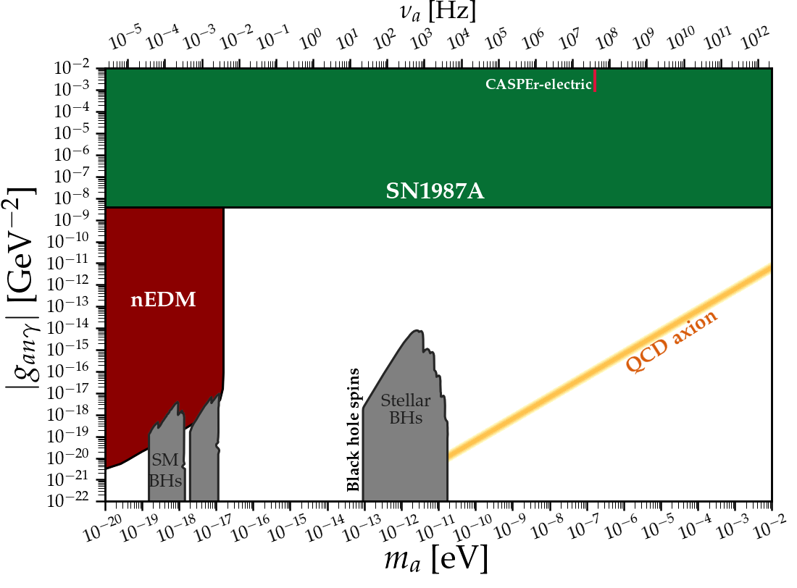
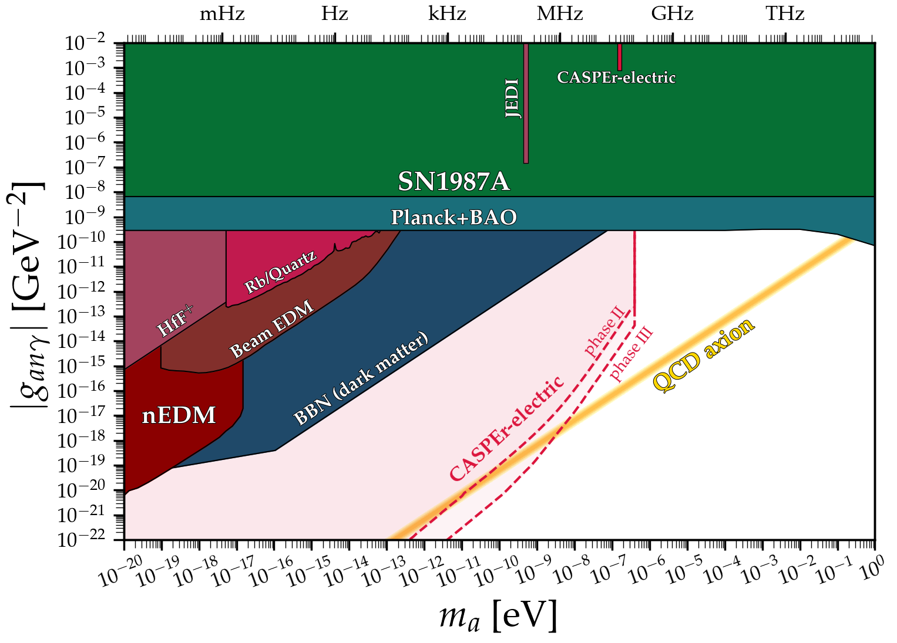

# Axion-EDM coupling
---

## Basic plot
### [View Notebook (.ipynb)](https://github.com/cajohare/AxionLimits/blob/master/AxionEDM.ipynb)
### [Download (.pdf)](https://github.com/cajohare/AxionLimits/raw/master/plots/AxionEDM.pdf)
### [Download (.png)](https://github.com/cajohare/AxionLimits/raw/master/plots/plots_png/AxionEDM.png)
### &nbsp;
### &nbsp;
---

## Plot with projections
### [View Notebook (.ipynb)](https://github.com/cajohare/AxionLimits/blob/master/AxionEDM.ipynb)
### [Download (.pdf)](https://github.com/cajohare/AxionLimits/raw/master/plots/AxionEDM_with_Projections.pdf)
### [Download (.png)](https://github.com/cajohare/AxionLimits/raw/master/plots/plots_png/AxionEDM_with_Projections.png)
### &nbsp;
### &nbsp;
---

It must be noted that this plot and the 1/fa plot are, at best, challenging to interpret from any theoretical point of view. They should not be taken any more seriously than simply a comparison of experimental sensitivities. The area outside of the QCD line here requires significant (and rarely natural) model-building. In essence one needs a "QCD" axion whose mass is different from than the mass arising just from the anomalous gluon coupling of the axion (which defines 1/f_a). There are very few models that achieve this naturally, such as the Z_N axion model of Hook (https://arxiv.org/abs/1802.10093), developed phenomenologically by Di Luzio et al. (https://arxiv.org/pdf/2102.00012.pdf)

# Data files and references

## Experiments
* Beam EDM: [limit](https://github.com/cajohare/AxionLimits/raw/master/limit_data/AxionEDM/BeamEDM.txt), [reference](https://arxiv.org/abs/2204.01454)
* CASPEr-electric: [limit](https://github.com/cajohare/AxionLimits/raw/master/limit_data/AxionEDM/CASPEr-electric.txt), [reference](https://arxiv.org/abs/2101.01241)
* CASPEr-electric projections: [phase I](https://github.com/cajohare/AxionLimits/raw/master/limit_data/AxionEDM/Projections/CASPEr-electric-PhaseI.txt), [phase II](https://github.com/cajohare/AxionLimits/raw/master/limit_data/AxionEDM/Projections/CASPEr-electric-PhaseII.txt), [phase III](https://github.com/cajohare/AxionLimits/raw/master/limit_data/AxionEDM/Projections/CASPEr-electric-PhaseIII.txt), [reference](https://arxiv.org/abs/1711.08999)
* HfH+: [limit](https://github.com/cajohare/AxionLimits/raw/master/limit_data/AxionEDM/HfH.txt), [reference](https://journals.aps.org/prl/abstract/10.1103/PhysRevLett.126.171301)
* JEDI: [limit](https://github.com/cajohare/AxionLimits/raw/master/limit_data/AxionEDM/JEDI.txt), [reference](https://arxiv.org/abs/2208.07293)
* nEDM: [limit](https://github.com/cajohare/AxionLimits/raw/master/limit_data/AxionEDM/nEDM.txt), [reference](https://arxiv.org/abs/1708.06367)
* Storage Ring EDM (Projection): [limit](https://github.com/cajohare/AxionLimits/raw/master/limit_data/AxionEDM/Projections/StorageRingEDM.txt), [reference](https://arxiv.org/abs/1710.05271)

## Astro bounds
* BBN (axion assumed to be dark matter): [limit](https://github.com/cajohare/AxionLimits/raw/master/limit_data/AxionEDM/BBN.txt), [reference](https://arxiv.org/abs/1401.6460)
* Planck+BAO thermal ALP bound: [limit](https://github.com/cajohare/AxionLimits/raw/master/limit_data/AxionEDM/SN1987A.txt), [reference](https://arxiv.org/abs/2205.01637)
* SN1987A: [limit](https://github.com/cajohare/AxionLimits/raw/master/limit_data/AxionEDM/SN1987A.txt), [reference](https://arxiv.org/abs/2203.15812)
