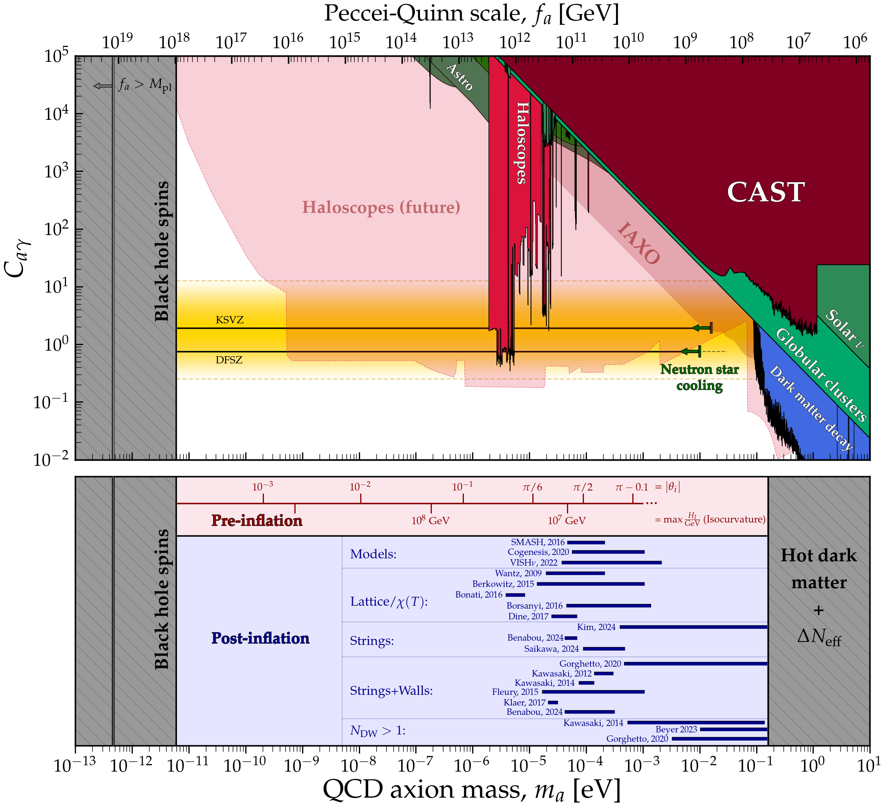
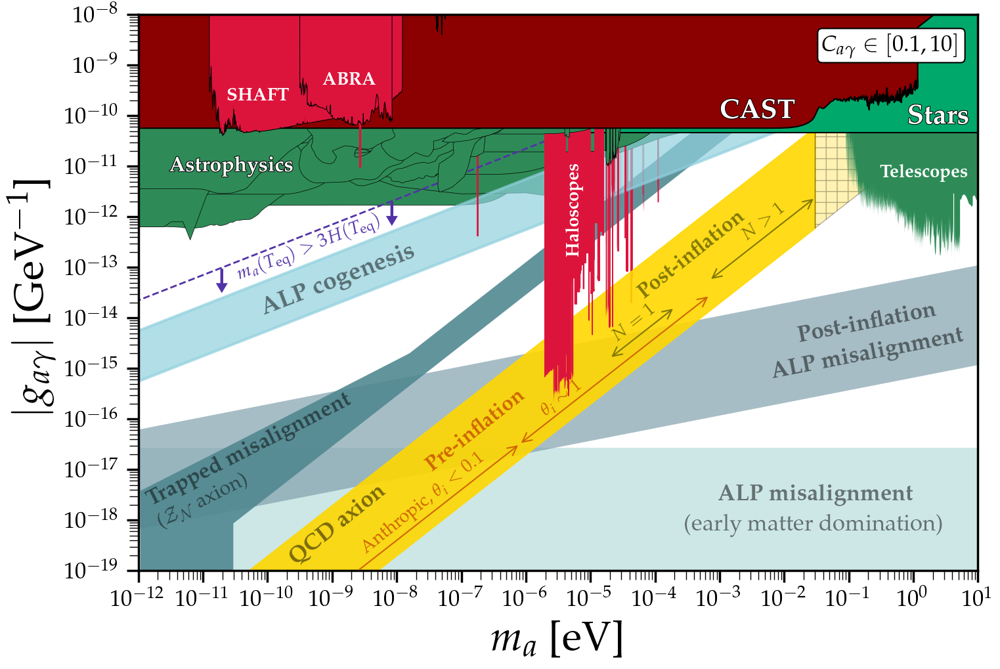

# Axion dark matter theory predictions
---

## QCD axion (axion-photon coupling)
### [View Notebook (.ipynb)](https://github.com/cajohare/AxionLimits/blob/master/AxionMass.ipynb)
### [Download (.pdf)](https://github.com/cajohare/AxionLimits/raw/master/plots/AxionMass.pdf)
### [Download (.png)](https://github.com/cajohare/AxionLimits/raw/master/plots/plots_png/AxionMass.png)
### &nbsp;
### &nbsp;
### &nbsp;
### &nbsp;
---

## QCD axion (haloscope closeup)
### [View Notebook (.ipynb)](https://github.com/cajohare/AxionLimits/blob/master/AxionPhoton_TheoryPredictions.ipynb)
### [Download (.pdf)](https://github.com/cajohare/AxionLimits/raw/master/plots/AxionPhoton_RadioFreqCloseup_withTheory.pdf)
### [Download (.png)](https://github.com/cajohare/AxionLimits/raw/master/plots/plots_png/AxionPhoton_RadioFreqCloseup_withTheory.png)
### &nbsp;
### &nbsp;
### &nbsp;
---

## Other DM predictions
### [View Notebook (.ipynb)](https://github.com/cajohare/AxionLimits/blob/master/ALPDarkMatter.ipynb)
### [Download (.pdf)](https://github.com/cajohare/AxionLimits/raw/master/plots/AxionPhoton_ALPDM.pdf)
### [Download (.png)](https://github.com/cajohare/AxionLimits/raw/master/plots/plots_png/AxionPhoton_ALPDM.png)
### &nbsp;
### &nbsp;
### &nbsp;
### &nbsp;
### &nbsp;
---

## Files and references

Click [here](https://github.com/cajohare/AxionLimits/raw/master/limit_data/AxionPhoton/Haloscopes_Combined_microeV-meV.txt) for a .txt file of all haloscopes combined

Click [here](https://github.com/cajohare/AxionLimits/raw/master/limit_data/AxionPhoton/Projections/HaloscopeProjections_Combined.txt) for .txt file of all haloscope **projections** combined

### QCD Axion masses:
* Ballesteros et al. (SMASH): [prediction](https://github.com/cajohare/AxionLimits/raw/master/limit_data/AxionMass/Ballesteros16.txt),  [reference](https://arxiv.org/abs/1608.05414)
* Berkowitz et al.: [prediction](https://github.com/cajohare/AxionLimits/raw/master/limit_data/AxionMass/Berkowitz15.txt),  [reference](https://arxiv.org/abs/1505.07455)
* Bonati et al.: [prediction](https://github.com/cajohare/AxionLimits/raw/master/limit_data/AxionMass/Bonati16.txt),  [reference](https://arxiv.org/abs/1512.06746)
* Borsanyi et al.: [prediction](https://github.com/cajohare/AxionLimits/raw/master/limit_data/AxionMass/Borsanyi16.txt),  [reference](https://arxiv.org/abs/1606.07494)
* Buschmann et al. (2020): [prediction](https://github.com/cajohare/AxionLimits/raw/master/limit_data/AxionMass/Buschmann20.txt),  [reference](https://arxiv.org/abs/1906.00967)
* Buschmann et al. (2021): [prediction](https://github.com/cajohare/AxionLimits/raw/master/limit_data/AxionMass/Buschmann21.txt),  [reference](https://arxiv.org/abs/2108.05368)
* Co et al. (2020): [prediction](https://github.com/cajohare/AxionLimits/raw/master/limit_data/AxionMass/Co20.txt),  [reference](https://arxiv.org/abs/2006.04809)
* Dine et al.: [prediction](https://github.com/cajohare/AxionLimits/raw/master/limit_data/AxionMass/Dine17.txt),  [reference](https://arxiv.org/abs/1705.00676)
* Fleury and Moore: [prediction](https://github.com/cajohare/AxionLimits/raw/master/limit_data/AxionMass/Fleury15.txt),  [reference](https://arxiv.org/abs/1509.00026)
* Klaer and Moore: [prediction](https://github.com/cajohare/AxionLimits/raw/master/limit_data/AxionMass/Klaer17.txt),  [reference](https://arxiv.org/abs/1708.07521)
* Petreczky et al.: [prediction](https://github.com/cajohare/AxionLimits/raw/master/limit_data/AxionMass/Petreczky16.txt),  [reference](https://arxiv.org/abs/1606.03145)
* VISHnu.: [prediction](https://github.com/cajohare/AxionLimits/raw/master/limit_data/AxionMass/VISHnu.txt),  [reference](https://arxiv.org/abs/2206.11598)
* Saikawa et al. (N_DW=6).: [prediction](https://github.com/cajohare/AxionLimits/raw/master/limit_data/AxionMass/SaikawaDW_6_10.txt),  [reference](https://arxiv.org/abs/1412.0789)
* Gorghetto et al. (N_DW=6).: [prediction](https://github.com/cajohare/AxionLimits/raw/master/limit_data/AxionMass/GorghettoDW_6.txt),  [reference](https://arxiv.org/abs/2007.04990)

### Other dark matter predictions
Go to the [notebook](https://github.com/cajohare/AxionLimits/blob/master/ALPDarkMatter.ipynb) for details on plotting
* ALP Cogenesis [reference](https://arxiv.org/abs/2006.04809)
* Early matter domination [reference](https://arxiv.org/abs/1905.06952)
* Post-inflation misalignment [reference](https://arxiv.org/abs/2112.05117)
* Trapped misalignment [reference](https://arxiv.org/abs/2102.01082)
