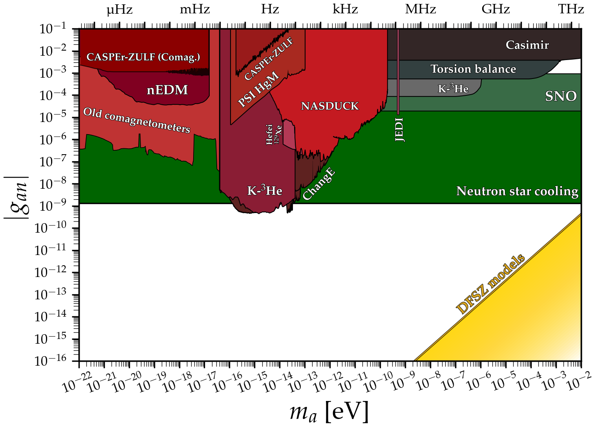

# Axion-neutron coupling
---

## Basic plot
### [View Notebook (.ipynb)](https://github.com/cajohare/AxionLimits/blob/master/AxionNeutron.ipynb)
### [Download (.pdf)](https://github.com/cajohare/AxionLimits/raw/master/plots/AxionNeutron.pdf)
### [Download (.png)](https://github.com/cajohare/AxionLimits/raw/master/plots/plots_png/AxionNeutron.png)
### &nbsp;
### &nbsp;
---

## Plot with projections
### [View Notebook (.ipynb)](https://github.com/cajohare/AxionLimits/blob/master/AxionNeutron.ipynb)
### [Download (.pdf)](https://github.com/cajohare/AxionLimits/raw/master/plots/AxionNeutron_with_Projections.pdf)
### [Download (.png)](https://github.com/cajohare/AxionLimits/raw/master/plots/plots_png/AxionNeutron_with_Projections.png)
### &nbsp;
### &nbsp;
---

# Data files and references

## Haloscopes
Note: CASPEr and nEDM limits account for stochastic correction reported in [1905.13650](https://arxiv.org/abs/1905.13650)
* CASPEr-wind: [projection](https://github.com/cajohare/AxionLimits/raw/master/limit_data/AxionNeutron/Projections/CASPEr_wind.txt), [reference](https://arxiv.org/abs/1711.08999)
* CASPEr-ZULF-Comagnetometer: [limit](https://github.com/cajohare/AxionLimits/raw/master/limit_data/AxionNeutron/CASPEr_Comagnetometer.txt), [reference](https://arxiv.org/abs/1901.10843)
* CASPEr-ZULF-Sidechain: [limit](https://github.com/cajohare/AxionLimits/raw/master/limit_data/AxionNeutron/CASPEr_ZULF.txt), [projection](https://github.com/cajohare/AxionLimits/raw/master/limit_data/AxionNeutron/Projections/CASPEr_ZULF.txt), [reference](https://arxiv.org/abs/1902.04644)
* Electrostatic storage ring: [projection](https://github.com/cajohare/AxionLimits/raw/master/limit_data/AxionNeutron/Projections/ElectrostaticStorageRing.txt), [reference](https://arxiv.org/abs/2211.08439)
* JEDI: [limit](https://github.com/cajohare/AxionLimits/raw/master/limit_data/AxionNeutron/JEDI.txt), [reference](https://arxiv.org/abs/2208.07293)
* nEDM (ultracold neutrons and mercury): [limit](https://github.com/cajohare/AxionLimits/raw/master/limit_data/AxionNeutron/nEDM.txt), [reference](https://arxiv.org/abs/1708.06367)
* NASDUCK (Floquet): [limit](https://github.com/cajohare/AxionLimits/raw/master/limit_data/AxionNeutron/NASDUCK.txt), [reference](https://arxiv.org/abs/2105.04603)
* NASDUCK (SERF): [limit](https://github.com/cajohare/AxionLimits/raw/master/limit_data/AxionNeutron/NASDUCK-SERF.txt), [reference](https://arxiv.org/abs/2209.13588)
* PSI HgM: [limit](https://github.com/cajohare/AxionLimits/raw/master/limit_data/AxionNeutron/PSI_HgM.txt), [reference](https://arxiv.org/abs/2212.02403)
* Superfluid helium-3 HPD [projection](https://github.com/cajohare/AxionLimits/raw/master/limit_data/AxionNeutron/Projections/SuperfluidHe3.txt) [limit](https://arxiv.org/abs/2208.14454)
* K-3He comagnetometer: [limit](https://github.com/cajohare/AxionLimits/raw/master/limit_data/AxionNeutron/K-3He_Comagnetometer_DarkMatter.txt), [reference](https://arxiv.org/abs/2209.03289)
* Old comagnetometers: [limit](https://github.com/cajohare/AxionLimits/raw/master/limit_data/AxionNeutron/OldComagnetometers.txt), [reference](https://arxiv.org/abs/1907.03767)
* Future comagnetometers: [projection](https://github.com/cajohare/AxionLimits/raw/master/limit_data/AxionNeutron/Projections/FutureComagnetometers.txt), [reference](https://arxiv.org/abs/1907.03767)

## Fifth force
* Casimir effect: [limit](https://github.com/cajohare/AxionLimits/raw/master/limit_data/AxionNeutron/Casimir), [reference](https://arxiv.org/abs/2009.04517)
* K-3He comagnetometer: [limit](https://github.com/cajohare/AxionLimits/raw/master/limit_data/AxionNeutron/K-3He_Comagnetometer.txt), [reference](https://arxiv.org/abs/0809.4700)
* Torsion balance: [limit](https://github.com/cajohare/AxionLimits/raw/master/limit_data/AxionNeutron/TorsionBalance.txt), [reference](https://arxiv.org/abs/hep-ph/0611223)

## Other experiments
* SNO (deuterium dissasociation): [limit](https://github.com/cajohare/AxionLimits/raw/master/limit_data/AxionNeutron/SNO.txt), [reference](https://arxiv.org/abs/2004.02733)

## Astro bounds
* Astrophysical Black hole spins: [limit](https://github.com/cajohare/AxionLimits/raw/master/limit_data/fa/BlackHoleSpins_Mehta.txt), [reference](https://arxiv.org/abs/2011.08693)
* Neutron star cooling: [limit](https://github.com/cajohare/AxionLimits/raw/master/limit_data/AxionNeutron/NeutronStars.txt), [reference](https://arxiv.org/abs/2111.09892)
* SN1987 Cooling: [limit](https://github.com/cajohare/AxionLimits/raw/master/limit_data/AxionNeutron/SN1987A.txt), [reference](https://arxiv.org/abs/1906.11844)
