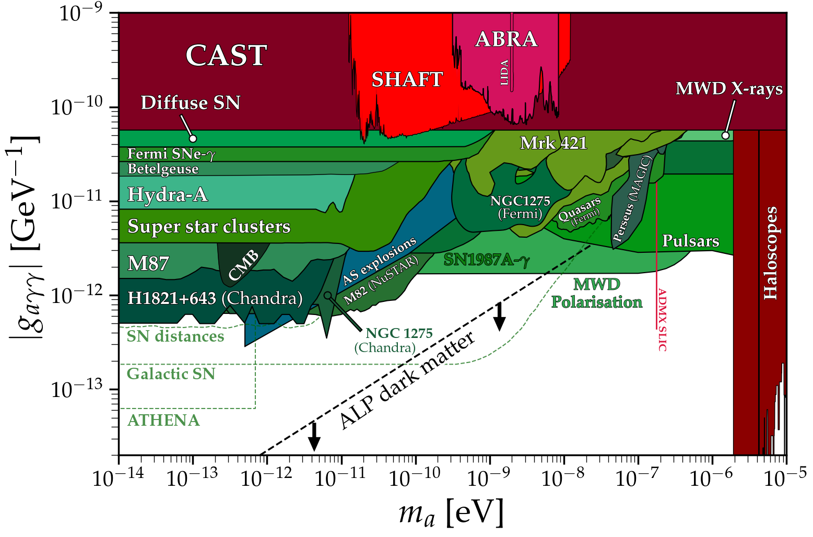
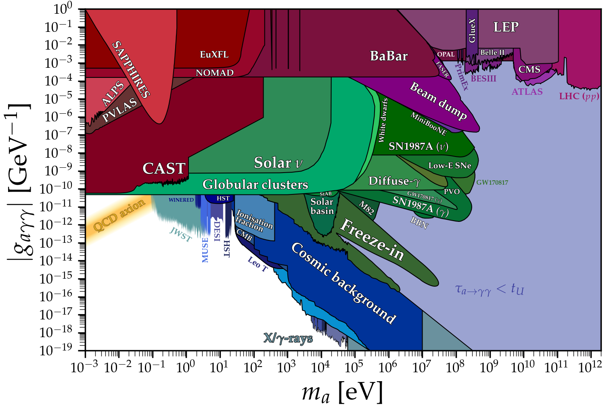
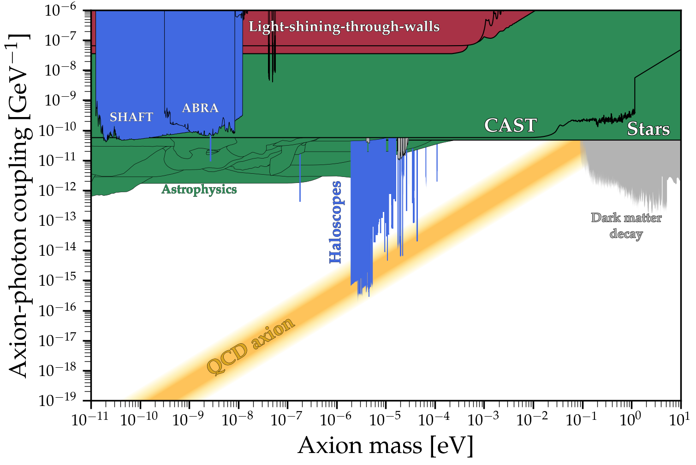
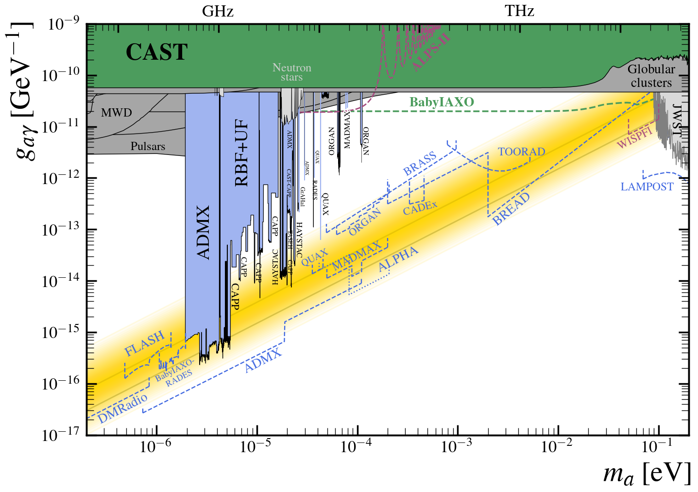

# Axion-photon coupling
---

## Basic plot
### [View Notebook (.ipynb)](https://github.com/cajohare/AxionLimits/blob/master/AxionPhoton.ipynb)
### [Download (.pdf)](https://github.com/cajohare/AxionLimits/raw/master/plots/AxionPhoton.pdf)
### [Download (.png)](https://github.com/cajohare/AxionLimits/raw/master/plots/plots_png/AxionPhoton.png)
### &nbsp;
---

## Basic plot with projections
### [View Notebook (.ipynb)](https://github.com/cajohare/AxionLimits/blob/master/AxionPhoton.ipynb)
### [Download (.pdf)](https://github.com/cajohare/AxionLimits/raw/master/plots/AxionPhoton_with_Projections.pdf)
### [Download (.png)](https://github.com/cajohare/AxionLimits/raw/master/plots/plots_png/AxionPhoton_with_Projections.png)
### &nbsp;
---

## Helioscope closeup
### [View Notebook (.ipynb)](https://github.com/cajohare/AxionLimits/blob/master/AxionPhoton_Closeups.ipynb)
### [Download (.pdf)](https://github.com/cajohare/AxionLimits/raw/master/plots/AxionPhoton_IAXOCloseup.pdf)
### [Download (.png)](https://github.com/cajohare/AxionLimits/raw/master/plots/plots_png/AxionPhoton_IAXOCloseup.png)
### &nbsp;
---

## High energy astrophysics limits closeup
### [View Notebook (.ipynb)](https://github.com/cajohare/AxionLimits/blob/master/AxionPhoton_Closeups.ipynb)
### [Download (.pdf)](https://github.com/cajohare/AxionLimits/raw/master/plots/AxionPhoton_AstroCloseUp.pdf)
### [Download (.png)](https://github.com/cajohare/AxionLimits/raw/master/plots/plots_png/AxionPhoton_AstroCloseUp.png)
### &nbsp;
---

## Haloscopes closeup
### [View Notebook (.ipynb)](https://github.com/cajohare/AxionLimits/blob/master/AxionPhoton_Closeups.ipynb)
### [Download (.pdf)](https://github.com/cajohare/AxionLimits/raw/master/plots/AxionPhoton_RadioFreqCloseup.pdf)
### [Download (.png)](https://github.com/cajohare/AxionLimits/raw/master/plots/plots_png/AxionPhoton_RadioFreqCloseup.png)
### &nbsp;
---

## Ultralight axions
### [View Notebook (.ipynb)](https://github.com/cajohare/AxionLimits/blob/master/AxionPhoton_Ultralight.ipynb)
### [Download (.pdf)](https://github.com/cajohare/AxionLimits/raw/master/plots/AxionPhoton_Ultralight_with_Projections.pdf)
### [Download (.png)](https://github.com/cajohare/AxionLimits/raw/master/plots/plots_png/AxionPhoton_Ultralight_with_Projections.png)
### &nbsp;
---

## Heavy axions
### [View Notebook (.ipynb)](https://github.com/cajohare/AxionLimits/blob/master/AxionPhoton_ColliderBounds.ipynb)
### [Download (.pdf)](https://github.com/cajohare/AxionLimits/raw/master/plots/AxionPhoton_HighMass.pdf)
### [Download (.png)](https://github.com/cajohare/AxionLimits/raw/master/plots/plots_png/AxionPhoton_HighMass.png)
### &nbsp;
---

## Simplified plot
### [View Notebook (.ipynb)](https://github.com/cajohare/AxionLimits/blob/master/SimplifiedPlots.ipynb)
### [Download (.pdf)](https://github.com/cajohare/AxionLimits/raw/master/plots/AxionPhoton_Simple_Wide.pdf)
### [Download (.png)](https://github.com/cajohare/AxionLimits/raw/master/plots/plots_png/AxionPhoton_Simple_Wide.png)
### &nbsp;
---

## FIPs White Paper version 
### [View Notebook (.ipynb)](https://github.com/cajohare/AxionLimits/blob/master/FIPS.ipynb)
### [Download (.pdf)](https://github.com/cajohare/AxionLimits/raw/master/plots/AxionPhoton_FIPS.pdf)
### [Download (.png)](https://github.com/cajohare/AxionLimits/raw/master/plots/plots_png/AxionPhoton_FIPS.png)
### &nbsp;
### &nbsp;
### &nbsp;
---

## FIPs White Paper version (closeup)
### [View Notebook (.ipynb)](https://github.com/cajohare/AxionLimits/blob/master/FIPS.ipynb)
### [Download (.pdf)](https://github.com/cajohare/AxionLimits/raw/master/plots/AxionPhoton_Closeup_FIPS.pdf)
### [Download (.png)](https://github.com/cajohare/AxionLimits/raw/master/plots/plots_png/AxionPhoton_Closeup_FIPS.png)
### &nbsp;
### &nbsp;
### &nbsp;
---

## Data files and references

### Haloscopes:

Click [here](https://github.com/cajohare/AxionLimits/raw/master/limit_data/AxionPhoton/Haloscopes_Combined_microeV-meV.txt) for a .txt file of all haloscopes combined (except ABRA and SHAFT)

Click [here](https://github.com/cajohare/AxionLimits/raw/master/limit_data/AxionPhoton/Projections/HaloscopeProjections_Combined.txt) for .txt file of all haloscope **projections** combined

* ABRACADABRA (Run 1): [limit](https://github.com/cajohare/AxionLimits/raw/master/limit_data/AxionPhoton/ABRACADABRA.txt),  [reference](https://arxiv.org/abs/1810.12257)
* ABRACADABRA (Run 2): [limit](https://github.com/cajohare/AxionLimits/raw/master/limit_data/AxionPhoton/ABRACADABRA_run2.txt), [reference](https://arxiv.org/abs/2102.06722)
* ABRACADABRA (Projection) [projection](https://github.com/cajohare/AxionLimits/raw/master/limit_data/AxionPhoton/Projections/ABRACADABRA.txt), [reference](https://abracadabra.mit.edu/)
* ADBC: [projection](https://github.com/cajohare/AxionLimits/raw/master/limit_data/AxionPhoton/Projections/ADBC.txt), [reference](https://arxiv.org/abs/1809.01656)
* ADMX (2010): [limit](https://github.com/cajohare/AxionLimits/raw/master/limit_data/AxionPhoton/ADMX.txt), [reference](https://arxiv.org/abs/0910.5914)
* ADMX (2018): [limit](https://github.com/cajohare/AxionLimits/raw/master/limit_data/AxionPhoton/ADMX2018.txt), [reference](https://arxiv.org/abs/1804.05750)
* ADMX (2019): [limit1](https://github.com/cajohare/AxionLimits/raw/master/limit_data/AxionPhoton/ADMX2019_1.txt), [limit2](https://github.com/cajohare/AxionLimits/raw/master/limit_data/AxionPhoton/ADMX2019_2.txt), [reference](https://arxiv.org/abs/1910.08638)
* ADMX (2021): [limit](https://github.com/cajohare/AxionLimits/raw/master/limit_data/AxionPhoton/ADMX2021.txt), [reference](https://arxiv.org/abs/2110.06096)
* ADMX Sidecar: [limit](https://github.com/cajohare/AxionLimits/raw/master/limit_data/AxionPhoton/ADMX_Sidecar.txt), [reference](https://arxiv.org/abs/1901.00920)
* ADMX Sidecar (JTWPA): [limit](https://github.com/cajohare/AxionLimits/raw/master/limit_data/ADMX_Sidecar_JTWPA.txt), [reference](https://arxiv.org/abs/2110.10262)
* ADMX SLIC: [limit](https://github.com/cajohare/AxionLimits/raw/master/limit_data/AxionPhoton/ADMX_SLIC.txt), [reference](https://arxiv.org/abs/1911.05772)
* ADMX Projection: [projection](https://github.com/cajohare/AxionLimits/raw/master/limit_data/AxionPhoton/Projections/ADMX_Projected.txt),  [reference](https://arxiv.org/abs/1612.08296)
* aLIGO: [projection](https://github.com/cajohare/AxionLimits/raw/master/limit_data/AxionPhoton/Projections/aLIGO.txt), [reference](https://arxiv.org/abs/1903.02017)
* ALPHA: [projection](https://github.com/cajohare/AxionLimits/raw/master/limit_data/AxionPhoton/Projections/PlasmaHaloscope.txt), [reference](https://arxiv.org/abs/1904.11872)
* BASE: [limit](https://github.com/cajohare/AxionLimits/raw/master/limit_data/AxionPhoton/BASE.txt), [reference](https://arxiv.org/abs/2101.11290)
* BRASS: [projection](https://github.com/cajohare/AxionLimits/raw/master/limit_data/AxionPhoton/Projections/BRASS.txt), [reference](https://www1.physik.uni-hamburg.de/iexp/gruppe-horns/forschung/brass.html)
* BREAD: [projection](https://github.com/cajohare/AxionLimits/raw/master/limit_data/AxionPhoton/Projections/BREAD.txt), [reference](https://arxiv.org/abs/2111.12103)
* CADEx: [projection](https://github.com/cajohare/AxionLimits/raw/master/limit_data/AxionPhoton/Projections/CADEx.txt), [reference](https://arxiv.org/abs/2206.02980)
* CAPP-1: [limit](https://github.com/cajohare/AxionLimits/raw/master/limit_data/AxionPhoton/CAPP-1.txt), [reference](https://arxiv.org/abs/2001.05102)
* CAPP-2: [limit](https://github.com/cajohare/AxionLimits/raw/master/limit_data/AxionPhoton/CAPP-2.txt), [reference](https://arxiv.org/abs/2008.10141)
* CAPP-3: [limit](https://github.com/cajohare/AxionLimits/raw/master/limit_data/AxionPhoton/CAPP-3.txt), [reference](https://arxiv.org/abs/2012.10764)
* CAPP-4: [limit](https://github.com/cajohare/AxionLimits/raw/master/limit_data/AxionPhoton/CAPP-4.txt), [reference](https://arxiv.org/abs/2206.08845)
* CAPP-5: [limit](https://github.com/cajohare/AxionLimits/raw/master/limit_data/AxionPhoton/CAPP-5.txt), [reference](https://arxiv.org/abs/2207.13597)
* CAPP-6 (DFSZ): [limit](https://github.com/cajohare/AxionLimits/raw/master/limit_data/AxionPhoton/CAPP-5.txt), [reference](https://arxiv.org/abs/2210.10961)
* CAST-CAPP: [limit](https://github.com/cajohare/AxionLimits/raw/master/limit_data/AxionPhoton/CAST-CAPP.txt), [reference](https://arxiv.org/abs/2211.02902)
* DALI: [projection](https://github.com/cajohare/AxionLimits/raw/master/limit_data/AxionPhoton/Projections/DALI.txt), [reference](https://arxiv.org/abs/2303.03997)
* DANCE concept: [projection](https://github.com/cajohare/AxionLimits/raw/master/limit_data/AxionPhoton/Projections/DANCE.txt), [reference](https://arxiv.org/abs/1911.05196)
* DANCE (2023): [limit](https://github.com/cajohare/AxionLimits/raw/master/limit_data/AxionPhoton/DANCE.txt), [reference](https://arxiv.org/abs/2303.03594)
* DM-Radio: [projection](https://github.com/cajohare/AxionLimits/raw/master/limit_data/AxionPhoton/Projections/DMRadio.txt), [reference](https://arxiv.org/abs/2204.13781)
* FLASH: [projection](https://github.com/cajohare/AxionLimits/raw/master/limit_data/AxionPhoton/Projections/FLASH.txt), [reference](https://indico.cern.ch/event/1115163/)
* GrAHal: [limit](https://github.com/cajohare/AxionLimits/raw/master/limit_data/AxionPhoton/GrAHal.txt), [reference](https://arxiv.org/abs/2110.14406)
* HAYSTAC (2018): [limit (low res.)](https://github.com/cajohare/AxionLimits/raw/master/limit_data/AxionPhoton/HAYSTAC.txt),[limit (high res.)](https://github.com/cajohare/AxionLimits/raw/master/limit_data/AxionPhoton/HAYSTAC_highres.txt), [reference](https://arxiv.org/abs/1803.03690)
* HAYSTAC (2020): [limit (low res.)](https://github.com/cajohare/AxionLimits/raw/master/limit_data/AxionPhoton/HAYSTAC_2020.txt), [limit (high res.)](https://github.com/cajohare/AxionLimits/raw/master/limit_data/AxionPhoton/HAYSTAC_2020_highres.txt), [reference](https://arxiv.org/abs/2008.01853)
* HAYSTAC (2022): [limit](https://github.com/cajohare/AxionLimits/raw/master/limit_data/AxionPhoton/HAYSTAC_2022.txt), [reference](https://arxiv.org/abs/2301.09721)
* LAMPOST: [projection](https://github.com/cajohare/AxionLimits/raw/master/limit_data/AxionPhoton/Projections/LAMPOST.txt), [reference](https://arxiv.org/abs/1803.11455)
* MADMAX: [projection](https://github.com/cajohare/AxionLimits/raw/master/limit_data/AxionPhoton/Projections/MADMAX.txt), [reference](https://arxiv.org/abs/2003.10894)
* ORGAN (2017): [limit](https://github.com/cajohare/AxionLimits/raw/master/limit_data/AxionPhoton/ORGAN.txt), [projection](https://github.com/cajohare/AxionLimits/raw/master/limit_data/AxionPhoton/Projections/ORGAN_Projected.txt), [reference](https://arxiv.org/abs/1706.00209)
* ORGAN-1a (2022): [limit](https://github.com/cajohare/AxionLimits/raw/master/limit_data/AxionPhoton/ORGAN-1a.txt),[reference](https://arxiv.org/abs/2203.12152)
* QUAX (2019): [limit](https://github.com/cajohare/AxionLimits/raw/master/limit_data/AxionPhoton/QUAX.txt), [reference](https://arxiv.org/abs/1903.06547)
* QUAX (2020): [limit](https://github.com/cajohare/AxionLimits/raw/master/limit_data/AxionPhoton/QUAX2.txt), [reference](https://arxiv.org/abs/2012.09498)
* QUAX (2022): [limit](https://github.com/cajohare/AxionLimits/raw/master/limit_data/AxionPhoton/QUAX3.txt), [reference](https://arxiv.org/abs/2208.12670)
* QUAX Projection: [projection](https://github.com/cajohare/AxionLimits/raw/master/limit_data/AxionPhoton/Projections/QUAX2005.txt), [reference](https://agenda.infn.it/event/20431/contributions/137687/attachments/82511/108428/Rettaroli_Patras2021_compressed.pdf)
* RADES: [limit](https://github.com/cajohare/AxionLimits/raw/master/limit_data/AxionPhoton/RADES.txt), [reference](https://arxiv.org/abs/2104.13798)
* RBF: [limit](https://github.com/cajohare/AxionLimits/raw/master/limit_data/AxionPhoton/RBF.txt), [reference](https://journals.aps.org/prl/abstract/10.1103/PhysRevLett.59.839)
* SHAFT: [limit](https://github.com/cajohare/AxionLimits/raw/master/limit_data/AxionPhoton/SHAFT.txt), [reference](https://arxiv.org/abs/2003.03348)
* SRF: [projection](https://github.com/cajohare/AxionLimits/raw/master/limit_data/AxionPhoton/Projections/SRF.txt), [reference](https://arxiv.org/abs/2007.15656)
* SuperMAG: [limit](https://github.com/cajohare/AxionLimits/raw/master/limit_data/AxionPhoton/SuperMAG.txt), [reference](https://arxiv.org/abs/2112.09620)
* TASEH: [limit](https://github.com/cajohare/AxionLimits/raw/master/limit_data/AxionPhoton/TASEH.txt), [reference](https://arxiv.org/abs/2205.05574)
* TOORAD: [projection1](https://github.com/cajohare/AxionLimits/raw/master/limit_data/AxionPhoton/Projections/TOORAD1.txt), [projection2](https://github.com/cajohare/AxionLimits/raw/master/limit_data/AxionPhoton/Projections/TOORAD2.txt), [reference](https://arxiv.org/abs/2102.05366)
* Twisted Anyon Cavity: [projection](https://github.com/cajohare/AxionLimits/raw/master/limit_data/AxionPhoton/Projections/TwistedAnyonCavity.txt), [reference](https://arxiv.org/abs/2208.01640)
* UF: [limit](https://github.com/cajohare/AxionLimits/raw/master/limit_data/AxionPhoton/UF.txt), [reference](https://journals.aps.org/prd/abstract/10.1103/PhysRevD.42.1297)
* UPLOAD (2019): [limit](https://github.com/cajohare/AxionLimits/raw/master/limit_data/AxionPhoton/UPLOAD.txt), [reference](https://arxiv.org/abs/1912.07751)
* UPLOAD (2023): [limit](https://github.com/cajohare/AxionLimits/raw/master/limit_data/AxionPhoton/UPLOAD-2.txt), [reference](https://arxiv.org/abs/2301.06778)
* WISPLC: [projection](https://github.com/cajohare/AxionLimits/raw/master/limit_data/AxionPhoton/Projections/WISPLC.txt), [reference](https://arxiv.org/abs/2111.04541)

### Helioscopes/LSW
* ALPS: [limit](https://github.com/cajohare/AxionLimits/raw/master/limit_data/AxionPhoton/ALPS.txt), [reference](https://arxiv.org/abs/1004.1313)
* ALPS-II: [projection](https://github.com/cajohare/AxionLimits/raw/master/limit_data/AxionPhoton/Projections/ALPS-II.txt), [reference](https://arxiv.org/abs/2009.14294)
* CAST (2007): [limit](https://github.com/cajohare/AxionLimits/raw/master/limit_data/AxionPhoton/CAST_highm.txt), [reference](https://arxiv.org/abs/hep-ex/0702006)
* CAST (2017): [limit](https://github.com/cajohare/AxionLimits/raw/master/limit_data/AxionPhoton/CAST.txt), [reference](https://arxiv.org/abs/1705.02290)
* CROWS: [limit](https://github.com/cajohare/AxionLimits/raw/master/limit_data/AxionPhoton/CROWS.txt), [reference](https://arxiv.org/abs/1310.8098)
* babyIAXO: [projection](https://github.com/cajohare/AxionLimits/raw/master/limit_data/AxionPhoton/Projections/babyIAXO.txt), [reference](https://arxiv.org/abs/1904.09155)
* IAXO: [projection](https://github.com/cajohare/AxionLimits/raw/master/limit_data/AxionPhoton/Projections/IAXO.txt), [reference](https://arxiv.org/abs/1904.09155)
* IAXO+: [projection](https://github.com/cajohare/AxionLimits/raw/master/limit_data/AxionPhoton/Projections/IAXO_plus.txt), [reference](https://arxiv.org/abs/1904.09155)
* IAXO (Galactic SN): [projection](https://github.com/cajohare/AxionLimits/raw/master/limit_data/AxionPhoton/Projections/IAXO_plus_SN_Spica1.txt), [reference](https://arxiv.org/abs/2008.03924)
* OSQAR: [limit](https://github.com/cajohare/AxionLimits/raw/master/limit_data/AxionPhoton/OSQAR.txt), [reference](https://arxiv.org/abs/1506.08082)
* PVLAS: [limit](https://github.com/cajohare/AxionLimits/raw/master/limit_data/AxionPhoton/PVLAS.txt), [reference](https://arxiv.org/abs/1510.08052)
* SAPPHIRES: [limit](https://github.com/cajohare/AxionLimits/raw/master/limit_data/AxionPhoton/SAPPHIRES.txt), [reference](https://arxiv.org/abs/2208.09880)

### Astrophysical searches for axions (green)
* Astrophysical Black hole spins: [limit](https://github.com/cajohare/AxionLimits/raw/master/limit_data/fa/BlackHoleSpins_Mehta.txt), [reference](https://arxiv.org/abs/2011.08693)
* Betelgeuse (NuStar X-ray obs.): [limit](https://github.com/cajohare/AxionLimits/raw/master/limit_data/AxionPhoton/Betelgeuse.txt), [reference](https://arxiv.org/abs/2009.09059)
* Bullet Cluster (Radio): [limit](https://github.com/cajohare/AxionLimits/raw/master/limit_data/AxionPhoton/BulletCluster.txt), [reference](https://arxiv.org/abs/2109.11734)
* Cosmic IR background (axion hint): [limit](https://github.com/cajohare/AxionLimits/raw/master/limit_data/AxionPhoton/CIBER.txt), [reference](https://arxiv.org/abs/1704.05189)
* Chandra (Hydra-A): [limit](https://github.com/cajohare/AxionLimits/raw/master/limit_data/AxionPhoton/Chandra_HYDRA_A.txt), [reference](https://arxiv.org/abs/1304.0989)
* Chandra (M87): [limit](https://github.com/cajohare/AxionLimits/raw/master/limit_data/AxionPhoton/Chandra_M87.txt), [reference](https://arxiv.org/abs/1703.07354)
* Chandra (NGC 1275): [limit](https://github.com/cajohare/AxionLimits/raw/master/limit_data/AxionPhoton/Chandra_NGC1275.txt), [reference](https://arxiv.org/abs/1907.05475)
* Chandra (H1821+643): [limit](https://github.com/cajohare/AxionLimits/raw/master/limit_data/AxionPhoton/Chandra_H1821643.txt), [reference](https://arxiv.org/abs/2109.03261)
* Diffuse SN ALP background: [limit](https://github.com/cajohare/AxionLimits/raw/master/limit_data/AxionPhoton/DSNALP.txt), [reference](https://arxiv.org/abs/2110.03679)
* Diffuse gamma-rays: [limit](https://github.com/cajohare/AxionLimits/raw/master/limit_data/AxionPhoton/DiffuseGammaRays.txt), [reference](https://arxiv.org/abs/2201.09890)
* Distance ladder: [limit](https://github.com/cajohare/AxionLimits/raw/master/limit_data/AxionPhoton/Projections/SN_distances.txt), [reference](https://arxiv.org/abs/2011.05993)
* Fermi-LAT (NGC 1275): [limit](https://github.com/cajohare/AxionLimits/raw/master/limit_data/AxionPhoton/Fermi_bound.txt), [hole](https://github.com/cajohare/AxionLimits/raw/master/limit_data/AxionPhoton/Fermi_hole.txt), [reference](https://arxiv.org/abs/1603.06978)
* Fermi-LAT (Galactic SN): [projection](https://github.com/cajohare/AxionLimits/raw/master/limit_data/AxionPhoton/Projections/FermiSN.txt), [reference](https://arxiv.org/abs/1609.02350)
* Fermi-LAT (Extragalactic SNe): [limit](https://github.com/cajohare/AxionLimits/raw/master/limit_data/AxionPhoton/SNe-gamma.txt), [reference](https://arxiv.org/abs/2006.06722)
* Fermi-LAT (Quasars): [limit](https://github.com/cajohare/AxionLimits/raw/master/limit_data/AxionPhoton/FermiQuasars.txt), [reference](https://arxiv.org/abs/2211.03414)
* Freeze-in ALPs (irreducible axions): [limit](https://github.com/cajohare/AxionLimits/raw/master/limit_data/AxionPhoton/IrreducibleFreezeIn.txt), [reference](https://arxiv.org/abs/2209.06216)
* Globular cluster R-parameter: [limit](https://github.com/cajohare/AxionLimits/raw/master/limit_data/AxionPhoton/GlobularClusters-R.txt), [reference](https://arxiv.org/abs/1406.6053)
* Globular cluster R2-parameter: [limit](https://github.com/cajohare/AxionLimits/raw/master/limit_data/AxionPhoton/GlobularClusters-R2.txt), [reference](https://arxiv.org/abs/2207.03102)
* HAWC (TeV Blazars): [limit](https://github.com/cajohare/AxionLimits/raw/master/limit_data/AxionPhoton/HAWC.txt), [reference](https://arxiv.org/abs/2203.04332)
* HESS (PKS 2155-304): [limit](https://github.com/cajohare/AxionLimits/raw/master/limit_data/AxionPhoton/HESS.txt), [reference](https://arxiv.org/abs/1311.3148)
* Magnetic white dwarf X-rays: [limit1](https://github.com/cajohare/AxionLimits/raw/master/limit_data/AxionPhoton/Chandra_WhiteDwarfs_electron_equals_photon.txt), [limit2](https://github.com/cajohare/AxionLimits/raw/master/limit_data/AxionPhoton/Chandra_WhiteDwarfs_Wphobic.txt), [reference](https://arxiv.org/abs/2104.12772)
* Magnetic white dwarf polarisation: [limit](https://github.com/cajohare/AxionLimits/raw/master/limit_data/AxionPhoton/MWDPolarisation.txt), [reference](https://arxiv.org/abs/2203.04319)
* Mrk 421 (ARGO-YBJ+Fermi): [limit](https://github.com/cajohare/AxionLimits/raw/master/limit_data/AxionPhoton/Mrk421.txt), [reference](https://arxiv.org/abs/2008.09464)
* Mrk 421 (MAGIC+Fermi): [limit](https://github.com/cajohare/AxionLimits/raw/master/limit_data/AxionPhoton/Mrk421-MAGIC.txt), [reference](https://arxiv.org/abs/2110.13636)
* Planck (BBN + N_eff): [limit](https://github.com/cajohare/AxionLimits/raw/master/limit_data/AxionPhoton/BBN_Neff.txt), [reference](https://arxiv.org/abs/2002.08370)
* Pulsar polar caps: [limit](https://github.com/cajohare/AxionLimits/raw/master/limit_data/AxionPhoton/PulsarPolarCap.txt), [reference](https://arxiv.org/abs/2209.09917)
* Solar neutrinos: [limit](https://github.com/cajohare/AxionLimits/raw/master/limit_data/AxionPhoton/SolarNu.txt), [reference](https://arxiv.org/abs/1501.01639)
* Solar basin, DeRocco et al. (NuSTAR): [limit](https://github.com/cajohare/AxionLimits/raw/master/limit_data/AxionPhoton/SolarBasin.txt), [reference](https://arxiv.org/abs/2205.05700)
* Solar basin, Beaufort et al. (NuSTAR and SPHINX): [limit](https://github.com/cajohare/AxionLimits/raw/master/limit_data/AxionPhoton/SolarBasin_Beaufort.txt), [reference](https://arxiv.org/abs/2303.06968)
* SN1987A ALP decay to gammas: [limit](https://github.com/cajohare/AxionLimits/raw/master/limit_data/AxionPhoton/SN1987A_decay.txt), [reference](https://arxiv.org/abs/2304.01060), [see also](https://arxiv.org/abs/2212.09764)
* SN1987A light ALP gamma-ray conversion: [limit](https://github.com/cajohare/AxionLimits/raw/master/limit_data/AxionPhoton/SN1987A_gamma.txt), [reference](https://arxiv.org/abs/2212.09764)
* SN1987A neutrinos: [limit](https://github.com/cajohare/AxionLimits/raw/master/limit_data/AxionPhoton/SN1987A_HeavyALP_nu.txt), [reference](https://arxiv.org/abs/2008.04918)
* SNe (low-energy) ALP decay: [limit](https://github.com/cajohare/AxionLimits/raw/master/limit_data/AxionPhoton/SNe-decay.txt), [reference](https://arxiv.org/abs/2201.09890)
* Super star clusters (NuSTAR Xray): [limit](https://github.com/cajohare/AxionLimits/raw/master/limit_data/AxionPhoton/Xray-SuperStarClusters.txt), [reference](https://arxiv.org/abs/2008.03305)
* White dwarf initial-final mass relation: [limit](https://github.com/cajohare/AxionLimits/raw/master/limit_data/AxionPhoton/WhiteDwarfs.txt), [reference](https://arxiv.org/abs/2102.00379)

### Astrophysical searches for axions as dark matter (blue)
* Axion star explosions: [limit1](https://github.com/cajohare/AxionLimits/raw/master/limit_data/AxionPhoton/AxionStarExplosions-1.txt), [limit2](https://github.com/cajohare/AxionLimits/raw/master/limit_data/AxionPhoton/AxionStarExplosions-2.txt), [reference](https://arxiv.org/abs/2302.10206)
* BICEP/KECK: [limit](https://github.com/cajohare/AxionLimits/raw/master/limit_data/AxionPhoton/BICEP-KECK.txt), [reference](https://arxiv.org/abs/2108.03316)
* Breakthrough Listen (Doppler): [limit](https://github.com/cajohare/AxionLimits/raw/master/limit_data/AxionPhoton/BreakthroughListen.txt), [reference](https://arxiv.org/abs/2112.03439)
* CMB Anisotropies [limit](https://github.com/cajohare/AxionLimits/raw/master/limit_data/AxionPhoton/NeutronStars_BreakthroughListen.txt), [reference](https://arxiv.org/abs/2202.08274)
* COBE/FIRAS + Planck spectral distortions: [limit](https://github.com/cajohare/AxionLimits/raw/master/limit_data/AxionPhoton/CMB_Anisotropies.txt), [reference1](https://arxiv.org/abs/2303.07370), [reference2](https://arxiv.org/abs/2303.07426)
* eROSITA (ALP decay) [projection](https://github.com/cajohare/AxionLimits/raw/master/limit_data/AxionPhoton/Projections/eROSITA.txt), [reference](https://arxiv.org/pdf/2103.13241.pdf)
* Gamma-ray attenuation: [limit](https://github.com/cajohare/AxionLimits/raw/master/limit_data/AxionPhoton/GammaRayAttenuation.txt), [reference](https://arxiv.org/abs/2208.13794)
* HST Cosmic optical background anisotropies (Nakayama and Yin): [limit](https://github.com/cajohare/AxionLimits/raw/master/limit_data/AxionPhoton/HST_Nakayama.txt), [reference](https://arxiv.org/abs/2205.01079)
* HST Cosmic optical background anisotropies (Carenza et al.): [limit](https://github.com/cajohare/AxionLimits/raw/master/limit_data/AxionPhoton/HST.txt), [reference](https://arxiv.org/abs/2301.06560)
* INTEGRAL (ALP decay): [limit](https://github.com/cajohare/AxionLimits/raw/master/limit_data/AxionPhoton/INTEGRAL.txt), [reference](https://arxiv.org/abs/2209.06299)
* Leo T gas temperature: [limit](https://github.com/cajohare/AxionLimits/raw/master/limit_data/AxionPhoton/LeoT.txt), [reference](https://arxiv.org/abs/2111.08025)
* MOJAVE: [limit](https://github.com/cajohare/AxionLimits/raw/master/limit_data/AxionPhoton/MOJAVE.txt), [reference](https://arxiv.org/abs/1811.10997)
* Neutron stars (breakthrough listen) [limit](https://github.com/cajohare/AxionLimits/raw/master/limit_data/AxionPhoton/NeutronStars_BreakthroughListen.txt), [reference](https://arxiv.org/abs/2202.08274)
* Neutron stars (PSR J2144−3933) [limit](https://github.com/cajohare/AxionLimits/raw/master/limit_data/AxionPhoton/NeutronStars_Battye2.txt), [reference](https://arxiv.org/abs/2303.11792)
* NuSTAR (decaying DM): [limit](https://github.com/cajohare/AxionLimits/raw/master/limit_data/AxionPhoton/NuSTAR.txt), compiled from [ref1](https://arxiv.org/abs/1609.00667), [ref2](https://arxiv.org/abs/1901.01262), [ref3](https://arxiv.org/abs/2207.04572)
* POLARBEAR: [limit](https://github.com/cajohare/AxionLimits/raw/master/limit_data/AxionPhoton/POLARBEAR.txt), [reference](https://arxiv.org/abs/2303.08410)
* PPTA+QUIJOTE: [limit](https://github.com/cajohare/AxionLimits/raw/master/limit_data/AxionPhoton/PPTA_QUIJOTE.txt), [reference](https://arxiv.org/abs/2201.03422)
* Pulsar Polarisation Arrays: [projection](https://github.com/cajohare/AxionLimits/raw/master/limit_data/AxionPhoton/Projections/PPA.txt), [reference](https://arxiv.org/abs/2111.10615)
* SPT: [limit](https://github.com/cajohare/AxionLimits/raw/master/limit_data/AxionPhoton/SPT.txt), [reference](https://arxiv.org/abs/2203.16567)
* Telescopes (Haystack): [limit](https://github.com/cajohare/AxionLimits/raw/master/limit_data/AxionPhoton/Telescopes_Haystack.txt), [reference](https://iopscience.iop.org/article/10.1086/318310)
* Telescopes (MUSE Leo-T): [limit](https://github.com/cajohare/AxionLimits/raw/master/limit_data/AxionPhoton/Telescopes_MUSE.txt), [reference](https://arxiv.org/abs/2009.01310)
* Telescopes (VIMOS Abell 2667 and 2390): [limit](https://github.com/cajohare/AxionLimits/raw/master/limit_data/AxionPhoton/Telescopes_VIMOS.txt), [reference](https://arxiv.org/abs/astro-ph/0611502)
* THESEUS (ALP DM decay to Xrays): [projection](https://github.com/cajohare/AxionLimits/raw/master/limit_data/AxionPhoton/Projections/THESEUS.txt), [reference](https://arxiv.org/abs/2008.08306)
* XMM-Newton (decaying DM): [limit](https://github.com/cajohare/AxionLimits/raw/master/limit_data/AxionPhoton/XMM-Newton.txt), [reference](https://arxiv.org/abs/2102.02207)
* 2011 Compilation: [EBL](https://github.com/cajohare/AxionLimits/raw/master/limit_data/AxionPhoton/EBL.txt), [X-rays](https://github.com/cajohare/AxionLimits/raw/master/limit_data/AxionPhoton/XRAY.txt), [x_ion](https://github.com/cajohare/AxionLimits/raw/master/limit_data/AxionPhoton/x_ion.txt), [reference](https://arxiv.org/abs/1110.2895)

### Collider, accelerator and beam dump bounds (purple)
* ATLAS (PbPb): [limit](https://github.com/cajohare/AxionLimits/raw/master/limit_data/AxionPhoton/ATLAS_PbPb.txt), [reference](https://arxiv.org/abs/2008.05355)
* BaBar: [limit](https://github.com/cajohare/AxionLimits/raw/master/limit_data/AxionPhoton/BaBar.txt), [reference](https://link.springer.com/content/pdf/10.1007/JHEP03(2021)190.pdf?pdf=button)
* Beam dump (combined): [limit](https://github.com/cajohare/AxionLimits/raw/master/limit_data/AxionPhoton/BeamDump.txt), [CHARM](https://www.sciencedirect.com/science/article/abs/pii/0370269385904009?via%3Dihub), [E141](https://journals.aps.org/prl/abstract/10.1103/PhysRevLett.59.755), [E137](https://arxiv.org/abs/1709.00009), [NuCal](https://link.springer.com/article/10.1007/BF01548556), [NA64](https://arxiv.org/abs/2005.02710)
* Belle II: [limit](https://github.com/cajohare/AxionLimits/raw/master/limit_data/AxionPhoton/BelleII.txt), [reference](https://arxiv.org/abs/2007.13071)
* BESIII: [limit](https://github.com/cajohare/AxionLimits/raw/master/limit_data/AxionPhoton/BESIII.txt), [reference](https://arxiv.org/abs/2211.12699)
* CMS (PbPb): [limit](https://github.com/cajohare/AxionLimits/raw/master/limit_data/AxionPhoton/CMS_PbPb.txt), [reference](https://arxiv.org/abs/1810.04602)
* CONUS: [projection](https://github.com/cajohare/AxionLimits/raw/master/limit_data/AxionPhoton/Projections/CONUS.txt), [reference](https://arxiv.org/abs/1912.05733)
* DUNE: [projection](https://github.com/cajohare/AxionLimits/raw/master/limit_data/AxionPhoton/Projections/DUNE.txt), [reference](https://arxiv.org/abs/2011.07054)
* FASER (LLP): [projection](https://github.com/cajohare/AxionLimits/raw/master/limit_data/AxionPhoton/Projections/FASER_LLP.txt), [reference](https://arxiv.org/abs/1811.12522)
* LEP: [limit](https://github.com/cajohare/AxionLimits/raw/master/limit_data/AxionPhoton/LEP.txt), [reference](https://arxiv.org/abs/1509.00476)
* LHC (pp): [limit](https://github.com/cajohare/AxionLimits/raw/master/limit_data/AxionPhoton/LHC_pp.txt), [reference](https://arxiv.org/abs/1607.06083)
* NOMAD: [limit](https://github.com/cajohare/AxionLimits/raw/master/limit_data/AxionPhoton/NOMAD.txt), [reference](https://www.sciencedirect.com/science/article/abs/pii/S0370269300003750?via%3Dihub)
* OPAL: [limit](https://github.com/cajohare/AxionLimits/raw/master/limit_data/AxionPhoton/OPAL.txt), [reference](https://arxiv.org/abs/1607.06083)
* PrimEx: [limit](https://github.com/cajohare/AxionLimits/raw/master/limit_data/AxionPhoton/PrimEx.txt), [reference](https://arxiv.org/abs/1903.03586)
