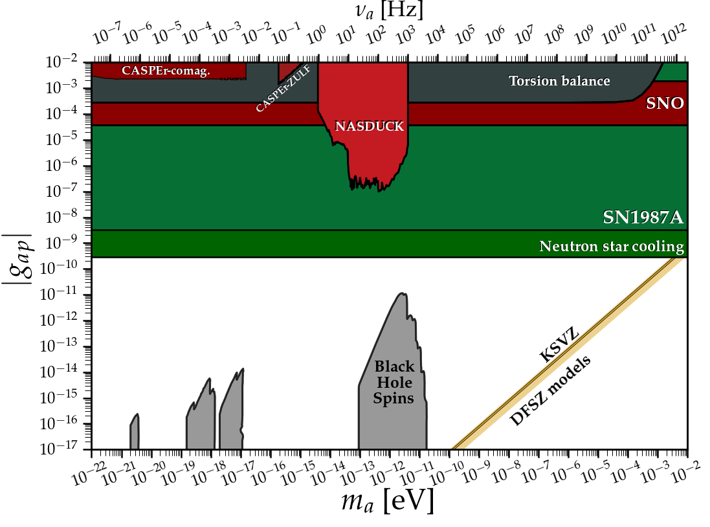

# Axion-proton coupling
---

## Basic plot
### [View Notebook (.ipynb)](https://github.com/cajohare/AxionLimits/blob/master/AxionProton.ipynb)
### [Download (.pdf)](https://github.com/cajohare/AxionLimits/raw/master/plots/AxionProton.pdf)
### [Download (.png)](https://github.com/cajohare/AxionLimits/raw/master/plots/plots_png/AxionProton.png)
### &nbsp;
### &nbsp;
---

## Plot with projections
### [View Notebook (.ipynb)](https://github.com/cajohare/AxionLimits/blob/master/AxionProton.ipynb)
### [Download (.pdf)](https://github.com/cajohare/AxionLimits/raw/master/plots/AxionProton_with_Projections.pdf)
### [Download (.png)](https://github.com/cajohare/AxionLimits/raw/master/plots/plots_png/AxionProton_with_Projections.png)
### &nbsp;
### &nbsp;
---

# Data files and references

## Haloscopes
Note: CASPEr and nEDM limits account for stochastic correction reported in [1905.13650](https://arxiv.org/abs/1905.13650)
* CASPEr-wind: [projection](https://github.com/cajohare/AxionLimits/raw/master/limit_data/AxionNeutron/Projections/CASPEr_wind.txt), [reference](https://arxiv.org/abs/1711.08999)
* CASPEr-ZULF-Comagnetometer: [limit](https://github.com/cajohare/AxionLimits/raw/master/limit_data/AxionNeutron/CASPEr_Comagnetometer.txt), [reference](https://arxiv.org/abs/1901.10843)
* CASPEr-ZULF-Sidechain: [limit](https://github.com/cajohare/AxionLimits/raw/master/limit_data/AxionNeutron/CASPEr_ZULF.txt), [projection](https://github.com/cajohare/AxionLimits/raw/master/limit_data/AxionNeutron/Projections/CASPEr_ZULF.txt), [reference](https://arxiv.org/abs/1902.04644)
* NASDUCK: [limit](https://github.com/cajohare/AxionLimits/raw/master/limit_data/AxionNeutron/NASDUCK.txt), [reference](https://arxiv.org/abs/2105.04603)
* Torsion balance: [limit](https://github.com/cajohare/AxionLimits/raw/master/limit_data/AxionNeutron/TorsionBalance.txt), [reference](https://arxiv.org/abs/hep-ph/0611223)

## Other experiments
* SNO (deuterium dissasociation): [limit](https://github.com/cajohare/AxionLimits/raw/master/limit_data/AxionNeutron/SNO.txt), [reference](https://arxiv.org/abs/2004.02733)
* Proton storage ring: [projection](https://github.com/cajohare/AxionLimits/raw/master/limit_data/AxionNeutron/Projections/StorageRing.txt), [reference](https://arxiv.org/abs/2005.11867)

## Astro bounds
* Astrophysical Black hole spins: [limit](https://github.com/cajohare/AxionLimits/raw/master/limit_data/fa/BlackHoleSpins_Mehta.txt), [reference](https://arxiv.org/abs/2011.08693)
* Neutron star cooling: [limit](https://github.com/cajohare/AxionLimits/raw/master/limit_data/AxionProton/NeutronStars.txt), [reference](https://arxiv.org/abs/2111.09892
* SN1987 Cooling: [limit](https://github.com/cajohare/AxionLimits/raw/master/limit_data/AxionProton/SN1987A.txt), [reference](https://arxiv.org/abs/1906.11844)
