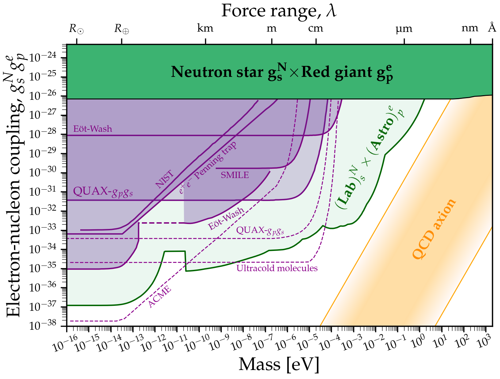

# Axion CP-violating couplings
These plots appeared in the paper [O'Hare & Vitagliano, PRD 102 115026 2021](https://arxiv.org/abs/2010.03889) so if you use them for whatever reason, please cite this paper too
```
@article{OHare:2020wah,
    author = "O'Hare, Ciaran A. J. and Vitagliano, Edoardo",
    title = "{Cornering the axion with $CP$-violating interactions}",
    eprint = "2010.03889",
    archivePrefix = "arXiv",
    primaryClass = "hep-ph",
    reportNumber = "CPPC-2020-16",
    doi = "10.1103/PhysRevD.102.115026",
    journal = "Phys. Rev. D",
    volume = "102",
    number = "11",
    pages = "115026",
    year = "2020"
}
```

---
[](https://github.com/cajohare/AxionLimits/raw/master/plots/plots_png/ScalarNucleon.png)
### Basic plot
### [View Notebook (.ipynb)](https://github.com/cajohare/AxionLimits/blob/master/AxionCPV.ipynb)
### [Download (.pdf)](https://github.com/cajohare/AxionLimits/raw/master/plots/ScalarNucleon.pdf)
### [Download (.png)](https://github.com/cajohare/AxionLimits/raw/master/plots/plots_png/ScalarNucleon.png)
### &nbsp;
### &nbsp;
---
[](https://github.com/cajohare/AxionLimits/raw/master/plots/plots_png/MonopoleDipole_ElectronNucleon.png)
### Basic plot
### [View Notebook (.ipynb)](https://github.com/cajohare/AxionLimits/blob/master/AxionCPV.ipynb)
### [Download (.pdf)](https://github.com/cajohare/AxionLimits/raw/master/plots/MonopoleDipole_ElectronNucleon.pdf)
### [Download (.png)](https://github.com/cajohare/AxionLimits/raw/master/plots/plots_png/MonopoleDipole_ElectronNucleon.png)
### &nbsp;
### &nbsp;
---
[](https://github.com/cajohare/AxionLimits/raw/master/plots/plots_png/MonopoleDipole_NucleonNucleon.png)
### Basic plot
### [View Notebook (.ipynb)](https://github.com/cajohare/AxionLimits/blob/master/AxionCPV.ipynb)
### [Download (.pdf)](https://github.com/cajohare/AxionLimits/raw/master/plots/MonopoleDipole_NucleonNucleon.pdf)
### [Download (.png)](https://github.com/cajohare/AxionLimits/raw/master/plots/plots_png/MonopoleDipole_NucleonNucleon.png)
### &nbsp;
### &nbsp;
---

# Download combined limits
* Scalar-Nucleon combined bound: [.txt file](https://github.com/cajohare/AxionLimits/raw/master/limit_data/ScalarNucleon/Union.txt)
* Electron-Nucleon Astro/Lab combined bound: [.txt file](https://github.com/cajohare/AxionLimits/raw/master/limit_data/MonopoleDipole/ElectronNucleon/UnionAstroLab.txt)
* Nucleon-Nucleon Astro/Lab combined bound: [.txt file](https://github.com/cajohare/AxionLimits/raw/master/limit_data/MonopoleDipole/NucleonNucleon/UnionAstroLab.txt)
