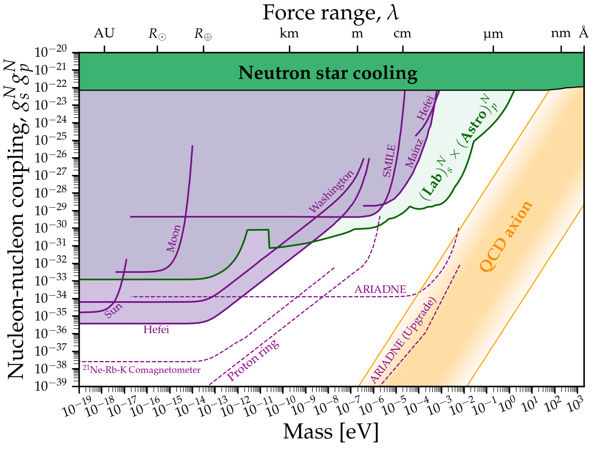

# Axion CP-violating couplings

 \
For more details see our paper: [arXiv:2010.03889](https://arxiv.org/abs/2010.03889)

Download Scalar Nucleon: [png](https://github.com/cajohare/AxionLimits/raw/master/plots/plots_png/ScalarNucleon.png), [pdf](https://github.com/cajohare/AxionLimits/raw/master/plots/ScalarNucleon.pdf)\
Download Electron-Nucleon: [png](https://github.com/cajohare/AxionLimits/raw/master/plots/plots_png/MonopoleDipole_ElectronNucleon.png), [pdf](https://github.com/cajohare/AxionLimits/raw/master/plots/MonopoleDipole_ElectronNucleon.pdf)\
Download Nucleon-Nucleon: [png](https://github.com/cajohare/AxionLimits/raw/master/plots/plots_png/MonopoleDipole_NucleonNucleon.png), [pdf](https://github.com/cajohare/AxionLimits/raw/master/plots/MonopoleDipole_NucleonNucleon.pdf)

### Download combined limits
* Scalar-Nucleon combined bound: [.txt file](https://github.com/cajohare/AxionLimits/raw/master/limit_data/ScalarNucleon/Union.txt)
* Electron-Nucleon Astro/Lab combined bound: [.txt file](https://github.com/cajohare/AxionLimits/raw/master/limit_data/MonopoleDipole/ElectronNucleon/UnionAstroLab.txt)
* Nucleon-Nucleon Astro/Lab combined bound: [.txt file](https://github.com/cajohare/AxionLimits/raw/master/limit_data/MonopoleDipole/NucleonNucleon/UnionAstroLab.txt)
