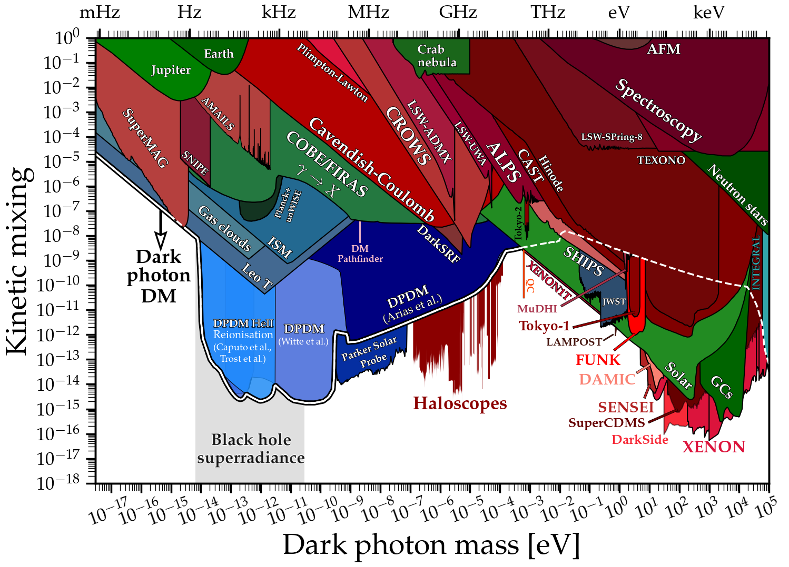

# Dark photon limits
---

## Basic plot
### [View Notebook (.ipynb)](https://github.com/cajohare/AxionLimits/blob/master/DarkPhoton.ipynb)
### [Download (.pdf)](https://github.com/cajohare/AxionLimits/raw/master/plots/DarkPhoton.pdf)
### [Download (.png)](https://github.com/cajohare/AxionLimits/raw/master/plots/plots_png/DarkPhoton.png)
### &nbsp;
### &nbsp;
---

## Plot with projections
### [View Notebook (.ipynb)](https://github.com/cajohare/AxionLimits/blob/master/DarkPhoton.ipynb)
### [Download (.pdf)](https://github.com/cajohare/AxionLimits/raw/master/plots/DarkPhoton_with_Projections.pdf)
### [Download (.png)](https://github.com/cajohare/AxionLimits/raw/master/plots/plots_png/DarkPhoton_with_Projections.png)
### &nbsp;
### &nbsp;
---
# Data files and references

## Tests of coulomb law/photon mass
* Atomic spectroscopy: [limit](https://github.com/cajohare/AxionLimits/raw/master/limit_data/DarkPhoton/Spectroscopy.txt), [reference](https://arxiv.org/abs/1008.3536)
* AFM [limit](https://github.com/cajohare/AxionLimits/raw/master/limit_data/DarkPhoton/AFM.txt), [reference](https://arxiv.org/abs/2008.02209)
* Cavendish-like experiments [limit](https://github.com/cajohare/AxionLimits/raw/master/limit_data/DarkPhoton/Coulomb.txt), [reference](https://arxiv.org/abs/2008.02209)
* Plimpton-Lawton experiment [limit](https://github.com/cajohare/AxionLimits/raw/master/limit_data/DarkPhoton/PlimptonLawton.txt), [reference](https://arxiv.org/abs/2008.02209)

## Light-shining through walls/Helioscopes
* Aharonov-Bohm: [projection](https://github.com/cajohare/AxionLimits/raw/master/limit_data/DarkPhoton/Projections/AharonovBohm.txt), [reference](https://arxiv.org/abs/1603.01282)
* ALPS: [limit](https://github.com/cajohare/AxionLimits/raw/master/limit_data/DarkPhoton/ALPS.txt), [reference](https://arxiv.org/abs/1004.1313)
* CAST: [limit](https://github.com/cajohare/AxionLimits/raw/master/limit_data/DarkPhoton/CAST.txt), [reference](https://arxiv.org/abs/0801.1527)
* CROWS: [limit](https://github.com/cajohare/AxionLimits/raw/master/limit_data/DarkPhoton/CROWS.txt), [reference](https://arxiv.org/abs/1310.8098)
* LSW-AMDX: [limit](https://github.com/cajohare/AxionLimits/raw/master/limit_data/DarkPhoton/LSW_ADMX.txt), [reference](https://arxiv.org/abs/1410.5244)
* LSW-CERN: [limit](https://github.com/cajohare/AxionLimits/raw/master/limit_data/DarkPhoton/LSW_CERN.txt), [reference](https://arxiv.org/abs/1207.3275)
* LSW-SPring-8: [limit](https://github.com/cajohare/AxionLimits/raw/master/limit_data/DarkPhoton/SPring-8.txt), [reference](https://arxiv.org/abs/1502.04490)
* LSW-UWA: [limit](https://github.com/cajohare/AxionLimits/raw/master/limit_data/DarkPhoton/LSW_UWA.txt), [reference](https://arxiv.org/abs/1003.0964)
* SHIPS: [limit](https://github.com/cajohare/AxionLimits/raw/master/limit_data/DarkPhoton/SHIPS.txt), [reference](https://arxiv.org/abs/1502.04490)

## Experimental searches for DPDM
* ALPHA: [projection](https://github.com/cajohare/AxionLimits/raw/master/limit_data/DarkPhoton/Projections/ALPHA.txt), [reference](https://arxiv.org/abs/2006.06836)
* DAMIC: [limit](https://github.com/cajohare/AxionLimits/raw/master/limit_data/DarkPhoton/DAMIC.txt), [reference](https://arxiv.org/abs/1907.12628)
* Dark E-field Pilot: [limit](https://github.com/cajohare/AxionLimits/raw/master/limit_data/DarkPhoton/DarkEfield.txt), [limit](https://github.com/cajohare/AxionLimits/raw/master/limit_data/DarkPhoton/Projections/DarkEfield.txt), [reference](https://arxiv.org/abs/2101.02805)
* DM-Radio: [limit](https://github.com/cajohare/AxionLimits/raw/master/limit_data/DarkPhoton/Projections/DMRadio.txt), [reference](https://irwinlab.sites.stanford.edu/dark-matter-radio-dmradio)
* DM-Pathfinder: [limit](https://github.com/cajohare/AxionLimits/raw/master/limit_data/DarkPhoton/DM-Pathfinder.txt), [reference](https://arxiv.org/abs/1906.08814)
* FUNK: [limit](https://github.com/cajohare/AxionLimits/raw/master/limit_data/DarkPhoton/FUNK.txt), [reference](https://arxiv.org/abs/2003.13144)
* LAMPOST: [projection](https://github.com/cajohare/AxionLimits/raw/master/limit_data/DarkPhoton/Projections/LAMPOST.txt), [reference](https://arxiv.org/abs/1803.11455)
* MADMAX: [projection](https://github.com/cajohare/AxionLimits/raw/master/limit_data/DarkPhoton/Projections/MADMAX.txt), [reference](https://arxiv.org/abs/2006.06836)
* SENSEI: [limit](https://github.com/cajohare/AxionLimits/raw/master/limit_data/DarkPhoton/SENSEI.txt), [reference](https://journals.aps.org/prl/abstract/10.1103/PhysRevLett.125.171802)
* SHUKET: [limit](https://github.com/cajohare/AxionLimits/raw/master/limit_data/DarkPhoton/SHUKET.txt), [reference](https://arxiv.org/abs/1905.05579)
* SQuAD (Superconducting Qubit): [limit](https://github.com/cajohare/AxionLimits/raw/master/limit_data/DarkPhoton/SQuAD.txt), [reference](https://arxiv.org/abs/2008.12231)
* SuperCDMS: [projection](https://github.com/cajohare/AxionLimits/raw/master/limit_data/DarkPhoton/Projections/SuperCDMS.txt), [reference](https://link.springer.com/article/10.1007/JHEP06(2017)087)
* Tokyo (Knirck et al.): [limit](https://github.com/cajohare/AxionLimits/raw/master/limit_data/DarkPhoton/Tokyo-Knirck.txt), [reference](https://arxiv.org/abs/1806.05120)
* Tokyo (Suzuki et al.): [limit](https://github.com/cajohare/AxionLimits/raw/master/limit_data/DarkPhoton/Tokyo-Dish.txt), [reference](https://arxiv.org/abs/2003.13144)
* Tokyo (Tomita et al.): [limit](https://github.com/cajohare/AxionLimits/raw/master/limit_data/DarkPhoton/Tokyo-Tomita.txt), [reference](https://arxiv.org/abs/2006.02828)
* WISPDMX: [limit](https://github.com/cajohare/AxionLimits/raw/master/limit_data/DarkPhoton/WISPDMX.txt), [reference](https://arxiv.org/abs/1907.12449)
* WSi Nanowire: [limit](https://github.com/cajohare/AxionLimits/raw/master/limit_data/DarkPhoton/WSi_Nanowire.txt), [reference](https://arxiv.org/abs/1903.05101)
* Xenon100: [limit](https://github.com/cajohare/AxionLimits/raw/master/limit_data/DarkPhoton/Xenon100.txt), [reference](https://link.springer.com/article/10.1007%2FJHEP06%282017%29087)
* Xenon1T S2 only: [limit](https://github.com/cajohare/AxionLimits/raw/master/limit_data/DarkPhoton/Xenon1T.txt), [reference](https://arxiv.org/abs/1907.11485)
* Xenon1T S1+S2: [limit](https://github.com/cajohare/AxionLimits/raw/master/limit_data/DarkPhoton/Xenon1T_S1S2.txt), [reference](https://arxiv.org/abs/2006.09721)

## Axion Haloscopes (recast axion bounds)
Note that these have been recast using the scheme detailed in [arXiv:21??.?????](https://arxiv.org/abs/2105.?????)
* ADMX: [limit](https://github.com/cajohare/AxionLimits/raw/master/limit_data/DarkPhoton/ADMX.txt)
* CAPP: [limit](https://github.com/cajohare/AxionLimits/raw/master/limit_data/DarkPhoton/CAPP.txt)
* HAYSTAC: [limit](https://github.com/cajohare/AxionLimits/raw/master/limit_data/DarkPhoton/HAYSTAC.txt)
* ORGAN: [limit](https://github.com/cajohare/AxionLimits/raw/master/limit_data/DarkPhoton/ORGAN.txt)

## Reactor neutrinos
* TEXONO [limit](https://github.com/cajohare/AxionLimits/raw/master/limit_data/DarkPhoton/TEXONO.txt), [reference](https://arxiv.org/abs/1804.10777)

## Astrophysical bounds
* Earth: [limit](https://github.com/cajohare/AxionLimits/raw/master/limit_data/DarkPhoton/Earth.txt), [reference](https://arxiv.org/abs/1002.0329)
* Crab Nebula gamma rays (2008, DP-photon oscillations): [limit](https://github.com/cajohare/AxionLimits/raw/master/limit_data/DarkPhoton/Crab.txt), [reference](https://arxiv.org/abs/0810.5501)
* Crab Nebula gamma rays (2020, photons scattering off DPDM): [limit](https://github.com/cajohare/AxionLimits/raw/master/limit_data/DarkPhoton/Crab_2.txt), [reference](https://arxiv.org/abs/2002.01796)
* Horizontal branch: [limit](https://github.com/cajohare/AxionLimits/raw/master/limit_data/DarkPhoton/HB.txt), [reference](https://arxiv.org/abs/1305.2920)
* IGM: [limit](https://github.com/cajohare/AxionLimits/raw/master/limit_data/DarkPhoton/IGM.txt), [reference](https://arxiv.org/abs/1509.00039)
* Jupiter: [limit](https://github.com/cajohare/AxionLimits/raw/master/limit_data/DarkPhoton/Jupiter.txt), [reference](https://arxiv.org/abs/1002.0329)
* LeoT: [limit](https://github.com/cajohare/AxionLimits/raw/master/limit_data/DarkPhoton/LeoT.txt), [reference](https://arxiv.org/abs/1903.12190)
* Solar temperature/luminosity: [limit](https://github.com/cajohare/AxionLimits/raw/master/limit_data/DarkPhoton/Solar.txt), [reference](https://arxiv.org/abs/1305.2920)
* Solar luminosity (global fit): [limit](https://github.com/cajohare/AxionLimits/raw/master/limit_data/DarkPhoton/Solar-Global.txt), [reference](https://arxiv.org/abs/1501.01639)
* Red giants: [limit](https://github.com/cajohare/AxionLimits/raw/master/limit_data/DarkPhoton/RG.txt), [reference](https://arxiv.org/abs/1305.2920)

## Cosmological bounds on Dark photons
* COBE/FIRAS (Caputo et al.): [limit](https://github.com/cajohare/AxionLimits/raw/master/limit_data/DarkPhoton/COBEFIRAS.txt), [reference](https://arxiv.org/abs/2002.05165)
* COBE/FIRAS (Witte et al.): [limit](https://github.com/cajohare/AxionLimits/raw/master/limit_data/DarkPhoton/COBEFIRAS.txt), [reference](https://arxiv.org/abs/1911.05086)

## Cosmological bounds on Dark Photon as Dark Matter (DPDM)
* Arias et al.: [limit](https://github.com/cajohare/AxionLimits/raw/master/limit_data/DarkPhoton/Cosmology_Arias.txt), [reference](https://arxiv.org/abs/1201.5902)
* Witte et al. (homogeneous plasma): [limit](https://github.com/cajohare/AxionLimits/raw/master/limit_data/DarkPhoton/Cosmology_Witte_homogeneous.txt), [reference](https://arxiv.org/abs/1911.05086)
* Witte et al. (inhomogeneous plasma): [limit](https://github.com/cajohare/AxionLimits/raw/master/limit_data/DarkPhoton/Cosmology_Witte_inhomogeneous.txt), [reference](https://arxiv.org/abs/2003.13698)
* Caputo et al. (HeII reionisation): [limit](https://github.com/cajohare/AxionLimits/raw/master/limit_data/DarkPhoton/Cosmology_Caputo_HeII.txt), [reference](https://arxiv.org/abs/2002.05165)
