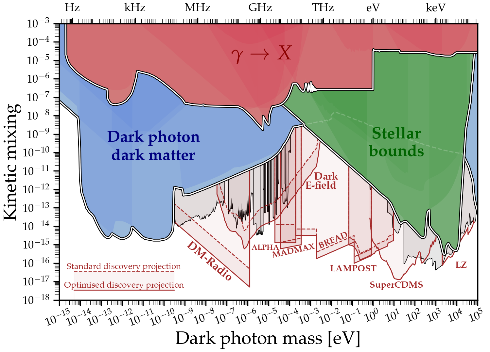
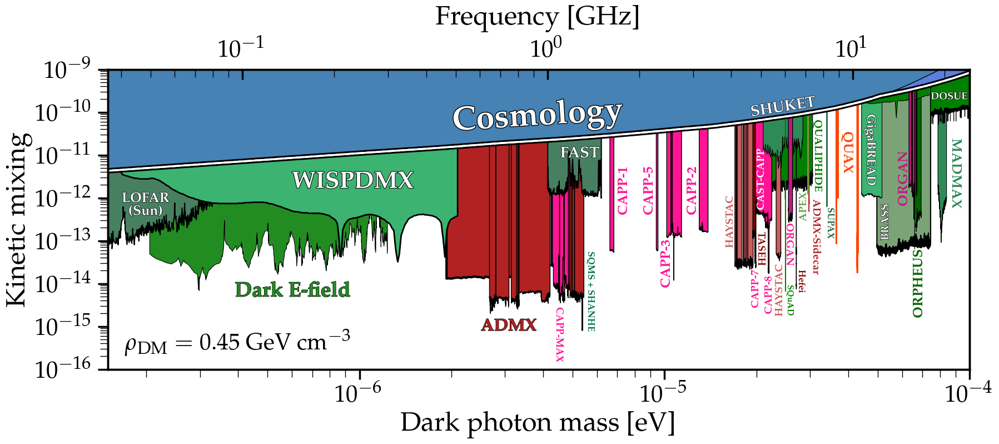

# Dark photon limits

These plots appeared in the paper [Caputo et al. 2021](https://arxiv.org/abs/2105.04565) so if you use them for whatever reason, please cite this paper too
```
@article{Caputo:2021eaa,
    author = "Caputo, Andrea and O'Hare, Ciaran A. J. and Millar, Alexander J. and Vitagliano, Edoardo",
    title = "{Dark photon limits: a cookbook}",
    eprint = "2105.04565",
    archivePrefix = "arXiv",
    primaryClass = "hep-ph",
    reportNumber = "NORDITA-2021-036",
    month = "5",
    year = "2021"
}
```

---
[](https://github.com/cajohare/AxionLimits/raw/master/plots/plots_png/DarkPhoton.png)
## Basic plot
### [View Notebook (.ipynb)](https://github.com/cajohare/AxionLimits/blob/master/DarkPhoton.ipynb)
### [Download (.pdf)](https://github.com/cajohare/AxionLimits/raw/master/plots/DarkPhoton.pdf)
### [Download (.png)](https://github.com/cajohare/AxionLimits/raw/master/plots/plots_png/DarkPhoton.png)
### &nbsp;
### &nbsp;
---
[](https://github.com/cajohare/AxionLimits/raw/master/plots/plots_png/DarkPhoton_with_Projections.png)
## Plot with projections
### [View Notebook (.ipynb)](https://github.com/cajohare/AxionLimits/blob/master/DarkPhoton.ipynb)
### [Download (.pdf)](https://github.com/cajohare/AxionLimits/raw/master/plots/DarkPhoton_with_Projections.pdf)
### [Download (.png)](https://github.com/cajohare/AxionLimits/raw/master/plots/plots_png/DarkPhoton_with_Projections.png)
### &nbsp;
### &nbsp;
---
[](https://github.com/cajohare/AxionLimits/raw/master/plots/plots_png/DarkPhoton_Haloscopes_Closeup.png)
## Haloscope closeup
### [View Notebook (.ipynb)](https://github.com/cajohare/AxionLimits/blob/master/DarkPhoton.ipynb)
### [Download (.pdf)](https://github.com/cajohare/AxionLimits/raw/master/plots/DarkPhoton_Haloscopes_Closeup.pdf)
### [Download (.png)](https://github.com/cajohare/AxionLimits/raw/master/plots/plots_png/DarkPhoton_Haloscopes_Closeup.png)
### &nbsp;
### &nbsp;
---
[](https://github.com/cajohare/AxionLimits/raw/master/plots/plots_png/DarkPhoton_FIPS.png)
## FIPs White paper version
### [View Notebook (.ipynb)](https://github.com/cajohare/AxionLimits/blob/master/FIPS.ipynb)
### [Download (.pdf)](https://github.com/cajohare/AxionLimits/raw/master/plots/DarkPhoton_FIPS.pdf)
### [Download (.png)](https://github.com/cajohare/AxionLimits/raw/master/plots/plots_png/DarkPhoton_FIPS.png)
### &nbsp;
### &nbsp;
### &nbsp;
---
[](https://github.com/cajohare/AxionLimits/raw/master/plots/plots_png/DarkPhoton_Closeup_FIPS.png)
## FIPs White paper version (closeup)
### [View Notebook (.ipynb)](https://github.com/cajohare/AxionLimits/blob/master/FIPS.ipynb)
### [Download (.pdf)](https://github.com/cajohare/AxionLimits/raw/master/plots/DarkPhoton_Closeup_FIPS.pdf)
### [Download (.png)](https://github.com/cajohare/AxionLimits/raw/master/plots/plots_png/DarkPhoton_Closeup_FIPS.png)
### &nbsp;
### &nbsp;
### &nbsp;
---
# Data files and references
## Combined limits
* Combined DP haloscopes (without axion haloscopes): [limit](https://github.com/cajohare/AxionLimits/raw/master/limit_data/DarkPhoton/DP_Combined_DarkMatterSearches.txt)
* Combined DP haloscopes (rescaled from axion limit): [limit](https://github.com/cajohare/AxionLimits/raw/master/limit_data/DarkPhoton/DP_Combined_AxionSearchesRescaled.txt)
* photon-DP transitions: [limit](https://github.com/cajohare/AxionLimits/raw/master/limit_data/DarkPhoton/DP_Combined_Laboratory.txt)
* Stellar bounds: [limit](https://github.com/cajohare/AxionLimits/raw/master/limit_data/DarkPhoton/DP_Combined_Stellar.txt)

## Combined projections
* Combined DP LSW projections [projection](https://github.com/cajohare/AxionLimits/raw/master/limit_data/DarkPhoton/Projections/LSW_Projections_Combined.txt)
* Combined DP haloscopes projections: [limit](https://github.com/cajohare/AxionLimits/raw/master/limit_data/DarkPhoton/Projections/DP_Combined_DarkMatterSearches.txt)

## Tests of coulomb law/photon mass
* Atomic spectroscopy: [limit](https://github.com/cajohare/AxionLimits/raw/master/limit_data/DarkPhoton/Spectroscopy.txt), [reference](https://arxiv.org/abs/1008.3536)
* AFM [limit](https://github.com/cajohare/AxionLimits/raw/master/limit_data/DarkPhoton/AFM.txt), [reference](https://arxiv.org/abs/2008.02209)
* Cavendish-like experiments [limit](https://github.com/cajohare/AxionLimits/raw/master/limit_data/DarkPhoton/Coulomb.txt), [reference](https://arxiv.org/abs/2008.02209)
* Plimpton-Lawton experiment [limit](https://github.com/cajohare/AxionLimits/raw/master/limit_data/DarkPhoton/PlimptonLawton.txt), [reference](https://arxiv.org/abs/2008.02209)

## Light-shining through walls/Helioscopes
* Aharonov-Bohm: [projection](https://github.com/cajohare/AxionLimits/raw/master/limit_data/DarkPhoton/Projections/AharonovBohm.txt), [reference](https://arxiv.org/abs/1603.01282)
* ALPS: [limit](https://github.com/cajohare/AxionLimits/raw/master/limit_data/DarkPhoton/ALPS.txt), [reference](https://arxiv.org/abs/1004.1313)
* ALPS-II: [projection](https://github.com/cajohare/AxionLimits/raw/master/limit_data/DarkPhoton/Projections/ALPS.txt), [reference](https://arxiv.org/abs/1302.5647)
* CAST: [limit](https://github.com/cajohare/AxionLimits/raw/master/limit_data/DarkPhoton/CAST.txt), [reference](https://arxiv.org/abs/0801.1527)
* CROWS: [limit](https://github.com/cajohare/AxionLimits/raw/master/limit_data/DarkPhoton/CROWS.txt), [reference](https://arxiv.org/abs/1310.8098)
* DarkSRF: [limit](https://github.com/cajohare/AxionLimits/raw/master/limit_data/DarkPhoton/DarkSRF.txt), [reference](https://arxiv.org/abs/2301.11512)
* HINODE: [limit](https://github.com/cajohare/AxionLimits/raw/master/limit_data/DarkPhoton/HINODE.txt), [reference](https://arxiv.org/abs/2211.00022)
* LSW-AMDX: [limit](https://github.com/cajohare/AxionLimits/raw/master/limit_data/DarkPhoton/LSW_ADMX.txt), [reference](https://arxiv.org/abs/1410.5244)
* LSW-CERN: [limit](https://github.com/cajohare/AxionLimits/raw/master/limit_data/DarkPhoton/LSW_CERN.txt), [reference](https://arxiv.org/abs/1207.3275)
* LSW-SPring-8: [limit](https://github.com/cajohare/AxionLimits/raw/master/limit_data/DarkPhoton/SPring-8.txt), [reference](https://arxiv.org/abs/1502.04490)
* LSW-UWA: [limit](https://github.com/cajohare/AxionLimits/raw/master/limit_data/DarkPhoton/LSW_UWA.txt), [reference](https://arxiv.org/abs/1003.0964)
* SHIPS: [limit](https://github.com/cajohare/AxionLimits/raw/master/limit_data/DarkPhoton/SHIPS.txt), [reference](https://arxiv.org/abs/1502.04490)
* STAX: [projection](https://github.com/cajohare/AxionLimits/raw/master/limit_data/DarkPhoton/Projections/STAX.txt), [reference](https://arxiv.org/abs/2212.01139)

## Experimental searches for DPDM
### All files are true to their *original* sources, i.e. without any rescaling
* ALPHA: [projection](https://github.com/cajohare/AxionLimits/raw/master/limit_data/DarkPhoton/Projections/ALPHA.txt), [reference](https://arxiv.org/abs/2006.06836)
* BREAD: [projection](https://github.com/cajohare/AxionLimits/raw/master/limit_data/DarkPhoton/Projections/BREAD.txt), [reference](https://arxiv.org/abs/2111.12103)
* DAMIC: [limit](https://github.com/cajohare/AxionLimits/raw/master/limit_data/DarkPhoton/DAMIC.txt), [reference](https://arxiv.org/abs/1907.12628)
* DarkSide-50: [limit](https://github.com/cajohare/AxionLimits/raw/master/limit_data/DarkPhoton/DarkSide.txt), [reference](https://arxiv.org/abs/2207.11968)
* Dark E-field Pilot: [limit](https://github.com/cajohare/AxionLimits/raw/master/limit_data/DarkPhoton/DarkEfield.txt), [projection](https://github.com/cajohare/AxionLimits/raw/master/limit_data/DarkPhoton/Projections/DarkEfield.txt), [reference](https://arxiv.org/abs/2101.02805)
* DM-Radio: [limit](https://github.com/cajohare/AxionLimits/raw/master/limit_data/DarkPhoton/Projections/DMRadio.txt), [reference](https://irwinlab.sites.stanford.edu/dark-matter-radio-dmradio)
* DM-Pathfinder: [limit](https://github.com/cajohare/AxionLimits/raw/master/limit_data/DarkPhoton/DM-Pathfinder.txt), [reference](https://arxiv.org/abs/1906.08814)
* DOSUE-RR: [limit](https://github.com/cajohare/AxionLimits/raw/master/limit_data/DarkPhoton/DOSUE-RR.txt), [reference](https://arxiv.org/abs/2205.03679)
* FAST radio antenna: [limit](https://github.com/cajohare/AxionLimits/raw/master/limit_data/DarkPhoton/FAST.txt), [reference](https://arxiv.org/abs/2207.05767)
* FUNK: [limit](https://github.com/cajohare/AxionLimits/raw/master/limit_data/DarkPhoton/FUNK.txt), [reference](https://arxiv.org/abs/2003.13144)
* LAMPOST (limit): [limit](https://github.com/cajohare/AxionLimits/raw/master/limit_data/DarkPhoton/LAMPOST.txt), [reference](https://arxiv.org/abs/2110.01582)
* LAMPOST (projection): [projection](https://github.com/cajohare/AxionLimits/raw/master/limit_data/DarkPhoton/Projections/LAMPOST.txt), [reference](https://arxiv.org/abs/1803.11455)
* LOFAR (solar corona): [limit](https://github.com/cajohare/AxionLimits/raw/master/limit_data/DarkPhoton/LOFAR.txt), [reference](https://arxiv.org/abs/2301.03622)
* LZ: [projection](https://github.com/cajohare/AxionLimits/raw/master/limit_data/DarkPhoton/Projections/LZ.txt), [reference](https://arxiv.org/abs/2102.11740)
* MADMAX: [projection](https://github.com/cajohare/AxionLimits/raw/master/limit_data/DarkPhoton/Projections/MADMAX.txt), [reference](https://arxiv.org/abs/2006.06836)
* MuDHI: [limit](https://github.com/cajohare/AxionLimits/raw/master/limit_data/DarkPhoton/MuDHI.txt), [reference](https://arxiv.org/abs/2110.10497)
* ORPHEUS: [limit](https://github.com/cajohare/AxionLimits/raw/master/limit_data/DarkPhoton/ORPHEUS.txt), [reference](https://arxiv.org/abs/2204.03818)
* QUALIPHIDE: [limit](https://github.com/cajohare/AxionLimits/raw/master/limit_data/DarkPhoton/QUALIPHIDE.txt), [reference](https://arxiv.org/abs/2209.03419)
* Quantum cyclotron: [limit](https://github.com/cajohare/AxionLimits/raw/master/limit_data/DarkPhoton/QuantumCyclotron.txt), [reference](https://arxiv.org/abs/2208.06519)
* SENSEI: [limit](https://github.com/cajohare/AxionLimits/raw/master/limit_data/DarkPhoton/SENSEI.txt), [reference](https://journals.aps.org/prl/abstract/10.1103/PhysRevLett.125.171802)
* SHUKET: [limit](https://github.com/cajohare/AxionLimits/raw/master/limit_data/DarkPhoton/SHUKET.txt), [reference](https://arxiv.org/abs/1905.05579)
* SQuAD (Superconducting Qubit): [limit](https://github.com/cajohare/AxionLimits/raw/master/limit_data/DarkPhoton/SQuAD.txt), [reference](https://arxiv.org/abs/2008.12231)
* SQMS: [limit](https://github.com/cajohare/AxionLimits/raw/master/limit_data/DarkPhoton/SQMS.txt), [reference](https://arxiv.org/abs/2208.03183)
* SuperCDMS: [limit](https://github.com/cajohare/AxionLimits/raw/master/limit_data/DarkPhoton/SuperCDMS.txt), [reference](https://arxiv.org/abs/1911.11905)
* SuperCDMS: [projection](https://github.com/cajohare/AxionLimits/raw/master/limit_data/DarkPhoton/Projections/SuperCDMS.txt), [reference](https://link.springer.com/article/10.1007/JHEP06(2017)087)
* SuperMAG: [limit](https://github.com/cajohare/AxionLimits/raw/master/limit_data/DarkPhoton/SuperMAG.txt), [reference1](https://arxiv.org/abs/2106.00022), [reference2](https://arxiv.org/abs/2108.08852)
* Tokyo (Knirck et al.): [limit](https://github.com/cajohare/AxionLimits/raw/master/limit_data/DarkPhoton/Tokyo-Knirck.txt), [reference](https://arxiv.org/abs/1806.05120)
* Tokyo (Suzuki et al.): [limit](https://github.com/cajohare/AxionLimits/raw/master/limit_data/DarkPhoton/Tokyo-Dish.txt), [reference](https://arxiv.org/abs/2003.13144)
* Tokyo (Tomita et al.): [limit](https://github.com/cajohare/AxionLimits/raw/master/limit_data/DarkPhoton/Tokyo-Tomita.txt), [reference](https://arxiv.org/abs/2006.02828)
* WISPDMX: [limit](https://github.com/cajohare/AxionLimits/raw/master/limit_data/DarkPhoton/WISPDMX.txt), [reference](https://arxiv.org/abs/1907.12449)
* WSi Nanowire: [limit](https://github.com/cajohare/AxionLimits/raw/master/limit_data/DarkPhoton/WSi_Nanowire.txt), [reference](https://arxiv.org/abs/1903.05101)
* Xenon100: [limit](https://github.com/cajohare/AxionLimits/raw/master/limit_data/DarkPhoton/Xenon100.txt), [reference](https://link.springer.com/article/10.1007%2FJHEP06%282017%29087)
* Xenon1T S2 only: [limit](https://github.com/cajohare/AxionLimits/raw/master/limit_data/DarkPhoton/Xenon1T.txt), [reference](https://arxiv.org/abs/1907.11485)
* Xenon1T S1+S2: [limit](https://github.com/cajohare/AxionLimits/raw/master/limit_data/DarkPhoton/Xenon1T_S1S2.txt), [reference](https://arxiv.org/abs/2006.09721)
* XENON1T (DM, single electron): [limit](https://github.com/cajohare/AxionLimits/raw/master/limit_data/DarkPhoton/XENON1T_SE.txt), [reference](https://arxiv.org/abs/2112.12116)
* XENON1T (Solar DPs, S2): [limit](https://github.com/cajohare/AxionLimits/raw/master/limit_data/DarkPhoton/XENON1T_Solar_S2.txt), [reference](https://arxiv.org/abs/2006.13929)
* XENON1T (Solar DPs, single electron): [limit](https://github.com/cajohare/AxionLimits/raw/master/limit_data/DarkPhoton/XENON1T_Solar_SE.txt), [reference](https://arxiv.org/abs/2112.12116)
* XENONnT: [limit](https://github.com/cajohare/AxionLimits/raw/master/limit_data/DarkPhoton/XENONnT.txt), [reference](http://xenonexperiment.org/)

## Updated Experimental searches for DPDM
These have been recast using the scheme detailed in [arXiv:2105.04565](https://arxiv.org/abs/2105.04565) so they all assume the fixed polarisation scenario for the DP polarisation distribution around the Earth. They also all assume 0.45 GeV/cm^3 for the DM density and are defined as exclusion limits at 95% CL.
* ADMX 2009: [limit](https://github.com/cajohare/AxionLimits/raw/master/limit_data/DarkPhoton/Rescaled/ADMX.txt)
* ADMX 2018: [limit](https://github.com/cajohare/AxionLimits/raw/master/limit_data/DarkPhoton/Rescaled/ADMX2018.txt)
* ADMX 2019-1: [limit](https://github.com/cajohare/AxionLimits/raw/master/limit_data/DarkPhoton/Rescaled/ADMX2019_1.txt)
* ADMX 2019-2: [limit](https://github.com/cajohare/AxionLimits/raw/master/limit_data/DarkPhoton/Rescaled/ADMX2019_2.txt)
* ADMX Sidecar: [limit](https://github.com/cajohare/AxionLimits/raw/master/limit_data/DarkPhoton/Rescaled/ADMX_Sidecar.txt)
* ADMX SLIC: [limit](https://github.com/cajohare/AxionLimits/raw/master/limit_data/DarkPhoton/Rescaled/ADMX_SLIC.txt)
* CAPP-1: [limit](https://github.com/cajohare/AxionLimits/raw/master/limit_data/DarkPhoton/Rescaled/CAPP-1.txt)
* CAPP-2: [limit](https://github.com/cajohare/AxionLimits/raw/master/limit_data/DarkPhoton/Rescaled/CAPP-2.txt)
* CAPP-3: [limit](https://github.com/cajohare/AxionLimits/raw/master/limit_data/DarkPhoton/Rescaled/CAPP-3.txt)
* CAPP-4: [limit](https://github.com/cajohare/AxionLimits/raw/master/limit_data/DarkPhoton/Rescaled/CAPP-4.txt)
* CAPP-5: [limit](https://github.com/cajohare/AxionLimits/raw/master/limit_data/DarkPhoton/Rescaled/CAPP-5.txt)
* CAPP-6: [limit](https://github.com/cajohare/AxionLimits/raw/master/limit_data/DarkPhoton/Rescaled/CAPP-6.txt)
* CAST-CAPP: [limit](https://github.com/cajohare/AxionLimits/raw/master/limit_data/DarkPhoton/Rescaled/CAST-CAPP.txt)
* Dark E-field: [limit](https://github.com/cajohare/AxionLimits/raw/master/limit_data/DarkPhoton/Rescaled/DarkEfield.txt)
* DM Pathfinder: [limit](https://github.com/cajohare/AxionLimits/raw/master/limit_data/DarkPhoton/Rescaled/DM-Pathfinder.txt)
* FUNK: [limit](https://github.com/cajohare/AxionLimits/raw/master/limit_data/DarkPhoton/Rescaled/FUNK.txt)
* HAYSTAC (2018): [limit](https://github.com/cajohare/AxionLimits/raw/master/limit_data/DarkPhoton/Rescaled/HAYSTAC.txt)
* HAYSTAC (2020): [limit](https://github.com/cajohare/AxionLimits/raw/master/limit_data/DarkPhoton/Rescaled/HAYSTAC_2020.txt)
* HAYSTAC (2022): [limit](https://github.com/cajohare/AxionLimits/raw/master/limit_data/DarkPhoton/Rescaled/HAYSTAC_2022.txt)
* ORGAN-1a: [limit](https://github.com/cajohare/AxionLimits/raw/master/limit_data/DarkPhoton/Rescaled/ORGAN-1a.txt) [reference](https://arxiv.org/abs/2212.01971)
* QUAX: [limit](https://github.com/cajohare/AxionLimits/raw/master/limit_data/DarkPhoton/Rescaled/QUAX.txt)
* SHUKET: [limit](https://github.com/cajohare/AxionLimits/raw/master/limit_data/DarkPhoton/Rescaled/SHUKET.txt)
* SQuAD: [limit](https://github.com/cajohare/AxionLimits/raw/master/limit_data/DarkPhoton/Rescaled/SQuAD.txt)
* Tokyo (Suzuki et al.): [limit](https://github.com/cajohare/AxionLimits/raw/master/limit_data/DarkPhoton/Rescaled/Tokyo-Dish.txt)
* Tokyo (Knirck et al.): [limit](https://github.com/cajohare/AxionLimits/raw/master/limit_data/DarkPhoton/Rescaled/Tokyo-Knirck.txt)
* Tokyo (Tomita et al.): [limit](https://github.com/cajohare/AxionLimits/raw/master/limit_data/DarkPhoton/Rescaled/Tokyo-Tomita.txt)
* WISPDMX: [limit](https://github.com/cajohare/AxionLimits/raw/master/limit_data/DarkPhoton/Rescaled/WISPDMX.txt)

## Reactor neutrinos
* TEXONO [limit](https://github.com/cajohare/AxionLimits/raw/master/limit_data/DarkPhoton/TEXONO.txt), [reference](https://arxiv.org/abs/1804.10777)

## Astrophysical bounds
* Earth: [limit](https://github.com/cajohare/AxionLimits/raw/master/limit_data/DarkPhoton/Earth.txt), [reference](https://inspirehep.net/literature/380466)
* Crab Nebula gamma rays (2008, DP-photon oscillations): [limit](https://github.com/cajohare/AxionLimits/raw/master/limit_data/DarkPhoton/Crab.txt), [reference](https://arxiv.org/abs/0810.5501)
* Crab Nebula gamma rays (2020, photons scattering off DPDM): [limit](https://github.com/cajohare/AxionLimits/raw/master/limit_data/DarkPhoton/Crab_2.txt), [reference](https://arxiv.org/abs/2002.01796)
* Horizontal branch: [limit](https://github.com/cajohare/AxionLimits/raw/master/limit_data/DarkPhoton/HB.txt), [reference](https://arxiv.org/abs/2304.12907)
* Gas cloud heating: [limit](https://github.com/cajohare/AxionLimits/raw/master/limit_data/DarkPhoton/GasClouds.txt), [reference](https://arxiv.org/abs/1812.10919)
* IGM: [limit](https://github.com/cajohare/AxionLimits/raw/master/limit_data/DarkPhoton/IGM.txt), [reference](https://arxiv.org/abs/1509.00039)
* Jupiter: [limit](https://github.com/cajohare/AxionLimits/raw/master/limit_data/DarkPhoton/Jupiter.txt), [reference](https://arxiv.org/abs/2110.02875)
* LeoT: [limit](https://github.com/cajohare/AxionLimits/raw/master/limit_data/DarkPhoton/LeoT.txt), [reference](https://arxiv.org/abs/1903.12190)
* Neutron Star Cooling (Cas A + NS1987A): [limit](https://github.com/cajohare/AxionLimits/raw/master/limit_data/DarkPhoton/NeutronStarCooling.txt), [reference](https://arxiv.org/abs/2012.05427)
* Solar temperature/luminosity: [limit](https://github.com/cajohare/AxionLimits/raw/master/limit_data/DarkPhoton/Solar.txt), [reference](https://arxiv.org/abs/2304.12907)
* Solar luminosity (global fit): [limit](https://github.com/cajohare/AxionLimits/raw/master/limit_data/DarkPhoton/Solar-Global.txt), [reference](https://arxiv.org/abs/1501.01639)
* Red giants: [limit](https://github.com/cajohare/AxionLimits/raw/master/limit_data/DarkPhoton/RG.txt), [reference](https://arxiv.org/abs/2304.12907)

## Cosmological bounds on Dark photons
* COBE/FIRAS (Caputo et al.): [limit](https://github.com/cajohare/AxionLimits/raw/master/limit_data/DarkPhoton/COBEFIRAS.txt), [reference](https://arxiv.org/abs/2002.05165)
* COBE/FIRAS (Witte et al.): [limit](https://github.com/cajohare/AxionLimits/raw/master/limit_data/DarkPhoton/COBEFIRAS.txt), [reference](https://arxiv.org/abs/1911.05086)

## Cosmological/Astrophysical bounds on Dark Photons as Dark Matter (DPDM)
* Arias et al.: [limit](https://github.com/cajohare/AxionLimits/raw/master/limit_data/DarkPhoton/Cosmology_Arias.txt), [reference](https://arxiv.org/abs/1201.5902)
* Witte et al. (homogeneous plasma): [limit](https://github.com/cajohare/AxionLimits/raw/master/limit_data/DarkPhoton/Cosmology_Witte_homogeneous.txt), [reference](https://arxiv.org/abs/1911.05086)
* Witte et al. (inhomogeneous plasma): [limit](https://github.com/cajohare/AxionLimits/raw/master/limit_data/DarkPhoton/Cosmology_Witte_inhomogeneous.txt), [reference](https://arxiv.org/abs/2003.13698)
* Caputo et al. (HeII reionisation): [limit](https://github.com/cajohare/AxionLimits/raw/master/limit_data/DarkPhoton/Cosmology_Caputo_HeII.txt), [reference](https://arxiv.org/abs/2002.05165)

## Black hole superradiance
* Cardoso et al: [reference](https://arxiv.org/abs/1801.01420)
