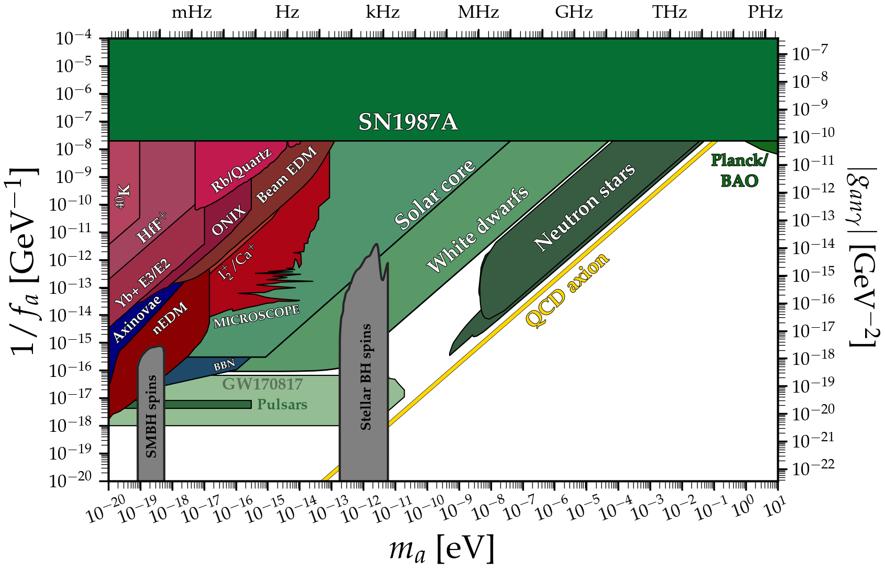
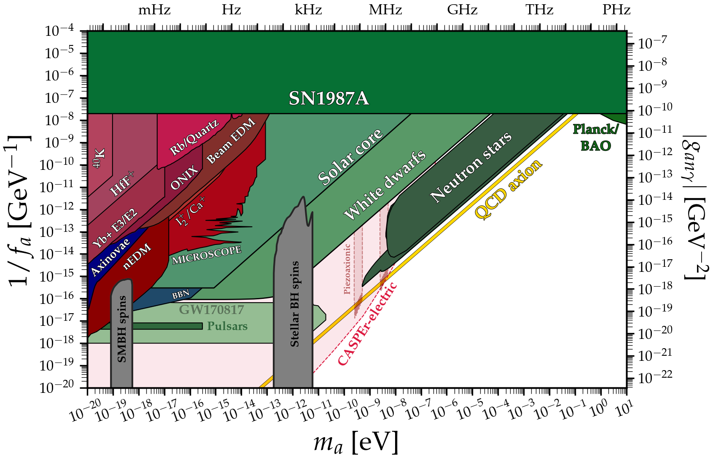

# Mass vs Peccei-Quinn scale
---

## Basic plot
### [View Notebook (.ipynb)](https://github.com/cajohare/AxionLimits/blob/master/Axion_fa.ipynb)
### [Download (.pdf)](https://github.com/cajohare/AxionLimits/raw/master/plots/Axion_fa.pdf)
### [Download (.png)](https://github.com/cajohare/AxionLimits/raw/master/plots/plots_png/Axion_fa.png)
### &nbsp;
### &nbsp;
---

---

## Plot with projections
### [View Notebook (.ipynb)](https://github.com/cajohare/AxionLimits/blob/master/Axion_fa.ipynb)
### [Download (.pdf)](https://github.com/cajohare/AxionLimits/raw/master/plots/Axion_fa_with_Projections.pdf)
### [Download (.png)](https://github.com/cajohare/AxionLimits/raw/master/plots/plots_png/Axion_fa_with_Projections.png)
### &nbsp;
### &nbsp;
---

It must be noted that this plot and the 1/fa plot are, at best, challenging to interpret from any theoretical point of view. They should not be taken any more seriously than simply a comparison of experimental/observational sensitivities. The area outside of the QCD line here requires significant (and rarely natural) model-building. In essence one needs a "QCD" axion whose mass is different from than the mass arising just from the anomalous gluon coupling of the axion (which defines 1/f_a). There are very few models that achieve this naturally, such as the Z_N axion model of Hook (https://arxiv.org/abs/1802.10093), developed phenomenologically by Di Luzio et al. (https://arxiv.org/pdf/2102.00012.pdf)

# Data files and references

## Experiments
* Beam EDM: [limit](https://github.com/cajohare/AxionLimits/raw/master/limit_data/fa/BeamEDM.txt), [reference](https://arxiv.org/abs/2204.01454)
* nEDM: [limit](https://github.com/cajohare/AxionLimits/raw/master/limit_data/fa/nEDM.txt), [reference](https://arxiv.org/abs/1708.06367)
* HfH+: [limit](https://github.com/cajohare/AxionLimits/raw/master/limit_data/fa/HfH.txt), [reference](https://journals.aps.org/prl/abstract/10.1103/PhysRevLett.126.171301)
* JEDI: [limit](https://github.com/cajohare/AxionLimits/raw/master/limit_data/AxionEDM/JEDI.txt), [reference](https://arxiv.org/abs/2208.07293)
* Rb/Quartz: [limit](https://github.com/cajohare/AxionLimits/raw/master/limit_data/fa/RbQuartz.txt), [reference](https://arxiv.org/abs/2212.04413)
* Piezoaxionic effect [N=1](https://github.com/cajohare/AxionLimits/raw/master/limit_data/fa/Projections/PiezoaxionicEffect1.txt), [N=64](https://github.com/cajohare/AxionLimits/raw/master/limit_data/fa/Projections/PiezoaxionicEffect64.txt) [reference](https://arxiv.org/abs/2112.11466)
* Storage Ring EDM (Projection): [limit](https://github.com/cajohare/AxionLimits/raw/master/limit_data/fa/Projections/StorageRingEDM.txt), [reference](https://arxiv.org/abs/1710.05271)
* CASPEr-electric projections: [phase III](https://github.com/cajohare/AxionLimits/raw/master/limit_data/fa/Projections/CASPEr-electric-PhaseIII.txt), [reference](https://arxiv.org/abs/1711.08999)

## Other bounds
* Axinovae (assumes post-inflationary scenario and axion star formation): [limit](https://github.com/cajohare/AxionLimits/raw/master/limit_data/fa/Axinovae.txt), [reference](https://arxiv.org/abs/2302.00685)
* BBN (axion assumed to be dark matter): [limit](https://github.com/cajohare/AxionLimits/raw/master/limit_data/fa/BBN.txt), [reference](https://arxiv.org/abs/1401.6460)
* Black hole spins (Mehta et al.): [limit](https://github.com/cajohare/AxionLimits/raw/master/limit_data/fa/BlackHoleSpins_Mehta.txt), [reference](https://arxiv.org/abs/2011.08693)
* Black hole spins (Baryakhtar et al.) [limit](https://github.com/cajohare/AxionLimits/raw/master/limit_data/fa/BlackHoleSpins_Baryakhtar.txt), [reference](https://arxiv.org/abs/2011.11646)
* Black hole spins (Unal et al.) [limit](https://github.com/cajohare/AxionLimits/raw/master/limit_data/fa/BlackHoleSpins_Unal.txt), [reference](https://arxiv.org/abs/2012.12790)
* *Binary pulsars: [limit](https://github.com/cajohare/AxionLimits/raw/master/limit_data/fa/Pulsar.txt), [reference](https://arxiv.org/abs/1708.08464)
* GW170817 [limit](https://github.com/cajohare/AxionLimits/raw/master/limit_data/fa/GW170817.txt), [reference](https://arxiv.org/abs/2105.13963)
* *Neutron stars: [projection](https://github.com/cajohare/AxionLimits/raw/master/limit_data/fa/Projections/NeutronStars.txt), [reference](https://arxiv.org/abs/1708.08464)
* NS-NS Inspiral: [projection](https://github.com/cajohare/AxionLimits/raw/master/limit_data/fa/Projections/NSNS-Inspiral.txt), [reference](https://arxiv.org/abs/1708.08464)
* NS-BH Inspiral: [projection](https://github.com/cajohare/AxionLimits/raw/master/limit_data/fa/Projections/NSBH-Inspiral.txt), [reference](https://arxiv.org/abs/1708.08464)
* Planck+BAO thermal ALP bound (gluon coupling): [limit](https://github.com/cajohare/AxionLimits/raw/master/limit_data/fa/PlanckBAO.txt), [reference](https://arxiv.org/abs/2205.01637)
* *Solar core (neutrino line): [limit](https://github.com/cajohare/AxionLimits/raw/master/limit_data/fa/SolarCore.txt), [reference](https://arxiv.org/abs/1708.08464)
* SN1987A: [limit](https://github.com/cajohare/AxionLimits/raw/master/limit_data/fa/SN1987A.txt), [reference](https://arxiv.org/abs/2203.15812)
* White dwarfs: [limit](https://github.com/cajohare/AxionLimits/raw/master/limit_data/fa/WhiteDwarfs.txt), [reference](https://arxiv.org/abs/2211.02661)

(*) Using corrected values from [here](https://arxiv.org/abs/2102.00012)
