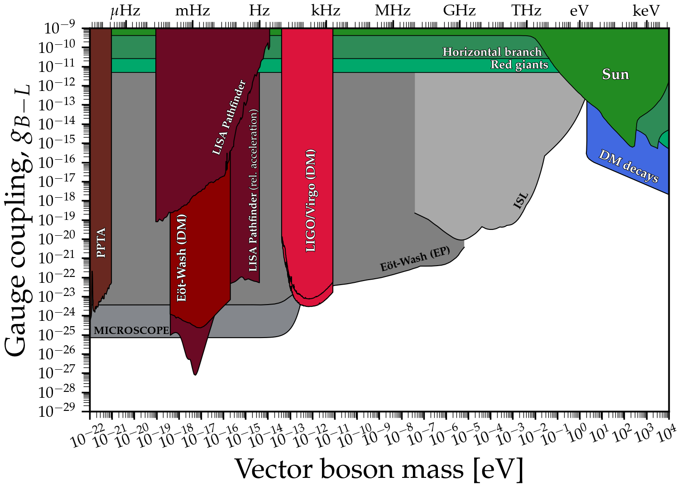

# Gauged B-L vector boson limits
---

## Basic plot
### [View Notebook (.ipynb)](https://github.com/cajohare/AxionLimits/blob/master/Vectors.ipynb)
### [Download (.pdf)](https://github.com/cajohare/AxionLimits/raw/master/plots/VectorB-L.pdf)
### [Download (.png)](https://github.com/cajohare/AxionLimits/raw/master/plots/plots_png/VectorB-L.png)
### &nbsp;
### &nbsp;
---

---

## Plot with projections
### [View Notebook (.ipynb)](https://github.com/cajohare/AxionLimits/blob/master/Vectors.ipynb)
### [Download (.pdf)](https://github.com/cajohare/AxionLimits/raw/master/plots/VectorB-L_with_Projections.pdf)
### [Download (.png)](https://github.com/cajohare/AxionLimits/raw/master/plots/plots_png/VectorB-L_with_Projections.png)
### &nbsp;
### &nbsp;
---

# Data files and references

## Fifth force etc.
* Casimir: [limit](https://github.com/cajohare/AxionLimits/raw/master/limit_data/VectorB-L/Casimir.txt), [reference1](https://arxiv.org/abs/quant-ph/0106045), [reference2](https://arxiv.org/abs/hep-ph/0502025), [reference2](https://journals.aps.org/prl/abstract/10.1103/PhysRevLett.107.171101)
* Eot-Wash (Equivalence principle test): [limit](https://github.com/cajohare/AxionLimits/raw/master/limit_data/VectorB-L/EotwashEP.txt), [reference](https://arxiv.org/abs/1207.2442)
* Fifth force (ISL): [limit](https://github.com/cajohare/AxionLimits/raw/master/limit_data/VectorB-L/InverseSquareLaw.txt), [reference](https://www.sciencedirect.com/science/article/pii/S0146641008000720?via%3Dihub)
* MICROSCOPE (Equivalence principle test): [limit](https://github.com/cajohare/AxionLimits/raw/master/limit_data/VectorB-L/MICROSCOPE.txt), [reference](http://dx.doi.org/10.1103/PhysRevLett.129.121102)

## Astrophysical bounds
* DM stability bound: [limit](https://github.com/cajohare/AxionLimits/raw/master/limit_data/VectorB-L/DMStability.txt), [reference](https://arxiv.org/abs/2205.03617)
* Horizontal branch: [limit](https://github.com/cajohare/AxionLimits/raw/master/limit_data/VectorB-L/HorizontalBranch.txt), [reference](https://arxiv.org/abs/1611.05852)
* Sun: [limit](https://github.com/cajohare/AxionLimits/raw/master/limit_data/VectorB-L/Sun.txt), [reference](https://arxiv.org/abs/1611.05852)

## DM searches
* Eot-Wash: [limit](https://github.com/cajohare/AxionLimits/raw/master/limit_data/VectorB-L/EotWashDM.txt), [reference](https://arxiv.org/abs/2109.08822)
* LIGO O1: [limit](https://github.com/cajohare/AxionLimits/raw/master/limit_data/VectorB-L/LIGO-O1.txt), [reference](https://arxiv.org/abs/2105.13085)
* LIGO/Virgo: [limit](https://github.com/cajohare/AxionLimits/raw/master/limit_data/VectorB-L/LIGOVirgo.txt), [reference](https://arxiv.org/abs/2105.13085)
* LISA Pathfinder: [limit](https://github.com/cajohare/AxionLimits/raw/master/limit_data/VectorB-L/LISAPathfinder.txt), [reference](https://arxiv.org/abs/2301.08736)
* PPTA: [limit](https://github.com/cajohare/AxionLimits/raw/master/limit_data/VectorB-L/PPTA.txt), [reference](https://arxiv.org/abs/2112.07687)

## Projected DM searches
* Asteroids: [limit](https://github.com/cajohare/AxionLimits/raw/master/limit_data/VectorB-L/Projections/Asteroids.txt), [reference](https://arxiv.org/abs/2210.09324)
* LISA: [limit](https://github.com/cajohare/AxionLimits/raw/master/limit_data/VectorB-L/Projections/LISA.txt), [reference](https://arxiv.org/abs/2210.09324)
* MAGIS-100: [projection1](https://github.com/cajohare/AxionLimits/raw/master/limit_data/VectorB-L/Projections/MAGIS100-Initial.txt), [projection2](https://github.com/cajohare/AxionLimits/raw/master/limit_data/VectorB-L/Projections/MAGIS100-Upgrade.txt) [reference](https://iopscience.iop.org/article/10.1088/2058-9565/abf719)
* Optomechanical membranes: [limit](https://github.com/cajohare/AxionLimits/raw/master/limit_data/VectorB-L/Projections/OptomechanicalMembranes.txt), [reference](https://arxiv.org/abs/2007.04899)
* SKA Pulsar timing array: [limit](https://github.com/cajohare/AxionLimits/raw/master/limit_data/VectorB-L/Projections/SKA.txt), [reference](https://arxiv.org/abs/1512.06165)
* STE-QUEST: [limit](https://github.com/cajohare/AxionLimits/raw/master/limit_data/VectorB-L/Projections/STE-QUEST.txt), [reference](https://arxiv.org/abs/2211.15412)
* Torsion balance (future): [limit](https://github.com/cajohare/AxionLimits/raw/master/limit_data/VectorB-L/Projections/TorsionBalance.txt), [reference](https://arxiv.org/abs/1512.06165)