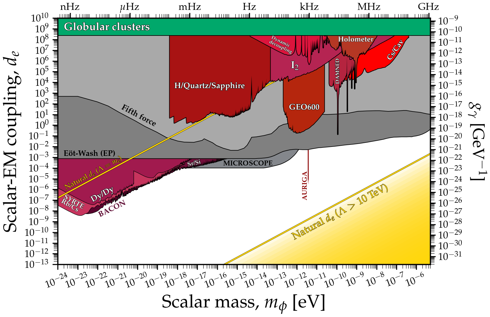
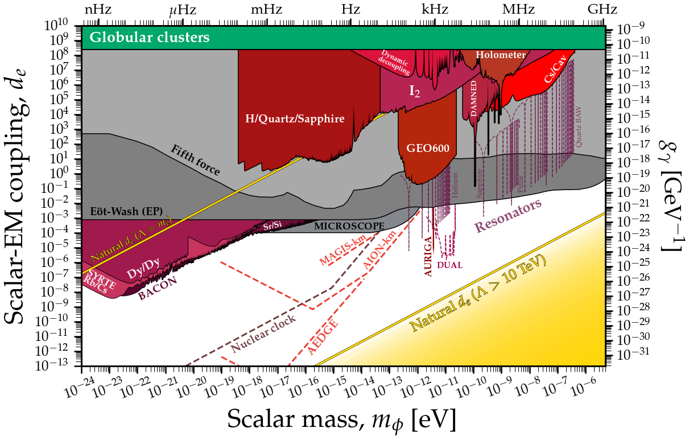

# Scalar-photon coupling limits
---

## Basic plot
### [View Notebook (.ipynb)](https://github.com/cajohare/AxionLimits/blob/master/Scalars.ipynb)
### [Download (.pdf)](https://github.com/cajohare/AxionLimits/raw/master/plots/ScalarPhoton.pdf)
### [Download (.png)](https://github.com/cajohare/AxionLimits/raw/master/plots/plots_png/ScalarPhoton.png)
### &nbsp;
### &nbsp;
---

---

## Plot with projections
### [View Notebook (.ipynb)](https://github.com/cajohare/AxionLimits/blob/master/Scalars.ipynb)
### [Download (.pdf)](https://github.com/cajohare/AxionLimits/raw/master/plots/ScalarPhoton_with_Projections.pdf)
### [Download (.png)](https://github.com/cajohare/AxionLimits/raw/master/plots/plots_png/ScalarPhoton_with_Projections.png)
### &nbsp;
### &nbsp;
---

# Data files and references

## Fifth force etc. (gray)
* Eot-Wash (Equivalence principle): [limit](https://github.com/cajohare/AxionLimits/raw/master/limit_data/ScalarPhoton/EotWashEP.txt), [reference](https://arxiv.org/abs/1807.04512)
* Fifth force (Eot-Wash): [limit](https://github.com/cajohare/AxionLimits/raw/master/limit_data/ScalarPhoton/FifthForce.txt), compiled from [ref1](https://arxiv.org/abs/hep-ph/0307284), [ref2](https://arxiv.org/abs/hep-ph/9606249), [ref3](https://www.sciencedirect.com/science/article/abs/pii/S0019103510003830)
* MICROSCOPE (Equivalence principle): [limit](https://github.com/cajohare/AxionLimits/raw/master/limit_data/ScalarPhoton/MICROSCOPE.txt), [reference](https://arxiv.org/abs/1712.00483)
* FOCOS (nuclear clock projection): [projection](https://github.com/cajohare/AxionLimits/raw/master/limit_data/ScalarPhoton/Projections/FOCOS.txt), [reference](https://arxiv.org/abs/2207.14310)

## Astrophysical bounds (green)
* Globular clusters (R2 ratio) [limit](https://github.com/cajohare/AxionLimits/raw/master/limit_data/ScalarPhoton/GlobularClusters.txt), [reference](https://arxiv.org/abs/2207.03102)

## DM Searches (red)
* AURIGA: [limit](https://github.com/cajohare/AxionLimits/raw/master/limit_data/ScalarPhoton/AURIGA.txt), [reference](https://arxiv.org/abs/1607.07327)
* BACON: [limit](https://github.com/cajohare/AxionLimits/raw/master/limit_data/ScalarPhoton/BACON.txt), [reference](https://arxiv.org/abs/2005.14694)
* Cs/Cav: [limit](https://github.com/cajohare/AxionLimits/raw/master/limit_data/ScalarPhoton/CsCav.txt), [reference](https://arxiv.org/abs/2201.02042)
* DAMNED: [limit](https://github.com/cajohare/AxionLimits/raw/master/limit_data/ScalarPhoton/DAMNED.txt), [reference](https://arxiv.org/abs/2006.07055)
* Dy/Dy: [limit](https://github.com/cajohare/AxionLimits/raw/master/limit_data/ScalarPhoton/DyDy.txt), [reference](https://arxiv.org/abs/1503.06886)
* Dy/Quartz: [limit](https://github.com/cajohare/AxionLimits/raw/master/limit_data/ScalarPhoton/DyQuartz.txt), [reference](https://arxiv.org/abs/2212.04413)
* Dynamic Decoupling: [limit](https://github.com/cajohare/AxionLimits/raw/master/limit_data/ScalarPhoton/DynamicDecoupling.txt), [reference](https://arxiv.org/abs/1902.02788)
* GEO 600: [limit](https://github.com/cajohare/AxionLimits/raw/master/limit_data/ScalarPhoton/GEO600.txt), [reference](https://arxiv.org/abs/2103.03783)
* LIGO O3: [limit](https://github.com/cajohare/AxionLimits/raw/master/limit_data/ScalarPhoton/LIGO.txt), [reference](https://arxiv.org/abs/2303.13088)
* Holometer: [limit](https://github.com/cajohare/AxionLimits/raw/master/limit_data/ScalarPhoton/Holometer.txt), [reference](https://arxiv.org/abs/2108.04746)
* H/Quartz/Sapphire: [limit](https://github.com/cajohare/AxionLimits/raw/master/limit_data/ScalarPhoton/HQuartzSapphire.txt), [reference](https://arxiv.org/abs/2010.08107)
* PTB (Yb+, Sr): [limit](https://github.com/cajohare/AxionLimits/raw/master/limit_data/ScalarPhoton/PTB.txt), [reference](https://arxiv.org/abs/2301.03433)
* I2: [limit](https://github.com/cajohare/AxionLimits/raw/master/limit_data/ScalarPhoton/I2.txt), [reference](https://arxiv.org/abs/2111.06883)
* Rb/Cs: [limit](https://github.com/cajohare/AxionLimits/raw/master/limit_data/ScalarPhoton/RbCs.txt), [reference](https://arxiv.org/abs/1604.08514)
* Sr/Si: [limit](https://github.com/cajohare/AxionLimits/raw/master/limit_data/ScalarPhoton/SrSi.txt), [reference](https://arxiv.org/abs/2008.08773)
* Yb+/Sr: [limit](https://github.com/cajohare/AxionLimits/raw/master/limit_data/ScalarPhoton/YbSr.txt), [reference](https://arxiv.org/abs/2302.04565)

## Projected DM searches (dashed lines)
* AEDGE: [projection](https://github.com/cajohare/AxionLimits/raw/master/limit_data/ScalarPhoton/Projections/AEDGE.txt), [reference](https://arxiv.org/abs/2108.02468)
* AION: [projection](https://github.com/cajohare/AxionLimits/raw/master/limit_data/ScalarPhoton/Projections/AION-km.txt), [reference](https://arxiv.org/abs/2108.02468)
* DUAL: [projection](https://github.com/cajohare/AxionLimits/raw/master/limit_data/ScalarPhoton/Projections/DUAL.txt), [reference](https://arxiv.org/abs/1508.01798)
* MAGIS: [projection](https://github.com/cajohare/AxionLimits/raw/master/limit_data/ScalarPhoton/Projections/MAGIS-km.txt), [reference](https://arxiv.org/abs/2104.02835)
* Nuclear clock: [projection](https://github.com/cajohare/AxionLimits/raw/master/limit_data/ScalarPhoton/Projections/NuclearClock.txt), [reference](https://arxiv.org/abs/2203.14915)
* Mechanical resonator - Superfluid He: [projection](https://github.com/cajohare/AxionLimits/raw/master/limit_data/ScalarPhoton/Projections/Resonator-Helium.txt), [reference](https://arxiv.org/abs/1910.07574)
* Mechanical resonator - Sapphire: [projection](https://github.com/cajohare/AxionLimits/raw/master/limit_data/ScalarPhoton/Projections/Resonator-Sapphire.txt), [reference](https://arxiv.org/abs/1910.07574)
* Mechanical resonator - Pillar: [projection](https://github.com/cajohare/AxionLimits/raw/master/limit_data/ScalarPhoton/Projections/Resonator-Pillar.txt), [reference](https://arxiv.org/abs/1910.07574)
* Mechanical resonator - Quartz: [projection](https://github.com/cajohare/AxionLimits/raw/master/limit_data/ScalarPhoton/Projections/Resonator-Quartz.txt), [reference](https://arxiv.org/abs/1910.07574)