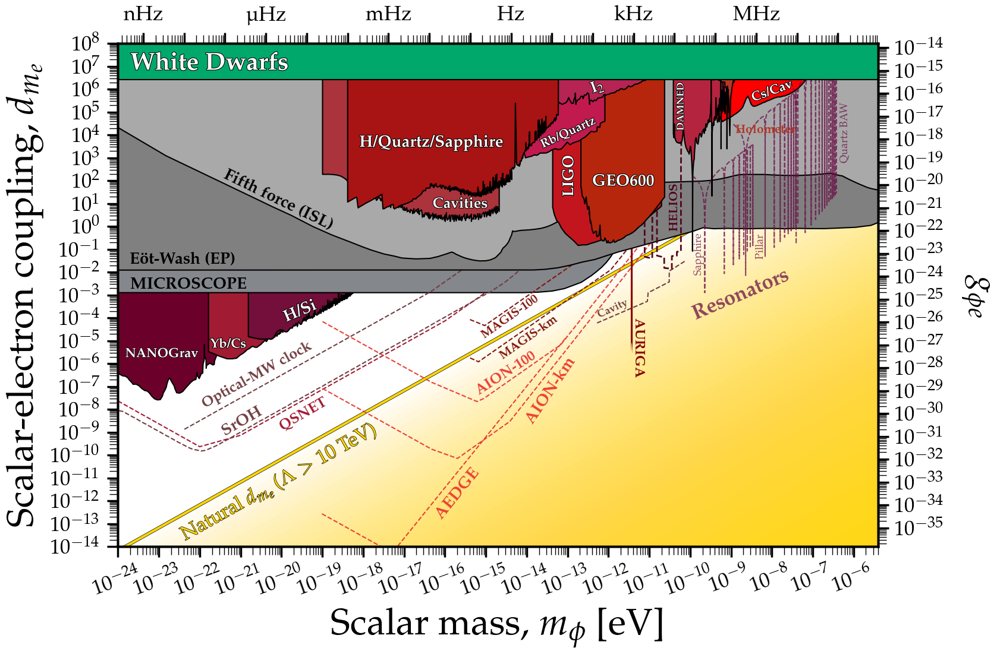

# Scalar-electron coupling limits
---

## Basic plot
### [View Notebook (.ipynb)](https://github.com/cajohare/AxionLimits/blob/master/Scalars.ipynb)
### [Download (.pdf)](https://github.com/cajohare/AxionLimits/raw/master/plots/ScalarElectron.pdf)
### [Download (.png)](https://github.com/cajohare/AxionLimits/raw/master/plots/plots_png/ScalarElectron.png)
### &nbsp;
### &nbsp;
---

---

## Plot with projections
### [View Notebook (.ipynb)](https://github.com/cajohare/AxionLimits/blob/master/Scalars.ipynb)
### [Download (.pdf)](https://github.com/cajohare/AxionLimits/raw/master/plots/ScalarElectron_with_Projections.pdf)
### [Download (.png)](https://github.com/cajohare/AxionLimits/raw/master/plots/plots_png/ScalarElectron_with_Projections.png)
### &nbsp;
### &nbsp;
---

# Data files and references

## Fifth force etc. (gray)
* Eot-Wash (Equivalence principle): [limit](https://github.com/cajohare/AxionLimits/raw/master/limit_data/ScalarElectron/EotWashEP.txt), [reference](https://arxiv.org/abs/1807.04512)
* Fifth force (Eot-Wash): [limit](https://github.com/cajohare/AxionLimits/raw/master/limit_data/ScalarElectron/FifthForce.txt), compiled from [ref1](https://arxiv.org/abs/hep-ph/0307284), [ref2](https://arxiv.org/abs/hep-ph/9606249), [ref3](https://www.sciencedirect.com/science/article/abs/pii/S0019103510003830)
* MICROSCOPE (Equivalence principle): [limit](https://github.com/cajohare/AxionLimits/raw/master/limit_data/ScalarElectron/MICROSCOPE.txt), [reference](https://arxiv.org/abs/1712.00483)

## Astrophysical bounds (green)
* Red giants: [limit](https://github.com/cajohare/AxionLimits/raw/master/limit_data/ScalarElectron/RedGiants.txt), [reference](https://arxiv.org/abs/1611.05852)
* White dwarfs: [limit](https://github.com/cajohare/AxionLimits/raw/master/limit_data/ScalarElectron/WhiteDwarfs.txt), [reference](https://arxiv.org/abs/2303.00778)

## DM Searches (red)
* AURIGA: [limit](https://github.com/cajohare/AxionLimits/raw/master/limit_data/ScalarElectron/AURIGA.txt), [reference](https://arxiv.org/abs/1607.07327)
* Cs/Cav: [limit](https://github.com/cajohare/AxionLimits/raw/master/limit_data/ScalarElectron/CsCav.txt), [reference](https://arxiv.org/abs/2201.02042)
* DAMNED: [limit](https://github.com/cajohare/AxionLimits/raw/master/limit_data/ScalarElectron/DAMNED.txt), [reference](https://arxiv.org/abs/2006.07055)
* GEO 600: [limit](https://github.com/cajohare/AxionLimits/raw/master/limit_data/ScalarElectron/GEO600.txt), [reference](https://arxiv.org/abs/2103.03783)
* Holometer: [limit](https://github.com/cajohare/AxionLimits/raw/master/limit_data/ScalarElectron/Holometer.txt), [reference](https://arxiv.org/abs/2108.04746)
* H/Quartz/Sapphire: [limit](https://github.com/cajohare/AxionLimits/raw/master/limit_data/ScalarElectron/HQuartzSapphire.txt), [reference](https://arxiv.org/abs/2010.08107)
* I2: [limit](https://github.com/cajohare/AxionLimits/raw/master/limit_data/ScalarElectron/I2.txt), [reference](https://arxiv.org/abs/2111.06883)
* H/Si: [limit](https://github.com/cajohare/AxionLimits/raw/master/limit_data/ScalarElectron/HSi.txt), [reference](https://arxiv.org/abs/2008.08773)
* Rb/Quartz: [limit](https://github.com/cajohare/AxionLimits/raw/master/limit_data/ScalarElectron/RbQuartz.txt), [reference](https://arxiv.org/abs/2212.04413)
* Yb/Cs: [limit](https://github.com/cajohare/AxionLimits/raw/master/limit_data/ScalarElectron/YbCs.txt), [reference](https://arxiv.org/abs/2212.05721)
* LIGO O3: [limit](https://github.com/cajohare/AxionLimits/raw/master/limit_data/ScalarElectron/LIGO.txt), [reference](https://arxiv.org/abs/2303.13088)

## Projected DM searches (dashed lines)
* AEDGE: [projection](https://github.com/cajohare/AxionLimits/raw/master/limit_data/ScalarElectron/Projections/AEDGE.txt), [reference](https://arxiv.org/abs/2108.02468)
* AION: [projection](https://github.com/cajohare/AxionLimits/raw/master/limit_data/ScalarElectron/Projections/AION-km.txt), [reference](https://arxiv.org/abs/2108.02468)
* DUAL: [projection](https://github.com/cajohare/AxionLimits/raw/master/limit_data/ScalarElectron/Projections/DUAL.txt), [reference](https://arxiv.org/abs/1508.01798)
* IPTA: [projection](https://github.com/cajohare/AxionLimits/raw/master/limit_data/ScalarPhoton/IPTA.txt), [reference](https://arxiv.org/abs/2205.06817)
* MAGIS: [projection](https://github.com/cajohare/AxionLimits/raw/master/limit_data/ScalarElectron/Projections/MAGIS-km.txt), [reference](https://arxiv.org/abs/2104.02835)
* Optical-microwave clock: [projection](https://github.com/cajohare/AxionLimits/raw/master/limit_data/ScalarElectron/Projections/OpticalMW.txt), [reference](https://arxiv.org/abs/1405.2925)
* Optical cavities: [projection](https://github.com/cajohare/AxionLimits/raw/master/limit_data/ScalarElectron/Projections/CavityCavity.txt), [reference](https://arxiv.org/abs/1808.00540)
* SrOH: [projection](https://github.com/cajohare/AxionLimits/raw/master/limit_data/ScalarElectron/Projections/SrOH.txt), [reference](https://arxiv.org/abs/1805.08185)
* Mechanical resonator - Superfluid He: [projection](https://github.com/cajohare/AxionLimits/raw/master/limit_data/ScalarElectron/Projections/Resonator-Helium.txt), [reference](https://arxiv.org/abs/1910.07574)
* Mechanical resonator - Sapphire: [projection](https://github.com/cajohare/AxionLimits/raw/master/limit_data/ScalarElectron/Projections/Resonator-Sapphire.txt), [reference](https://arxiv.org/abs/1910.07574)
* Mechanical resonator - Pillar: [projection](https://github.com/cajohare/AxionLimits/raw/master/limit_data/ScalarElectron/Projections/Resonator-Pillar.txt), [reference](https://arxiv.org/abs/1910.07574)
* Mechanical resonator - Quartz: [projection](https://github.com/cajohare/AxionLimits/raw/master/limit_data/ScalarElectron/Projections/Resonator-Quartz.txt), [reference](https://arxiv.org/abs/1910.07574)